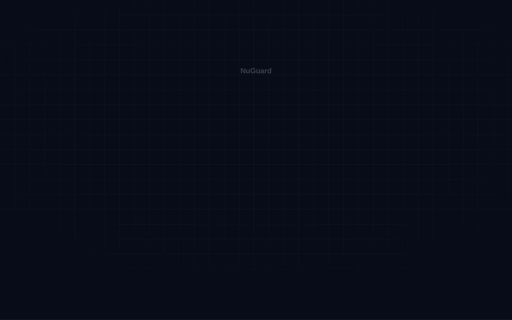

<h1 align="center">nuguard</h1>

<p align="center">
  <strong>AI-SBOM generation, static analysis, and automated red-teaming / adversarial-attack-generation for AI agents and applications.</strong>
</p>

<p align="center">
  <a href="../LICENSE"></a>
  <a href="https://github.com/NuGuardAI/nuguard/actions/workflows/pr-tests.yml"></a>
  <a href="https://pypi.org/project/nuguard/"></a>
  <a href="https://pypi.org/project/nuguard/"></a>
  <a href="https://github.com/NuGuardAI/nuguard/stargazers"></a>
</p>

<p align="center">
  <a href="#what-it-does">What it does</a> ·
  <a href="#see-it-in-action">See it in action</a> ·
  <a href="#framework-coverage">Framework coverage</a> ·
  <a href="#comparison">Comparison</a> ·
  <a href="#getting-started">Getting started</a> ·
  <a href="#faq">FAQ</a>
</p>

---

NuGuard is an open source AI application security toolkit. It generates an AI Bill of Materials (AI-SBOM) for your agentic application, statically analyzes it for structural risk, then red-teams a running instance with a catalog of 100+ adversarial scenarios — prompt injection, tool abuse, data exfiltration, and more — so you find the finding before an attacker does.

## What It Does

<p align="center">
  <picture>
    <source media="(prefers-color-scheme: dark)" srcset="../documentation/docs/assets/what-it-does-dark.svg">
    
  </picture>
</p>

## See It In Action

A real scan of a live fintech agent — Pinnacle Bank Assistant — walking through all five NuGuard stages: AI-SBOM, Cognitive Policy, Static Analysis, Behavior, and Red-Team. No mocks, no slides — real findings, including a live transcript of the agent leaking another customer's flagged fraud transactions on a routine question.

<p align="center">
  <a href="../documentation/docs/pinnacle-bank-demo.html">
    
  </a>
</p>

[**→ Open the interactive demo**](../documentation/docs/pinnacle-bank-demo.html) — scroll through the full walkthrough yourself.

## Comparison

<p align="center">
  <picture>
    <source media="(prefers-color-scheme: dark)" srcset="../documentation/docs/assets/comparison-dark.svg">
    
  </picture>
</p>

## Getting Started

Install, then generate an SBOM, statically analyze it, and red-team a live target:

```bash
pip install nuguard

nuguard init --target <your-app-url>
nuguard sbom generate --source <path-to-your-app> --output app.sbom.json
nuguard analyze --sbom app.sbom.json --format markdown
nuguard redteam --config nuguard.yaml --format markdown --output reports/redteam.md
```

### 🚀 Ready to run NuGuard?

Installation, the full CLI surface, and the configuration reference — all in one guide.

[](../documentation/docs/quick-start.md)


### 🤖 Using Claude Code?

Install the NuGuard plugin and run SBOM, analysis, behavior, and red-team scans directly from Claude Code or Claude Desktop.

[](../documentation/docs/plugin-guide.md)

## Hosted Version

<table align="center">
<tr>
<td align="center" width="600">

###  [NuGuard.ai](http://nuguard.ai)

A managed SaaS version of NuGuard, with additional features and support on top of everything in this repo.
Free trial available.

Supports RBAC, executive dashboards, audit-ready reports, policy checks, and integrations (ServiceNow AI Control Tower).

[](http://nuguard.ai)

</td>
</tr>
</table>

## Contributing

### 🤝 Want to contribute?

Dev setup, running tests and lint, and the pull request process are covered in the Contributing guide.

[](CONTRIBUTING.md)

## Repo Notes

- The repository currently contains example applications under `tests/apps/`
- LLM-assisted features depend on provider credentials being available via environment variables

## FAQ

**I have some questions, how do I reach out to folks behind this repo?**
You can contact us at [oss@nuguard.ai](mailto:oss@nuguard.ai)
For bug reporting, use the [issues](https://github.com/nuguard-ai/nuguard/issues) page on GitHub.

**Do I need a live app to get findings?**
No. `nuguard sbom` + `nuguard analyze` find structural and supply-chain risk statically. 
`nuguard behavior` and `nuguard redteam` need a running target typically in a sandbox.

**Which LLM providers are supported for LLM-assisted features?**
Configured via the `llm` section of `nuguard.yaml`; provider credentials are read from environment variables. Lite LLM is used to abstract any llm provider.

**What if I don't want to run all redteam scenarios?**
Filter by category or profile, or set `enabled: false` per scenario in a catalog exported with `nuguard redteam catalog-export`.

## License

[Apache 2.0](../LICENSE).

---

<sub>
<strong>Docs:</strong>
<a href="../documentation/docs/getting-started.md">Getting started</a> ·
<a href="../documentation/docs/quick-start.md">Quick start</a> ·
<a href="../documentation/docs/cli-reference.md">CLI reference</a> ·
<a href="../documentation/docs/policy-engine-guide.md">Policy engine</a> ·
<a href="../documentation/docs/static-analysis-guide.md">Static analysis</a> ·
<a href="../documentation/docs/red-teaming-guide.md">Red-team Guide</a> ·
<a href="../documentation/docs/plugin-guide.md">Claude plugin</a> ·
<a href="../documentation/docs/troubleshooting.md">Troubleshooting</a> ·
<a href="SECURITY.md">Security</a> ·
<a href="CONTRIBUTING.md">Contributing</a>
</sub>
