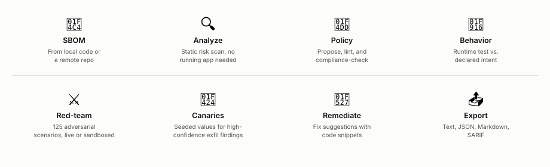
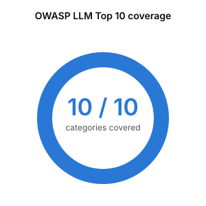
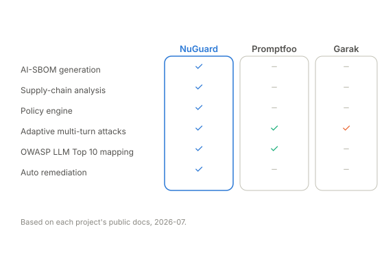

  

<h1 align="center">NuGuard</h1>

  <strong>AI-SBOM generation, static analysis, and automated red-teaming / adversarial-attack-generation for AI agents and LLM applications.</strong>

  
  
  
  
  

  <a href="#what-it-does">What it does</a> ·
  <a href="#framework-coverage">Framework coverage</a> ·
  <a href="#comparison">Comparison</a> ·
  <a href="#getting-started">Getting started</a> ·
  <a href="#faq">FAQ</a>

---

NuGuard is an open source AI application security toolkit. It generates an AI Bill of Materials (AI-SBOM) for your agentic application, statically analyzes it for structural risk, then red-teams a running instance with a catalog of 125 adversarial scenarios — prompt injection, tool abuse, data exfiltration, and more — so you find the finding before an attacker does.

## What It Does

  <picture>
    <source media="(prefers-color-scheme: dark)" srcset="../documentation/docs/assets/what-it-does-dark.svg">
    
  </picture>

## Example

  

[**→ View the full report**](../documentation/docs/assets/demo-redteam-report.md) — every scenario, turn-by-turn transcripts, and the generated remediation plan.

## Framework Coverage

<table>
<tr>
<td width="35%" valign="middle">

<picture>
  <source media="(prefers-color-scheme: dark)" srcset="../documentation/docs/assets/owasp-coverage-dark.svg">
  
</picture>

</td>
<td width="65%" valign="middle">

The attack catalog (`catalog.yaml`) tags every scenario against the OWASP Top 10 for LLM Applications (2025) — all 10 categories are covered.

- **125** red-team scenarios
- **18** attack categories, spanning prompt injection, tool abuse, data exfiltration, supply chain, and more
- Scenarios can map to more than one OWASP category, so per-category counts sum to more than 125
- MITRE ATLAS and NIST AI RMF mapping — planned for a future catalog release

</td>
</tr>
</table>

## Comparison

  <picture>
    <source media="(prefers-color-scheme: dark)" srcset="../documentation/docs/assets/comparison-dark.svg">
    
  </picture>

## Hosted Version

  <a href="http://nuguard.ai"><strong>NuGuard.ai</strong></a> — a managed SaaS version of NuGuard, with additional features and support on top of everything in this repo.

## Getting Started

### 🚀 Ready to run NuGuard?

Installation, the full CLI surface, a quick-start walkthrough, and the configuration reference — all in one guide.

### ⚙️ Need advanced red-team config?

Canaries, guided conversations, and finding triggers — covered in the Red-Team Design doc.

## Contributing

### 🤝 Want to contribute?

Dev setup, running tests and lint, and the pull request process are covered in the Contributing guide.

## Repo Notes

- The repository currently contains example outputs and benchmark fixtures under `tests/output/`
- Some red-team and benchmark tests are opt-in and gated by environment variables
- LLM-assisted features depend on provider credentials being available via environment variables

## FAQ

**Do I need a live app to get findings?**
No. `nuguard sbom` + `nuguard analyze` find structural and supply-chain risk statically. `nuguard behavior` and `nuguard redteam` need a running target.

**Which LLM providers are supported for LLM-assisted features?**
Configured via the `llm` section of `nuguard.yaml`; provider credentials are read from environment variables. Azure-backed setups are exercised directly in this repo's own test suite.

**What if I don't want to run all 125 scenarios?**
Filter by category or profile, or set `enabled: false` per scenario in a catalog exported with `nuguard redteam catalog-export`.

## License

[Apache 2.0](../LICENSE).

## Star History

<a href="https://star-history.com/#NuGuardAI/nuguard&Date">
  <picture>
    <source media="(prefers-color-scheme: dark)" srcset="https://api.star-history.com/svg?repos=NuGuardAI/nuguard&type=Date&theme=dark" />
    <source media="(prefers-color-scheme: light)" srcset="https://api.star-history.com/svg?repos=NuGuardAI/nuguard&type=Date" />
    
  </picture>
</a>

---

<strong>Docs:</strong>
<a href="../documentation/docs/getting-started.md">Getting started</a> ·
<a href="../documentation/docs/quick-start.md">Quick start</a> ·
<a href="../documentation/docs/cli-reference.md">CLI reference</a> ·
<a href="../documentation/docs/policy-engine-guide.md">Policy engine</a> ·
<a href="../documentation/docs/static-analysis-guide.md">Static analysis</a> ·
<a href="../documentation/docs/redteam-design.md">Red-team design</a> ·
<a href="../documentation/docs/plugin-guide.md">Claude plugin</a> ·
<a href="../documentation/docs/publishing.md">Publishing</a> ·
<a href="../documentation/docs/troubleshooting.md">Troubleshooting</a> ·
<a href="SECURITY.md">Security</a> ·
<a href="CONTRIBUTING.md">Contributing</a>

