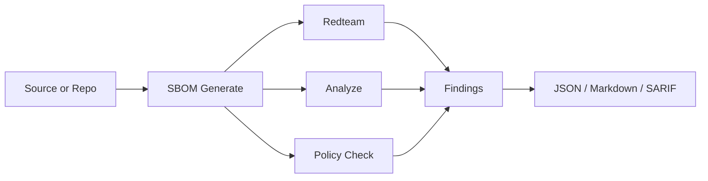
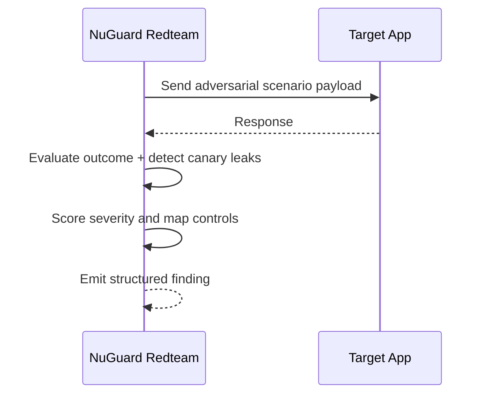

# NuGuard OSS

<p align="center">
  
</p>

NuGuard is an open source AI application security CLI for AI-native systems. It combines deterministic AI-SBOM generation, static security analysis, policy checks, and dynamic red-team execution in one workflow.

## Why NuGuard

- AI-SBOM first: map agents, tools, prompts, models, datastores, permissions, and API surfaces from source code.
- Security signal over noise: run AI-specific structural checks plus dependency and IaC scanners.
- Policy-aware evaluation: validate and check cognitive policy guardrails against actual system components.
- Dynamic proof: run adversarial scenarios against live targets, including canary-based exfiltration detection.
- CI-friendly outputs: text, JSON, Markdown, SARIF, and explicit non-zero exit behavior.

## Pipeline Overview



## Supported Frameworks

NuGuard scans both Python and TypeScript/JavaScript source and automatically detects components from these frameworks:

### Python

| Framework | What is detected |
|---|---|
| LangGraph | Graph nodes, agents, edges |
| LangChain | Chains, tools, memory, retrievers |
| OpenAI Agents SDK | Agents, tools, handoffs, prompts |
| CrewAI | Crew, agents, tasks |
| AutoGen | Agents, group chats |
| Agno | Agents, tools, knowledge, teams |
| LlamaIndex | Query engines, data connectors, synthesizers |
| Semantic Kernel | Kernels, plugins, prompts |
| Azure AI Agents | Agents, tools, threads |
| Google ADK | Agents, tools, sessions |
| AWS Bedrock AgentCore | Agents, tools, runtimes |
| GuardrailsAI | Guardrail validators |
| MCP Server | MCP tools and resources |
| FastAPI | API routes, auth, middleware |
| Flask | Routes, auth |
| LLM Clients | OpenAI, Anthropic, Gemini, Cohere, local models |

### TypeScript / JavaScript

| Framework | What is detected |
|---|---|
| LangGraph.js | Graph nodes, agents, edges |
| OpenAI Agents SDK (TS) | Agents, tools, handoffs |
| Agno (TS) | Agents, tools |
| Azure AI Agents (TS) | Agents, tools |
| Google ADK (TS) | Agents, tools |
| AWS Bedrock Agents (TS) | Agents, tools |
| LLM Clients (TS) | OpenAI, Anthropic, Google, Vertex AI, Bedrock |
| Datastores (TS) | PostgreSQL, MySQL, MongoDB, Redis, DynamoDB, Cosmos |
| Prompts (TS) | Prompt templates and system messages |

### Infrastructure adapters

- Dockerfile (container images, run-as-root, resource limits)
- Kubernetes manifests (RBAC, resource quotas, network policies)
- Terraform / CloudFormation IaC (IAM roles, storage encryption)
- Nginx reverse-proxy configs (auth headers, rate-limit rules)
- YAML configs (model endpoints, environment variables, secrets)

## Feature Matrix

| Area | Capability | Status |
|---|---|---|
| Project bootstrap | `nuguard init` starter files | implemented |
| AI-SBOM | Local source scan | implemented |
| AI-SBOM | Remote repo scan | implemented |
| AI-SBOM | Schema validation and DB register/show | implemented |
| AI-SBOM toolbox | CycloneDX, SPDX, SARIF, vulnerability plugins | implemented |
| Static analysis | NGA + optional OSV/Grype/Checkov/Trivy/Semgrep passes | implemented |
| Policy engine | `policy validate`, `policy check` | implemented |
| Dynamic redteam | Scenario generation and live target execution | implemented |
| Dynamic redteam | Guided conversations, canaries, auto-launch options | implemented |
| Unified command | `scan` SBOM + analyze orchestration | implemented |
| Unified command | `scan` inline policy/redteam steps | placeholder in `scan` |
| Additional commands | `seed`, `report`, `findings`, `replay` | present but stubbed |

## CLI Surface

Implemented and usable now:

- `nuguard init`
- `nuguard sbom`
- `nuguard analyze`
- `nuguard policy`
- `nuguard redteam`
- `nuguard scan`

Present but currently not implemented:

- `nuguard seed`
- `nuguard report`
- `nuguard findings`
- `nuguard replay`

Current `scan` behavior:

- `scan` fully wires SBOM generation + static analysis outputs.
- Policy and redteam steps inside `scan` are placeholders. Use `nuguard policy ...` and `nuguard redteam ...` directly.

## Requirements

- Python 3.12+
- `uv` (recommended for local development workflow)

Optional binaries used by analyzer backends:

- `grype`
- `checkov`
- `trivy`
- `semgrep`

If these tools are not installed, related checks are skipped or reported unavailable.

## Installation

Install from PyPI:

```bash
pip install nuguard
```

Local development setup:

```bash
uv sync --dev
uv run nuguard --help
```

## Quick Start

### 1. Create starter files

```bash
uv run nuguard init
```

This creates `nuguard.yaml.example`, `canary.example.json`, and `cognitive_policy.md` when missing.

Before running policy validation, edit `cognitive_policy.md` and add at least one real policy section. The starter template is intentionally empty and fails validation until you populate it.

### 2. Generate an AI-SBOM

```bash
uv run nuguard sbom generate --source . --output app.sbom.json
```

Remote repository scan:

```bash
uv run nuguard sbom generate \
  --from-repo https://github.com/org/repo \
  --ref main \
  --output app.sbom.json
```

### 3. Run static analysis

```bash
uv run nuguard analyze --sbom app.sbom.json --format markdown
```

### 4. Validate and check policy

```bash
uv run nuguard policy validate --file cognitive_policy.md
uv run nuguard policy check --policy cognitive_policy.md --sbom app.sbom.json
```

### 5. Red-team a live target

```bash
uv run nuguard redteam \
  --sbom app.sbom.json \
  --target http://localhost:3000 \
  --format json
```

If your target uses a non-default chat path (anything other than `/chat`), set `redteam.target_endpoint` in `nuguard.yaml` and run `nuguard redteam --config nuguard.yaml`.

### 6. Unified static pipeline

```bash
uv run nuguard scan --source . --output-dir nuguard-reports
```

## Redteam Illustration



## Configuration

Use project defaults via `nuguard.yaml` (template at [nuguard.yaml.example](nuguard.yaml.example)).

Key sections:

- `sbom`, `source`, `policy`
- `llm`, `sbom_generation`
- `redteam` (target, endpoint, auth header, scenarios, profile, strict outcome, guided options, redteam/eval LLM settings)
- `analyze`, `database`, `output`

Resolution precedence:

1. CLI flags
2. `nuguard.yaml`
3. environment variables
4. built-in defaults

## Canaries

NuGuard supports deterministic exfiltration detection by scanning target responses for seeded canary values.

Start from [canary.example.json](canary.example.json), seed values into the target system, then run redteam with `--canary`.

Reference guide: [docs/red-teaming-guide.md](docs/red-teaming-guide.md)

## Common Commands

```bash
uv run nuguard --help
uv run nuguard init --help
uv run nuguard sbom --help
uv run nuguard analyze --help
uv run nuguard policy --help
uv run nuguard redteam --help
uv run nuguard scan --help
```

## Development

```bash
make dev
make test
make lint
make fmt
```

## Documentation

- [docs/quick-start.md](docs/quick-start.md)
- [docs/cli-reference.md](docs/cli-reference.md)
- [docs/static-analysis-guide.md](docs/static-analysis-guide.md)
- [docs/policy-engine-guide.md](docs/policy-engine-guide.md)
- [docs/red-teaming-guide.md](docs/red-teaming-guide.md)
- [docs/troubleshooting.md](docs/troubleshooting.md)

## Publishing

- [.github/workflows/publish-testpypi.yml](.github/workflows/publish-testpypi.yml)
- [.github/workflows/publish-pypi.yml](.github/workflows/publish-pypi.yml)

Suggested release sequence:

1. Publish to TestPyPI and validate install/runtime.
2. Create a GitHub release to trigger PyPI publish.

## License

Apache-2.0. See [LICENSE](LICENSE).
