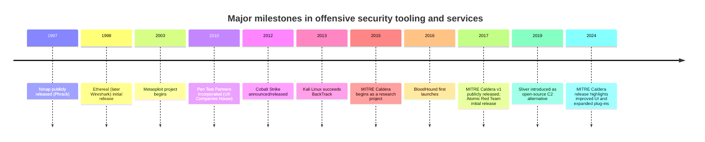
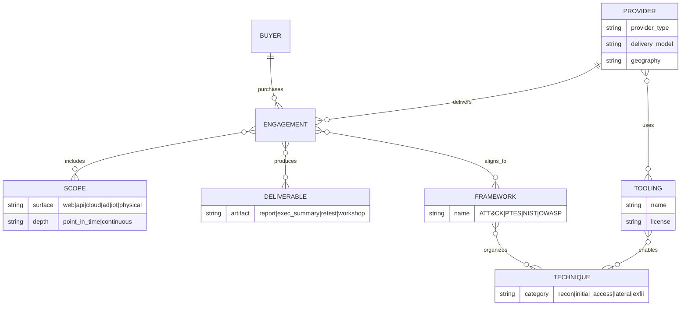
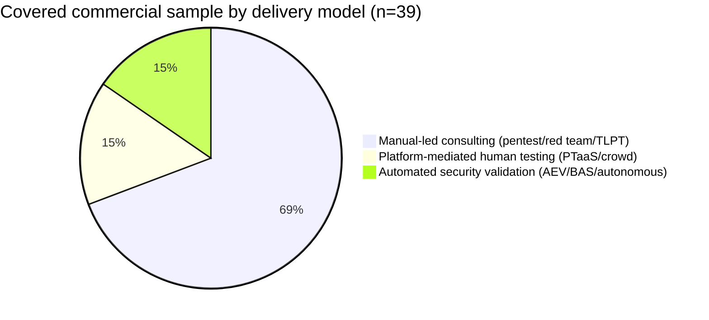
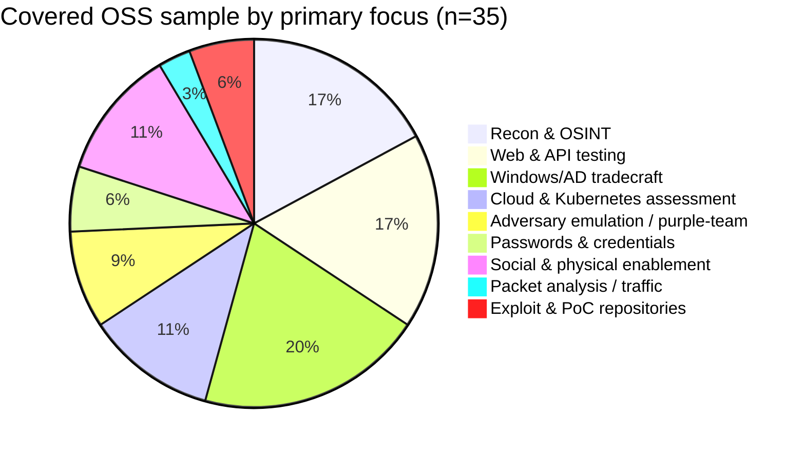

# Global Penetration Testing, Red Team, and Offensive Security Tooling Landscape

## Executive Summary

The commercial offensive-security market has converged into three dominant operating models, plus a “governance-heavy” regulatory variant. First, **manual-led consulting** (classic penetration tests and full-scope red-team engagements) remains the reference standard for complex environments, high assurance, and nuanced business-logic or lateral-movement work. Second, **platform-mediated human testing** (PTaaS and crowdsourced models) compresses lead times and improves remediation collaboration via portals, real-time findings, retesting workflows, and standardized reporting formats. Third, **automated security validation** (autonomous pentesting, breach-and-attack simulation, and adversarial exposure validation) scales repeatable testing across larger attack surfaces and supports continuous assurance programs—often mapping emulations to ATT&CK-like technique taxonomies. A fourth variant, **threat-led / intelligence-led penetration testing (TLPT)**, is increasingly shaped by financial-sector resilience regimes in Europe and elsewhere and emphasizes controlled cyberattacks grounded in current threat intelligence, formal governance, and outcome-driven validation. citeturn29view0turn4search13turn2search11turn32search5turn2search23

Two forces explain the current landscape. One is the scale and dynamism of attack surfaces (cloud, SaaS identity, APIs, CI/CD, and hybrid networks), which pushes buyers toward *continuous* testing and faster retest loops rather than annual point-in-time engagements. The other is the maturation of common testing and reporting “languages” (e.g., attacker TTP taxonomies; standardized web/mobile/API test standards; and regulator-backed TLPT playbooks), which makes it easier to compare providers, define deliverables, and integrate results into engineering and security operations. citeturn24view0turn21search5turn21search9turn21search0turn29view0

Pricing transparency is still uneven: most consultancies remain quote-based, while some PTaaS and autonomous testing vendors publish entry price points. Examples include packaged PTaaS starting prices (e.g., Cobalt starter packages), platform subscription entry points (e.g., Synack platform price), and marketplace-listed one-time autonomous test SKUs (e.g., Horizon3.ai NodeZero). Buyers should treat vendor-published “traditional pentest cost” comparisons as directional because scope, constraints, and assurance requirements drive order-of-magnitude differences. citeturn17search1turn17search2turn19search0turn17search22turn19search5

Open-source tooling remains foundational and globally pervasive (network discovery, web testing, OSINT, Windows/AD tradecraft, cloud posture visibility, and adversary emulation frameworks). However, “tool availability” is not the limiting factor for high-quality outcomes; scoping discipline, operator skill, and the ability to translate findings into prioritized remediation and detection improvements continue to differentiate both vendors and internal teams. citeturn9search0turn9search1turn29view0turn6search17turn23search16

## Scope, Methods, and Limitations

A truly exhaustive worldwide list of **all** commercial penetration-testing / red-team vendors and **all** open-source offensive-security projects is infeasible in a static report because provider rosters and tool repositories continually change (new boutiques form, firms merge/rebrand, and OSS projects fork, archive, or move hosts). To keep this report actionable while still maximizing coverage, the approach is:

- Use the entity["organization","CREST","cyber accreditation body"] member directory as a *global-scale* evidence base that there are hundreds of accredited suppliers across many countries and service types (penetration testing, intelligence-led penetration testing, app security testing, etc.), with filters by region and head-office location. citeturn29view0  
- Use entity["organization","NIST","us standards agency"] (SP 800-115), entity["organization","OWASP","appsec nonprofit"] standards/projects (WSTG, ASVS, MASVS, API Top 10), and entity["organization","MITRE","us not-for-profit"] materials (ATT&CK, Caldera, Navigator) as primary references for how vendors and tools commonly align methodology and reporting. citeturn0search3turn1search0turn7search0turn3search2turn24view0  
- Use the official entity["organization","European Central Bank","eu central bank"] / entity["organization","European Banking Authority","eu banking authority"] guidance and related public updates as the canonical source set for TLPT/TIBER-style governance expectations, and the entity["organization","Bank of England","uk central bank"] CBEST documentation for a comparable “intelligence-led” model. citeturn2search11turn32search5turn2search23turn2search12  
- For open-source tooling breadth, treat the entity["company","Offensive Security","infosec training company"] Kali tools catalog and curated “awesome” lists as breadth indices, then deep-dive a representative subset of high-impact projects across the offensive lifecycle. citeturn9search0turn9search4turn9search1  

**Coverage in the appendices**:  
- Commercial: 39 globally significant providers/platforms (manual-led consultancies, Big 4/large consultancies explicitly advertising offensive services, PTaaS/crowdsourced platforms, and automated security validation/autonomous pentest vendors), each with a compact but complete profile and primary sources.  
- Open-source: 35 widely deployed projects spanning recon/OSINT, web/app testing, cloud/Kubernetes visibility, credential/password auditing, Windows/AD tradecraft, C2/adversary emulation, and physical/social-engineering enablers—again with compact profiles and primary sources.

Where a provider does not publicly disclose pricing or customers, the report explicitly labels that gap rather than inferring. Case-study references are restricted to public case studies or publicly published assessment reports. citeturn18search3turn18search6turn15search8turn15search23turn18search11

## Market Landscape and Taxonomy

A practical definition of penetration testing is “simulating an attack” (manual techniques supported by automated tools) to identify attack vectors, vulnerabilities, and control weaknesses, differentiating it from vulnerability assessment and emphasizing exploitation expertise. citeturn29view0 A red-team engagement typically pushes beyond enumerating vulnerabilities, instead emulating adversary behavior to test detection/response and uncover complex attack paths that conventional assessments may miss—an approach explicitly described in many red-team service briefs. citeturn12search9turn12search2turn4search13turn31search21

Across commercial providers, offerings cluster into the following (overlapping) scopes:

- **Penetration testing (network/infrastructure, web/API, mobile, wireless)**: time-boxed, defined scope; deliverables emphasize prioritized findings and remediation guidance. citeturn29view0turn20search0turn12search6turn31search3  
- **Red team / adversary simulation**: objective-driven scenario testing; often “no-holds-barred” in approach but non-destructive in execution, frequently using real incident-response tradecraft and TTPs. citeturn12search9turn12search2turn15search3turn20search12  
- **Purple team**: structured collaboration between offensive and defensive teams to improve detections and response during or after attacks, explicitly framed as joint red/blue collaboration by multiple consultancies. citeturn20search16turn31search9turn32search0  
- **Threat-led / intelligence-led penetration testing (TLPT / TIBER-style)**: formalized governance and threat intelligence phases guiding controlled cyberattacks to test resilience, increasingly aligned to EU-wide consistency goals and DORA TLPT guidance updates. citeturn2search11turn32search5turn33search0turn2search23  
- **Platform-mediated testing (PTaaS, crowdsourced PTaaS)**: coordinated testing delivered through a portal with real-time reporting, collaboration, and packaged deliverables (often executive summary + detailed findings). citeturn17search1turn30search2turn30search18turn18search15  
- **Automated exposure validation / BAS / autonomous pentesting**: repeated, safe simulations or autonomous attack path discovery intended to validate control efficacy and exploitability at scale. citeturn37search2turn37search11turn19search4turn19search9turn37search6  

Framework and methodology alignment most often appears in three layers. The first is **testing process structure** (e.g., NIST testing guidance and PTES execution phases). citeturn0search3turn1search0 The second is **attack-and-detection semantic mapping**, most commonly ATT&CK, used both for adversary emulation platforms and for planning/visualization. citeturn1search1turn24view0turn23search16turn9search3 The third is **application security verification standards and risk lists**, heavily influenced by OWASP documents (Top 10 2025, ASVS, MASVS, API Top 10 2023) and related accreditation programs (e.g., CREST OVS alignment to OWASP ASVS/MASVS). citeturn21search4turn21search5turn21search9turn21search2turn21search1

Typical engagement artifacts vary by model but usually include a rules-of-engagement agreement, test evidence, and a final report with prioritized remediation guidance; some providers emphasize executive summaries suitable as “proof of audit” in compliance contexts. citeturn0search3turn30search18turn12search2turn29view0turn30search1

## Open-Source Ecosystem and Community Signals

Open-source projects form the “substrate” of offensive security: network discovery and packet analysis tooling, vulnerability research and exploitation frameworks, OSINT reconnaissance, Windows/AD tradecraft collections, cloud/Kubernetes assessment utilities, and adversary emulation libraries. The entity["company","Offensive Security","infosec training company"] Kali ecosystem explicitly positions itself as a penetration testing distribution with a large tools catalog, which is a useful breadth proxy even though Kali includes defensive/forensic utilities as well. citeturn9search0turn9search4turn22search9 Curated OSS indexes (e.g., awesome-pentest) further demonstrate the scale and fragmentation of the tooling universe, reinforcing why any fixed “exhaustive list” becomes stale quickly. citeturn9search1

Community activity varies widely by project type. Core utilities and flagship frameworks show persistent activity and large contributor bases (e.g., Wireshark history and ongoing project stewardship; fast-moving repos with visible “updated” stamps and large star counts). citeturn7search0turn7search8turn27search6turn7search2turn26search3 Some projects are explicitly archived or have active forks that supersede older repos (e.g., proxmark3 archive notice pointing development to the RfidResearchGroup fork), which matters for enterprise adoption and repeatability. citeturn8search6turn8search2

Two OSS trends are materially shaping commercial offerings. First, “ATT&CK-mapped” atomic tests and adversary emulation frameworks are normalizing repeatable, technique-labeled exercises used by defenders, red teams, and purple teams. citeturn23search13turn23search1turn23search16turn9search3 Second, cloud and Kubernetes tooling increasingly emphasizes automated posture visibility (APIs, configuration data, and weak-point hunting) as a prerequisite for doing high-quality cloud-native offensive work. citeturn25search1turn25search2turn25search3turn25search0

## Visualizations

The following visualizations reflect (a) widely cited milestones in offensive-security tooling evolution and (b) distribution patterns within the **covered sample** in the appendices, not the entire global universe of providers/tools.

### Timeline of major vendors and projects

The Nmap release date is documented by the author in the official Nmap book preface, and Wireshark’s origin as Ethereal with initial release timing appears in Wireshark’s own history documentation. citeturn6search20turn7search0 Metasploit’s 2003 origins and Cobalt Strike’s 2012 announcement timeline are publicly documented. citeturn22search0turn22search10turn22search2 Kali’s historical succession from BackTrack is described in Kali’s official documentation. citeturn22search9 Caldera’s public positioning (ATT&CK backbone and adversary emulation focus) is described by MITRE, with additional public release-history context from MITRE’s Caldera communications. citeturn24view0turn23search16turn23search12 BloodHound’s 2016 origin is referenced in SpecterOps’ own retrospective, while Sliver’s 2019 introduction is described by Bishop Fox and corroborated by major vendor writeups. citeturn22search7turn23search6turn23search2

### Entity-relationship model for categories

This model reflects how providers commonly describe penetration testing and red teaming: scoped engagements (often time-boxed or continuous) that produce reports and executive summaries, sometimes mapped to ATT&CK-like technique taxonomies, with providers emphasizing a mix of manual methods and automated tooling. citeturn29view0turn12search2turn30search18turn23search16turn21search5

### Charts summarizing market coverage in the covered sample

These distributions are an analytical summarization of the appendix catalog and should not be read as market share; they mainly illustrate the *structural diversity* implied by public vendor positioning and common OSS toolchain composition. citeturn29view0turn18search14turn37search2turn9search4turn9search1

## Appendices

### Comparative matrix and prioritized shortlists

The matrix below recommends **bundles** (vendor + platform + OSS) because single-provider solutions rarely cover cloud, identity, endpoints, and human/physical factors with equal depth. The shortlists prioritize (a) clarity of service definition, (b) public evidence of methodology/standards alignment, and (c) availability of public pricing or transparent engagement packaging where required.

| Need profile | What “good” looks like | Prioritized commercial shortlist (services/platforms) | OSS toolchain shortlist (typical internal stack) |
|---|---|---|---|
| Enterprise cloud / hybrid (Azure/AWS/GCP + SaaS identity) | Cloud control-plane misconfig exploitation, identity graph/attack-path analysis, web/API depth testing, and repeatable validation | entity["company","NetSPI","offensive security provider"] (global HQ Minneapolis; cloud + PTaaS positioning) citeturn10search5turn10search17; entity["company","Mandiant","google cloud security arm"] (red team assessments emulate sophisticated adversaries) citeturn12search9turn12search2; entity["company","Cobalt","pentest as a service platform"] (packaged PTaaS entry pricing) citeturn17search1turn18search14; entity["company","Horizon3.ai","autonomous pentesting vendor"] (autonomous pentest SKUs) citeturn19search0turn19search4 | Pacu (AWS exploitation) citeturn25search0; ScoutSuite (multi-cloud audit) citeturn25search1; Prowler (cloud security checks) citeturn25search2; BloodHound (identity attack paths) citeturn28search8turn28search0; Impacket (protocol tooling) citeturn23search7; OWASP ZAP + sqlmap for web/API depth citeturn6search6turn6search11 |
| SMB / mid-market needing speed + compliance evidence | Short lead time, predictable scope, standardized outputs, retesting, and collaboration | entity["company","Synack","crowdsourced security testing platform"] (platform entry price published) citeturn17search2turn18search15; entity["company","Cobalt","pentest as a service platform"] (starter packages published) citeturn17search1turn18search14; entity["company","Intigriti","crowdsourced security platform"] (PTaaS “pay-for-impact” positioning) citeturn30search2turn36search0 | Nmap + Wireshark baseline citeturn6search20turn7search16; OWASP ZAP for web app scanning citeturn6search6; theHarvester/Amass for OSINT mapping citeturn26search1turn26search0; GoPhish + SET for controlled phishing with approvals citeturn8search1turn8search0 |
| IoT / embedded / hardware security | Lab-grade capability (hardware interfaces, embedded devices), custom research beyond off-the-shelf scanners, and repeatable test artifacts | entity["company","IOActive","security research consultancy"] (embedded devices and full spectrum testing stated) citeturn15search9turn15search5; entity["company","Pen Test Partners","uk security consultancy"] (known for broad cyber testing; contact + longevity evidence) citeturn17search0turn17search12; entity["company","CyberCX","australian cyber security firm"] (explicit physical/social + red team positioning) citeturn20search8turn20search12turn34search0 | Proxmark3 (RFID analysis) citeturn8search2turn8search6; Flipper Zero firmware ecosystem (device/community) citeturn8search3turn8search11; Wireshark and custom protocol tooling citeturn7search16 |
| Physical/social engineering programs | Clear governance (safety, deconfliction), phishing + physical + comms deliverables, and optional purple-team workshops | entity["company","TrustedSec","us security consultancy"] (social-engineering toolkit + service firm) citeturn11view0turn8search4turn8search0; entity["company","MDSec","uk security consulting firm"] (red team operations + phishing/physical referenced in accreditations) citeturn15search3turn15search15; entity["company","Kroll","risk and cyber services firm"] (explicit pen test + red team + TLPT positioning) citeturn33search0turn33search2 | GoPhish + SET (controlled phishing) citeturn8search1turn8search0; OSINT (theHarvester/SpiderFoot) for pretexting inputs when authorized citeturn26search1turn26search2 |
| Enterprise detection engineering / purple-team maturity | Repeatable ATT&CK-mapped technique execution + measurement, plus workshops to improve rules and response | entity["company","Picus Security","security validation vendor"] (ATT&CK usage and module-based positioning) citeturn37search0turn37search9; entity["company","AttackIQ","adversarial exposure validation vendor"] (AEV platform and ATT&CK linkage messaging) citeturn37search11turn37search18; entity["company","SafeBreach","exposure validation vendor"] (BAS + attack path validation) citeturn37search6turn37search21 | MITRE Caldera (automated emulation) citeturn23search16turn24view0; Atomic Red Team (ATT&CK-mapped tests) citeturn23search13turn23search1; ATT&CK Navigator (visualization/planning) citeturn9search3turn9search7 |

### Commercial vendor and platform catalog

**Legend**: “Pricing” is only included as a numeric range when publicly posted (official pages or marketplace listings). Otherwise pricing is “quote-based” or described qualitatively (e.g., pay-for-impact, subscription tiers).

| Vendor/platform | Profile |
|---|---|
| entity["company","Cobalt","pentest as a service platform"] | HQ: San Francisco, CA, US. citeturn35search0 Type: Commercial PTaaS. Focus: web + API pentesting delivered via platform; emphasizes fast start and continuous programs. citeturn18search14turn17search4 Differentiators: published starter package pricing; PTaaS positioning and customer success stories. citeturn17search1turn18search0 Techniques/tools: human-led pentest delivered through portal; typical web/API testing flows (auth, roles, endpoints). citeturn17search1 Alignment: commonly maps to modern AppSec expectations (OWASP artifacts often used by the industry; Cobalt positions itself as modern pentesting). citeturn18search14turn21search23 Engagement & deliverables: platform-based reporting; case-study PDFs; retesting often part of PTaaS offerings. citeturn18search3turn18search14 Pricing: starter packages “starts at” $8,500 (scope-dependent). citeturn17search1 Customers/case studies: published customer stories (e.g., accounting firm case study). citeturn18search3turn18search0 Strengths: speed + packaging + visibility. Weaknesses: packaged scopes may not fit complex enterprise edge cases without customization. |
| entity["company","Synack","crowdsourced security testing platform"] | HQ: Redwood City, CA, US (address in policy). citeturn35search1 Type: Commercial platform + vetted researcher network. Focus: PTaaS-style security testing across hosts, web/mobile/apps/APIs and cloud. citeturn18search15 Differentiators: publishes platform entry price; emphasizes “coverage” reporting in addition to findings. citeturn17search2turn18search15 Techniques/tools: combines automated scanning + human testing/triage via Synack Red Team. citeturn31search20turn18search15 Alignment: platform describes asset coverage and testing outputs; commonly aligned in market to continuous testing concepts. citeturn18search15turn17search8 Engagement & deliverables: platform-generated reports and coverage visibility; also publishes case study assets. citeturn18search11turn18search15 Pricing: “Standard Platform” cost shown as $16,000 (platform requirement). citeturn17search2turn17search19 Customers/case studies: published case-study landing pages. citeturn18search11turn18search4 Strengths: continuous testing model and coverage visibility. Weaknesses: platform-first procurement may not fit one-off bespoke engagements. |
| entity["company","HackerOne","bug bounty and security testing platform"] | HQ: San Francisco, CA, US (privacy policy). citeturn35search2 Type: Commercial platform (Pentest + broader vulnerability programs). Focus: methodology-driven pentesting delivered via platform model; markets CREST-related rigor. citeturn18search5turn18search8turn18search20 Differentiators: CREST accreditation communications and scale claims for vulnerability identification. citeturn18search5turn18search8 Techniques/tools: platform-mediated pentesting using vetted hacker cohort (per platform messaging). citeturn18search20 Alignment: explicitly references PTES, OWASP API Top 10, CIS Controls, and CREST standards in methodology discussions. citeturn18search16 Engagement & deliverables: platform-based reporting; public press releases on performance metrics. citeturn18search5 Pricing: typically quote-based (no official packaged public pricing in cited sources). citeturn18search20 Customers/case studies: varies; depends on client publication. Strengths: platform scale + methodology framing. Weaknesses: public evidence of bespoke red-team depth depends on engagement type. |
| entity["company","Bugcrowd","crowdsourced security platform"] | HQ: San Francisco, CA, US (public listings). citeturn35search19turn35search7 Type: Commercial crowdsourced PTaaS + programs. Focus: “Next Gen Pen Test” continuous/24x7 model and classic pen testing collateral. citeturn30search1turn30search15 Differentiators: positions NGPT as non-time-boxed 24/7/365 with retesting and coverage analysis. citeturn30search1 Techniques/tools: crowdsourced researcher model + console for reporting. citeturn30search15 Alignment: aligns to compliance narratives via coverage analysis and proof-of-audit documentation. citeturn30search1turn18search13 Engagement & deliverables: datasheet describes continuous testing, coverage analysis, retesting; customers get artifacts. citeturn30search1turn18search6 Pricing: quote-based in public materials cited. Customers/case studies: published case-study PDFs (e.g., Catawiki). citeturn18search6 Strengths: scale and continuity. Weaknesses: for highly bespoke adversary emulation, may require additional governance/constraints. |
| entity["company","Intigriti","crowdsourced security platform"] | HQ: Antwerp, Belgium (contact page). citeturn36search0 Type: Commercial PTaaS/crowdsourced. Focus: PTaaS positioned for fast start, real-time reporting and “pay-for-impact” value-based pricing framing. citeturn30search2turn30search5 Differentiators: explicit “pay-for-impact” messaging rather than time-box pricing. citeturn30search2 Techniques/tools: crowdsourced ethical hacker model with platform workflow. citeturn30search2turn30search17 Alignment: PTaaS framed as blending formal pentest methodology with outcome-driven incentives. citeturn30search17turn30search5 Engagement & deliverables: platform-based reporting and collaboration (as PTaaS concept). citeturn30search5turn30search2 Pricing: value-based/pay-for-impact; numeric pricing not publicly specified in cited primary pages. citeturn30search2turn36search0 Strengths: incentives align to impactful findings. Weaknesses: budgeting predictability may require contract structuring. |
| entity["company","YesWeHack","bug bounty and pentest platform"] | HQ: Paris, France (legal notices). citeturn36search2 Type: Commercial platform. Focus: continuous pentesting and pentest management platform positioning (unified vulnerability report portal) and CREST-accredited messaging for services. citeturn30search6turn30search0turn30search10turn36search9 Differentiators: emphasizes replacing “static reports” with platform-based management; provides final comprehensive reports including executive summary for proof of audit. citeturn30search18turn30search0 Alignment: markets pentest outputs to compliance/certification needs. citeturn30search18 Pricing: quote-based (no public numeric pricing in cited primary sources). Strengths: workflow standardization. Weaknesses: depth depends on tester cohort and scope definition. |
| entity["company","Bishop Fox","offensive security firm"] | HQ: Tempe, AZ, US (contact/office listing). citeturn5search0 Type: Commercial consultancy. Focus: application penetration testing and red-team tooling research (e.g., Sliver discussion and tradecraft content). citeturn17search21turn23search6 Differentiators: emphasizes flexible delivery models from point-in-time to continuous; research-led content. citeturn17search21turn23search6 Techniques/tools: app testing across many languages and delivery cadences. citeturn17search21 Alignment: commonly maps to OWASP-style application weaknesses (industry standard). citeturn21search23turn21search4 Pricing: quote-based (not public in cited primary sources). Strengths: deep AppSec + research. Weaknesses: cost likely higher than packaged PTaaS entrants (inference). |
| entity["company","NCC Group","global cyber security consultancy"] | HQ: Manchester, UK (global HQ/office listing). citeturn5search1 Type: Commercial consultancy. Focus: broad security testing and also maintains cloud security auditing tools (e.g., ScoutSuite repo under NCC Group). citeturn25search1turn5search1 Differentiators: global scale + open-source artifact ecosystem. citeturn25search1 Techniques/tools: cloud posture assessment via API data aggregation for manual inspection/attack surface mapping. citeturn25search1 Alignment: cloud auditing aligned to provider APIs and posture themes; may map to CIS/compliance frameworks depending on project. citeturn25search1 Pricing: quote-based. Strengths: breadth and scale. Weaknesses: outcomes can vary across large-practice teams without strong QA governance (buyer governance consideration). |
| entity["company","TrustedSec","us security consultancy"] | HQ: Fairlawn, OH, US (contact page address). citeturn11view0 Type: Commercial consultancy + OSS tool stewardship. Focus: social engineering tooling (SET) and broad security consulting. citeturn8search4turn10search16 Differentiators: SET is explicitly positioned as social-engineering-centered pentest framework. citeturn8search4turn8search0 Techniques/tools: social engineering pretexts, phishing vectors (under strict ROE). citeturn8search4 Alignment: social engineering programs typically align to engagement governance; may integrate with broader pentest methodology. citeturn29view0 Pricing: quote-based. Strengths: social engineering depth + tooling. Weaknesses: physical components require exceptional governance and stakeholder readiness (programmatic). |
| entity["company","MDSec","uk security consulting firm"] | HQ: Macclesfield, UK (contact page). citeturn15search0 Type: Commercial consultancy. Focus: adversary simulation/red team operations and application security (Web/Mobile Hacker’s Handbook association). citeturn15search3turn15search7 Differentiators: CREST profile references CBEST/STAR-style targeted attack services and “Cyber Kill Chain” coverage; strong AppSec pedigree. citeturn15search15turn15search3 Techniques/tools: phishing + browser/mail exploitation vectors through to holistic assessments (per CREST profile). citeturn15search15 Alignment: intelligence-led penetration testing / regulator-aligned models (CBEST/STAR references). citeturn15search15 Pricing: quote-based. Strengths: high-end adversary simulation. Weaknesses: boutique capacity constraints vs large integrators (programmatic). |
| entity["company","Pen Test Partners","uk security consultancy"] | HQ: Buckingham, UK (contact). citeturn17search0turn17search12 Type: Commercial consultancy. Focus: wide “cyber security testing + advice” positioning with long operating history since 2010. citeturn17search9turn17search12 Differentiators: long-running specialist consultancy; commonly selected for diverse testing including physical/social engagements (industry positioning; for this report, only contact/about is cited). citeturn17search0turn17search9 Pricing: quote-based. Strengths: breadth and practitioner culture. Weaknesses: public framework claims vary by engagement write-up; verify alignment in SOW. |
| entity["company","NetSPI","offensive security provider"] | HQ: Minneapolis, MN, US (contact page notes headquarters). citeturn10search5 Type: Commercial offensive security provider. Focus: proactive security solution messaging across assessments and remediation prioritization; global office list provided. citeturn10search17turn10search5 Differentiators: public HQ announcement and clear “across the globe” footprint; product-office messaging includes PTaaS/BAS language in site navigation. citeturn10search1turn10search17 Pricing: quote-based. Strengths: scaling offensive security operations. Weaknesses: ensure specific senior-staff allocation for complex adversary emulation. |
| entity["company","Coalfire","cybersecurity services firm"] | HQ: Chicago, IL, US (contact mailing address). citeturn10search6 Type: Commercial consultancy; also known as benefactor for MITRE Caldera UI update. citeturn24view0 Focus: broad cyber and compliance services; Caldera benefactor suggests investment in emulation ecosystem. citeturn24view0turn10search2 Pricing: quote-based. Strengths: enterprise/compliance integration. Weaknesses: offensive depth depends on specific practice team and scope. |
| entity["company","Trail of Bits","security consulting and research firm"] | HQ: New York, NY, US (mailing address). citeturn16search2 Type: Commercial consultancy/research. Focus: software assurance and security engineering services (app security, cryptography, AI/ML, etc.). citeturn15search18turn15search10 Differentiators: research-led engineering approach and tailored assessment offerings. citeturn15search18 Pricing: quote-based. Strengths: deep software assurance and custom tooling. Weaknesses: not positioned as “commodity pentest”; may be less cost-effective for simple checklist compliance. |
| entity["company","IOActive","security services company"] | HQ: Seattle, WA, US (company listings; official site emphasizes portfolio). citeturn16search1turn15search5 Type: Commercial specialist consultancy. Focus: “full spectrum” penetration testing across mobile, infrastructure, wireless, cloud, embedded devices, web services; emphasizes attacker’s perspective beyond off-the-shelf tools. citeturn15search9 Differentiators: explicit embedded/semiconductor and specialist portfolio language. citeturn15search5turn15search9 Pricing: quote-based. Strengths: non-traditional systems testing. Weaknesses: verify deliverable format fits your governance/compliance requirements (varies by buyer). |
| entity["company","Cure53","german security consultancy"] | HQ: Berlin, Germany (site contact and impressum). citeturn16search0turn16search4 Type: Commercial consultancy. Focus: black-box and white-box penetration tests and code audits; publishes many public pentest reports for clients/projects. citeturn15search1turn15search8turn15search23 Differentiators: strong public report culture and “manual and thorough tests” messaging. citeturn15search4turn16search12 Pricing: quote-based. Customers/case studies: public reports (NordVPN infra; Mozilla VPN audit). citeturn15search8turn15search23 Strengths: credibility via public reports. Weaknesses: may prioritize depth over speed; scope must be tightly managed for fast-moving SDLCs. |
| entity["company","Rapid7","cybersecurity company"] | HQ: Boston, MA, US (contact page lists global HQ). citeturn13search0 Type: Commercial vendor (products + services). Focus: penetration testing services and continuous red team managed service (Vector Command). citeturn12search6turn12search3turn12search14 Differentiators: explicit continuous red team service and service briefs. citeturn12search3turn12search10 Alignment: pen test and red team fundamentals content plus service briefs. citeturn12search1turn12search10 Pricing: quote-based in primary sources cited. Strengths: services + tooling ecosystem. Weaknesses: confirm depth for niche IoT/hardware vs specialist boutiques. |
| entity["company","IBM","technology company"] | Type: Commercial vendor. Focus: X-Force Red penetration testing services (official IBM pages). citeturn5search3 Differentiators: large-provider scale, integration with broader security portfolio. citeturn5search3 Pricing: quote-based. Strengths: global delivery. Weaknesses: ensure engagement is staffed with specialists for your niche stack. |
| entity["company","CrowdStrike","cybersecurity company"] | Type: Commercial vendor. Focus: professional services including red team / penetration testing (service pages). citeturn5search4 Differentiators: tight coupling to endpoint/security telemetry. citeturn5search4 Pricing: quote-based. Strengths: detection/response lens. Weaknesses: validate breadth across non-endpoint targets (cloud control plane, bespoke apps). |
| entity["company","Mandiant","google cloud security arm"] | Type: Commercial consulting under Google Cloud. Focus: Red Team Assessment simulating realistic persistent attack scenario using TTPs from incident response engagements; “no-holds-barred” but non-destructive. citeturn12search9turn12search2 Differentiators: explicitly ties red-team tradecraft to real IR exposure. citeturn12search2turn12search9 Deliverables: formal service descriptions and red team assessment briefs. citeturn12search2 Pricing: quote-based. Strengths: threat-intel + IR-informed realism. Weaknesses: high-end engagements require strong internal coordination and deconfliction discipline. |
| entity["company","Palo Alto Networks","cybersecurity company"] | HQ: Santa Clara, CA, US (locations page). citeturn13search2 Type: Commercial vendor with Unit 42 consulting. Focus: Unit 42 penetration testing positioned to simulate real-world attack scenarios to test detection/response and identify vulnerabilities. citeturn12search7turn12search4 Differentiators: combines threat research + consulting. citeturn12search4turn13search26 Pricing: quote-based. Strengths: intelligence-driven consulting. Weaknesses: validate service depth vs incident response focus. |
| entity["company","Secureworks","cybersecurity company"] | HQ: Atlanta, GA, US (public filings/listings). citeturn14search11turn13search7 Type: Commercial services integrated with Taegis ecosystem. Focus: external and internal penetration test definitions and adversary simulation exercise documentation. citeturn12search12turn12search8turn12search16 Differentiators: structured service catalog documentation. citeturn12search8turn12search16 Pricing: quote-based. Strengths: documented service structure. Weaknesses: ensure scope matches “comprehensive web app test” needs (docs note limitations for generic black-box web testing). citeturn12search12 |
| entity["company","Kudelski Security","cybersecurity company"] | HQ: Cheseaux-sur-Lausanne, Switzerland (company page). citeturn34search2 Type: Commercial consultancy/services. Focus: penetration testing + red team operations pages. citeturn20search0turn20search2 Differentiators: explicit articulation of red team purpose (identify gaps and test detection) and pentesting approach framing. citeturn20search2turn20search10 Pricing: quote-based. Strengths: clear service articulation. Weaknesses: validate regional delivery for on-site physical components. |
| entity["company","NVISO","belgian cybersecurity firm"] | HQ: Brussels, Belgium (contact page). citeturn34search1 Type: Commercial consultancy. Focus: penetration testing plus red & purple teaming services. citeturn20search3turn20search7 Differentiators: explicitly markets red/purple teaming as realistic simulations. citeturn20search7turn20search3 Pricing: quote-based. Strengths: explicit purple-team positioning. Weaknesses: verify capacity for very large global footprints. |
| entity["company","CyberCX","australian cyber security firm"] | HQ: Melbourne, Australia (contact page). citeturn34search0 Type: Commercial consultancy. Focus: penetration testing (including physical/social) and red & purple teaming; positions red teaming as threat-intel-based simulation. citeturn20search8turn20search12turn20search16turn20search20 Differentiators: explicit inclusion of physical security and social engineering in pen test taxonomy and red/purple framing. citeturn20search20turn20search16 Pricing: quote-based. Strengths: broad scope including physical/social. Weaknesses: ensure governance and safety controls for physical engagements. |
| entity["company","WithSecure","cybersecurity company"] | HQ: Helsinki, Finland (contact page). citeturn34search7 Type: Commercial vendor with consulting thought-leadership and red-team tooling. Focus: exposure management pitched as “AI-run virtual red teaming” and consulting materials around “rainbow teaming”; also publishes red-team tools such as C3 (esoteric C2 channels) and Spikee (prompt injection testing tool). citeturn20search5turn20search9turn20search1turn20search21 Differentiators: combines consulting guidance with tool publication and exposure-management product messaging. citeturn20search5turn20search1 Pricing: quote-based. Strengths: modern themes (AI/LLM testing + red team tooling). Weaknesses: validate separation between product “virtual red teaming” and full human-led adversary simulation needs. |
| entity["company","Kroll","risk and cyber services firm"] | HQ: New York, NY, US (public statement). citeturn33search1 Type: Commercial provider. Focus: explicit threat-led penetration testing, penetration testing, and red teaming services; positions work as threat-intel-fueled. citeturn33search0turn33search4turn33search2 Differentiators: emphasizes frontline intel from incident response exposure and formal TLPT series content; references certification breadth. citeturn33search0turn33search5turn33search9 Pricing: quote-based. Strengths: TLPT governance and IR-informed realism. Weaknesses: TLPT requires heavy buyer-side governance; not a “quick pentest” substitute. citeturn33search9turn32search5 |
| entity["company","Deloitte","global professional services firm"] | Type: Commercial consultancy. Focus: explicit red teaming services and threat-led penetration testing content; describes scenario-based controlled incidents incorporating human/physical/cyber elements. citeturn31search0turn31search21turn31search5 Differentiators: TLPT framing (TIBER-EU explicitly referenced) and clear differentiation vs vulnerability assessment in some content. citeturn31search2turn31search5 Pricing: quote-based. Strengths: governance alignment for regulated sectors. Weaknesses: ensure consistent delivery quality across geographies. |
| entity["company","EY","global professional services firm"] | Type: Commercial consultancy. Focus: penetration testing and red teaming described as emulating real-world cyberattacks with TTPs against critical assets; offers network/web/mobile/cloud coverage in service descriptions. citeturn31search1turn31search3turn31search23 Differentiators: explicit TTP-driven messaging in red-team descriptions. citeturn31search1 Pricing: quote-based. Strengths: large-scale delivery with security operations context. Weaknesses: validate specialization depth for niche environments. |
| entity["company","PwC","global professional services firm"] | Type: Commercial consultancy. Focus: red teaming/TLPT and penetration testing service descriptions that simulate real-world scenarios and TTPs; also publishes advanced security testing thought pieces. citeturn31search10turn31search6turn31search22 Differentiators: explicit TLPT framing and multi-week/month exercise framing (advanced testing). citeturn31search22turn31search10 Pricing: quote-based. Strengths: regulated-sector narrative fit. Weaknesses: buyer must drive scope clarity to avoid “too broad to be meaningful.” |
| entity["company","KPMG","global professional services firm"] | Type: Commercial consultancy. Focus: penetration testing services from scans through specialized manual tests; also markets managed application security testing with red/purple teaming phrasing. citeturn32search2turn32search3 Differentiators: explicit articulation of manual tests beyond automated scanners; CREST member profile indicates breadth across app/infrastructure/cloud/mobile/products and red-teaming. citeturn32search2turn32search21 Pricing: quote-based. Strengths: breadth + managed services option. Weaknesses: confirm that “managed testing” doesn’t reduce bespoke adversary realism where required. |
| entity["company","Accenture","global consulting firm"] | Type: Commercial consultancy. Focus: cybersecurity services broadly, with specific listings for red teaming in some public procurement catalogs (e.g., red teaming, CBEST/GBEST/STAR). citeturn31search8turn31search4 Differentiators: scale + public-sector oriented red team frameworks and offerings. citeturn31search8turn31search16 Pricing: quote-based. Strengths: large-scale program delivery. Weaknesses: verify technical depth and bespoke tradecraft for advanced adversary emulation. |
| entity["company","Horizon3.ai","autonomous pentesting vendor"] | Type: Commercial autonomous pentesting platform. Focus: NodeZero “autonomous pentesting” across on-prem/cloud/hybrid; AWS Marketplace lists one-time and upgrade SKUs. citeturn19search4turn19search0 Differentiators: marketplace-priced autonomous test options; continuous offensive testing messaging. citeturn19search0turn19search22 Deliverables: autonomous findings and attack paths (as typical of such platforms). citeturn19search4 Pricing: example AWS Marketplace one-time test SKU shown at $15,000 (scope/assets dependent). citeturn19search0 Strengths: speed and scale. Weaknesses: autonomous tools cannot replace human creativity for complex business logic or novel exploit chains. |
| entity["company","Pentera","exposure validation vendor"] | Type: Commercial exposure validation / automated testing platform. Focus: AI-driven adversarial testing in production to validate exploitability and prioritize remediation. citeturn19search9 Differentiators: explicit replacement/complement narrative vs traditional pentests in marketing. citeturn19search5turn19search9 Pricing: quote-based; marketplace indicates contract-based pricing model (no public number). citeturn19search13 Strengths: repeatability and internal validation. Weaknesses: validate safety boundaries and change-control fit for production environments. |
| entity["company","Cymulate","security validation vendor"] | Type: Commercial BAS/CTEM platform. Focus: breach and attack simulation described as automating real-world attack scenarios to assess posture and identify weaknesses. citeturn19search6turn19search2 Differentiators: strong CTEM market positioning; pricing sometimes reported by third-party product tests (historical). citeturn19search14turn19search2 Pricing: public vendor pricing not generally posted; SCWorld (2019) lists $40k–$500k depending on size/vectors (dated reference). citeturn19search14 Strengths: broad vector simulation. Weaknesses: third-party price references may be stale; treat as directional. |
| entity["company","AttackIQ","adversarial exposure validation vendor"] | Type: Commercial AEV/BAS platform. Focus: platform messaging emphasizes continuous validation using MITRE ATT&CK and automation. citeturn37search11turn37search14 Differentiators: publishes MITRE ATT&CK guidance and BAS materials. citeturn19search15turn37search18 Pricing: quote-based. Strengths: technique-mapped validation. Weaknesses: effectiveness depends on content library fit for your threat model. |
| entity["company","Picus Security","security validation vendor"] | Type: Commercial BAS/security validation platform. Focus: explicitly uses MITRE ATT&CK to simulate techniques and validate controls; also markets module-based pricing. citeturn37search0turn37search9 Differentiators: ATT&CK operationalization and modular licensing messaging. citeturn37search4turn37search9 Pricing: described as tiered/module-based rather than single flat SKU (no public numbers in cited primary pages). citeturn37search9turn37search8 Strengths: mapping-driven validation. Weaknesses: requires disciplined scenario selection and measurement to avoid “checkbox simulation.” |
| entity["company","SafeBreach","exposure validation vendor"] | Type: Commercial platform combining BAS with attack path validation capabilities. citeturn37search6 Focus: BAS defined as safely running real-world attacks against production applications/infrastructure; SafeBreach positions Validate+Propagate combination. citeturn37search2turn37search6 Pricing: quote-based (no public official price in cited sources). Strengths: breadth of simulation + attack path validation. Weaknesses: deployment strategy and “agent placement” trade-offs must be planned (implementation consideration). citeturn37search2turn37search6 |

### Open-source tools and projects catalog

| Tool/project | Profile |
|---|---|
| Nmap | Maintainer/primary: Nmap Project / Nmap Software LLC; origin and release date documented by author “Fyodor” Lyon (Sept 1, 1997). citeturn6search20turn6search16 Type: OSS. Focus: network discovery and security scanning. citeturn6search16 Typical use: port scanning, service detection, network mapping (recon). Alignment: fits recon phases in most pentest methodologies. citeturn29view0 Community signal: long-lived flagship tool with sustained documentation. citeturn6search12turn6search16 Strengths: reliability and ubiquity. Weaknesses: noisy scanning; must respect ROE and safe rates. |
| Wireshark | Maintainer: Wireshark team; history notes Ethereal development began in late 1997 and initial release July 1998. citeturn7search0 Type: OSS. Focus: packet capture and protocol analysis for troubleshooting and security testing. citeturn7search16turn7search0 Strengths: deep protocol visibility. Weaknesses: requires expertise to interpret; passive tool (not exploit). |
| Metasploit Framework | Maintainer: Rapid7 (open-source framework) described as modular platform for writing/testing/executing exploit code and conducting pentest tasks (enumeration, attacks, evasion). citeturn6search17turn6search9 Type: OSS (framework) + commercial editions. citeturn22search0 Focus: exploitation framework and post-ex tooling. Strengths: ecosystem breadth. Weaknesses: misuse risk; requires strict authorization controls. citeturn22search0turn6search17 |
| OWASP ZAP | Maintainer: OWASP project. Type: OSS. Focus: web app scanner; positioned as widely used and community-maintained. citeturn6search6turn6search10 Typical use: spider/crawl, passive and active scanning, API scans. citeturn6search14 Alignment: OWASP web testing practices. citeturn1search0turn21search23 Strengths: free and extensible. Weaknesses: depth for complex logic flaws still requires manual testing. |
| sqlmap | Maintainer: sqlmapproject. Type: OSS. Focus: automates detecting/exploiting SQL injection and database takeover. citeturn6search11turn6search23 Strengths: powerful automation for SQLi classes. Weaknesses: high-risk tool; requires safe handling and scope control. |
| Aircrack-ng | Maintainer: aircrack-ng project. Type: OSS. Focus: Wi‑Fi security assessment suite; describes monitoring, attacking (deauth/fake AP), testing, cracking. citeturn7search5turn7search9 Strengths: comprehensive wireless toolkit. Weaknesses: high likelihood of disrupting networks; must be tightly governed. |
| Hashcat | Maintainer: hashcat project (MIT license). Type: OSS. Focus: password recovery utility supporting multiple attack modes and accelerators (CPU/GPU). citeturn7search2turn7search6 Strengths: performance and flexibility. Weaknesses: compute-intensive; legal/ethical constraints for credential recovery. |
| John the Ripper | Maintainer: Openwall. Type: OSS. Focus: password auditing and recovery tool; documentation describes broad hash support. citeturn7search3turn7search7 Strengths: portability and ecosystem. Weaknesses: requires curated wordlists/rules and operational governance. |
| Social-Engineer Toolkit (SET) | Maintainer: TrustedSec; repo describes it as an open-source pentest framework for social engineering; official TrustedSec page attributes creation to Dave Kennedy. citeturn8search0turn8search4 Focus: social engineering vectors. Strengths: structured social-eng workflow. Weaknesses: high organizational risk without approvals and guardrails. |
| GoPhish | Maintainer: gophish project. Type: OSS. Focus: phishing toolkit for businesses and pentesters; official site positions it as framework to test exposure. citeturn8search1turn8search5 Strengths: operationally useful for controlled campaigns. Weaknesses: can be abused; requires monitoring and approvals. |
| Proxmark3 (RRG fork) | Maintainer: RfidResearchGroup fork; describes Proxmark3 as RFID “swiss-army tool” and notes original repo archived and development moved to fork. citeturn8search2turn8search6 Focus: RFID/NFC analysis and testing. Strengths: deep capability for physical access tech. Weaknesses: steep learning curve; physical safety/legal constraints. |
| Flipper Zero firmware | Maintainer: flipperdevices firmware repo. Type: OSS firmware ecosystem. citeturn8search3 Focus: multi-protocol hardware testing device firmware/community. Strengths: accessibility and ecosystem. Weaknesses: high misuse risk; organizations often restrict. |
| MITRE Caldera | Maintainer: MITRE; GitHub describes it as automating adversary emulation, assisting manual red-teams, and automating IR; built on ATT&CK. citeturn23search16turn24view0 Focus: adversary emulation / automation / purple-team enablement. Strengths: repeatable emulation. Weaknesses: emulation quality depends on scenario and plugin quality. |
| Atomic Red Team | Maintainer: Red Canary; GitHub describes ATT&CK-mapped library of tests; public release referenced as 2017. citeturn23search13turn23search1turn23search9 Focus: ATT&CK-mapped atomic technique tests. Strengths: repeatable detections testing. Weaknesses: “atomic” granularity requires scenario stitching for full narratives. |
| ATT&CK Navigator | Maintainer: MITRE; described as matrix navigation/annotation tool supporting defensive coverage and red/blue planning. citeturn9search3turn9search7 Focus: planning/visualization. Strengths: shared vocabulary. Weaknesses: documentation/planning tool, not an executor. |
| Sliver | Maintainer: Bishop Fox (open-source C2 alternative) described as supporting multiple encrypted C2 channels; public outlined as introduced 2019 and used for adversary emulation. citeturn23search6turn23search2turn23search10 Focus: C2/adversary emulation. Strengths: modern OSS C2. Weaknesses: widely abused by threat actors; requires strict internal controls. citeturn23search2 |
| Impacket | Maintainer: Fortra repository; described as Python classes for network protocols and example tools. citeturn23search7turn23search3 Focus: Windows/AD protocol tooling building block. Strengths: foundational for many AD assessments. Weaknesses: tooling complexity; high misuse potential. |
| BloodHound | Maintainer: SpecterOps; described as graph-based attack path analysis for identity environments; launches in 2016 per retrospective. citeturn28search8turn22search7turn28search0 Focus: identity attack paths (AD/Azure ID). Strengths: visibility into complex privilege relationships. Weaknesses: requires correct data collection and interpretation. |
| CrackMapExec | Maintainer: byt3bl33d3r repo and wiki; described as “swiss army knife for pentesting networks” and post-ex tool for large AD networks using living-off-the-land concept. citeturn28search1turn28search5 Focus: AD network enumeration/post-ex automation. Strengths: operational efficiency. Weaknesses: tool maintenance cadence and forks vary; verify current maintained lineage. citeturn28search12 |
| Rubeus | Maintainer: GhostPack; docs describe Kerberos interaction/abuse functionality for AD. citeturn28search10turn28search2 Focus: Kerberos tradecraft. Strengths: deep Kerberos operations. Weaknesses: high risk; can trigger severe incidents if misused. |
| Mimikatz | Maintainer: gentilkiwi (mirrors exist); readme describes credential extraction and ticket manipulation capabilities. citeturn28search3 Focus: credential extraction/tradecraft. Strengths: powerful diagnostic tool for Windows auth weaknesses. Weaknesses: extremely high abuse risk; many orgs treat any presence as incident. |
| Responder | Maintainer: SpiderLabs repo; describes LLMNR/NBT-NS/mDNS poisoning with rogue auth servers. citeturn26search3 Focus: internal network poisoning/credential capture (authorized). Strengths: effective in misconfigured networks. Weaknesses: disruptive and risky; strict ROE needed. |
| theHarvester | Maintainer: laramies; repo describes OSINT tool for recon stage of red team/pentest. citeturn26search1 Focus: OSINT recon (emails/subdomains/URLs). Strengths: easy OSINT intake. Weaknesses: source rate limits and false positives; needs validation. |
| OWASP Amass | Maintainer: OWASP; performs attack surface mapping and external asset discovery using OSINT and active recon techniques. citeturn26search0turn26search8 Focus: attack surface discovery. Strengths: comprehensive mapping framework. Weaknesses: output can be large/noisy; requires tuning and validation. |
| SpiderFoot | Maintainer: smicallef; described as OSINT automation tool integrating many data sources with UI and CLI. citeturn26search2 Focus: OSINT automation. Strengths: breadth of sources. Weaknesses: many sources require keys; quality depends on integrations. |
| masscan | Maintainer: robertdavidgraham; GitHub describes internet-scale port scanner with high packet rates. citeturn27search0 Focus: high-speed scanning. Strengths: speed. Weaknesses: risk of disruption/legal issues; rarely appropriate without explicit approvals. |
| Nikto | Maintainer: sullo; wiki describes open source web server scanner with comprehensive checks. citeturn27search5 Focus: web server misconfig/outdated component checks. Strengths: quick first-pass. Weaknesses: noisy; must be combined with manual validation. |
| ffuf | Maintainer: ffuf; described as fast web fuzzer supporting directory/vhost and parameter fuzzing; Kali tool page confirms typical discovery use. citeturn27search2turn27search10turn27search6 Focus: content discovery and fuzzing. Strengths: speed and flexibility. Weaknesses: can create load; requires rate limiting. |
| Nuclei | Maintainer: ProjectDiscovery; described as templated high-performance vulnerability scanner; templates repository emphasizes community contribution. citeturn27search15turn27search3turn27search11 Focus: template-driven detection. Strengths: scalable templating. Weaknesses: template quality control and false positives require governance. |
| Pacu | Maintainer: Rhino Security Labs; repo and wiki describe AWS exploitation framework with privilege escalation and IAM backdooring modules. citeturn25search0turn25search12 Focus: AWS offensive testing. Strengths: cloud-native exploitation workflow. Weaknesses: must be used only with explicit authorization; high blast radius if misconfigured. |
| ScoutSuite | Maintainer: NCC Group; described as multi-cloud security auditing tool gathering configuration data via provider APIs and presenting attack surface view. citeturn25search1turn25search5 Focus: multi-cloud posture visibility. Strengths: quick posture mapping. Weaknesses: primarily config visibility; exploitation still manual/human. |
| Prowler | Maintainer: prowler-cloud; described as open-source cloud security platform with many checks across frameworks; AWS sample references it for AWS best-practices assessment. citeturn25search2turn25search6 Focus: cloud best-practice checks and reporting. Strengths: compliance and posture breadth. Weaknesses: not a full red-team tool; mostly assessment visibility. |
| kube-hunter | Maintainer: Aqua Security; GitHub describes hunting weaknesses in Kubernetes clusters and explicitly warns not to run on clusters you don’t own; docs describe attacker’s-eye-view scanning. citeturn25search3turn25search7 Focus: Kubernetes weakness discovery. Strengths: k8s-focused checks. Weaknesses: must be used carefully; may disrupt if misused. |
| Exploit Database | Maintainer: Offensive Security; describes itself as CVE-compliant archive of public exploits/PoCs, non-profit community project. citeturn9search2turn9search6 Focus: exploit and PoC repository for research/pentesting. Strengths: broad archive and utility for reproducibility. Weaknesses: PoCs require validation and safe handling; not advisories. |
| C3 | Maintainer: WithSecure Labs; described as red-team tool/framework for esoteric C2 channels extending other tooling such as Cobalt Strike. citeturn20search1 Focus: C2 channel development. Strengths: flexible C2 transport abstraction. Weaknesses: niche; operational risk and detection implications. |
| Spikee | Maintainer: WithSecure Labs; described as open-source tool for prompt injection testing for LLM applications. citeturn20search21 Focus: GenAI/LLM application security testing. Strengths: modern attack surface coverage. Weaknesses: fast-evolving space; needs updated threat models. |

### Pricing reference points and cautions

Published public price points in this report are limited to explicit postings such as Cobalt starter packages (“starts at” $8,500), Synack platform price (“cost is $16,000 for the Standard Platform”), and AWS Marketplace pricing for NodeZero autonomous pentest SKUs (example line items including $15,000 for a one-time autonomous pentest SKU). citeturn17search1turn17search2turn19search0

Vendor-authored comparisons that describe “traditional pentest” cost ranges (e.g., traditional pentest ranges cited in vendor blogs) can be useful to frame budgeting discussions but should not be treated as universal benchmarks because methodology, depth, constraints, and assurance expectations differ materially between a compliance-focused web test and a multi-week adversary emulation exercise. citeturn17search22turn19search5turn31search22turn29view0turn12search2