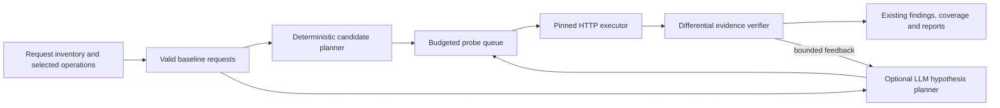

# LLM-guided DAST fuzzing plan

**Status:** Proposal for implementation and evaluation. No LLM-guided DAST engine is shipped by this document.

## Goal and decision

Use `nuguard.common.llm_client.LLMClient` to spend the active-fuzzing budget on the operations, input points, and techniques most likely to produce verifiable evidence. Keep Nuclei's bundled and standard passes; initially replace only its `-dast` pass behind an explicit opt-in. Compare three DAST arms: current Nuclei, a deterministic guided executor, and the same executor with an LLM planner. The deterministic arm establishes whether any gain comes from better request shaping and feedback rather than the model.

The model proposes *what to test next* from a closed set of safe techniques and, in a later phase, bounded payload variants. NuGuard builds and sends every request, enforces the budget and scope, and verifies every candidate finding. A model assertion alone never creates a vulnerability finding.



## Why the current run is a useful warning, not a benchmark result

The historical local log at `tests/apps/owasp-vulnerableapp/reports/vulnerableapp-test-20260926T195341Z.log` recorded 53 DAST templates, 5,439 requests reported as sent, 1,034 errors, and two matches. Its `5,439/70` progress counter used an estimated total; `70` was not a wire-request limit, and the displayed 7,770% is not meaningful coverage. The standard pass also ended with 2,544 of 18,676 estimated requests and 104 errors. The associated report marked coverage `degraded`. These facts suggest substantial request fan-out and uncertain test validity; they do **not** establish precision or recall. The local log is not a versioned benchmark artifact. The run predates the selector and finding-correlation fixes now in the branch, so it cannot be the A/B baseline.

NuGuard currently selects bounded operations and input points in `nuguard/pentest/inventory/selector.py`, compiles them to OpenAPI in `openapi_input.py`, and hands that document to Nuclei's DAST pass in `nuclei.py`. Those selection caps do not bound the number of requests produced by templates. Nuclei's [OpenAPI input documentation](https://docs.projectdiscovery.io/opensource/nuclei/input-formats) also describes generated placeholder values for optional parameters; a syntactically valid generated request may still be semantically invalid for a target. The new engine must measure valid baselines before interpreting failed probes as negative security results.

## Proposed execution contract

### 1. Preserve a typed request inventory

Carry selected `RequestSeed`, `RequestInputPoint`, and `RequestOperationIdentity` records from `openapi_input.py` into the guided engine, alongside the compiled OpenAPI document. Use the stable operation ID and canonical path for queueing, finding correlation, deduplication, coverage, and benchmark export. Preserve source confidence and route-family diversity from the current selector. Do not reconstruct input points from Nuclei output or infer them from a mutated URL.

Mark each selected operation as one of `baseline_valid`, `input_invalid`, `auth_blocked`, `transport_error`, `skipped_safety`, or `budget_omitted`, with a reason. A route that cannot be exercised is an explicit coverage gap. Route names and selection hints can guide priority, but cannot establish vulnerability type or a finding.

### 2. Establish an application-valid baseline

Build one scoped request for each eligible operation using its method, parameter locations, content type, and known required fields. Reuse existing target authentication through a credential-aware adapter and `pinned_request`/`RequestPacer` constraints from `nuguard/pentest/transport.py`; credentials never enter the planner. Where real values are needed, use safe fixture values supplied by the operator or validated discovery evidence; do not guess object IDs from arbitrary responses. Allow a small, bounded repair step for a missing or mistyped input, then mark the operation invalid if it still cannot be exercised.

Take a second baseline for dynamic or noisy responses. Store only normalized signals needed to compare later probes: status, response type and length, timing distribution, approved error signatures, and a scrubbed similarity fingerprint. Raw bodies, cookies, authorization headers, tokens, and parameter values stay out of model prompts and ordinary logs. An expected 4xx can be a valid baseline only when the operation's contract documents it and the tested input remains reachable; a login denial is `auth_blocked`.

### 3. Ask the model for ranked hypotheses, not requests

Batch a small set of valid operations (proposed maximum: 20 per call) into a structured prompt. Give the model only operation ID, method, route template, input name/location/type, content type, provenance, selection hints, and normalized baseline signals. Treat route and parameter names as untrusted data and delimit them in the prompt. Do not include the VulnerableApp solution key, benchmark labels, target secrets, raw responses, or live request values.

Require strict structured output with a schema equivalent to:

```json
{
  "probes": [
    {
      "operation_id": "op:...",
      "input_point": {"name": "q", "location": "query"},
      "technique": "sql_error_differential",
      "recipe_id": "sql_quote_control_v1",
      "priority": 0.8,
      "reason_code": "query_input_with_database_error_signal"
    }
  ]
}
```

The actual implementation should use Pydantic models with enum values for `technique`, `recipe_id`, and `reason_code`; referentially validate every ID against the selected inventory. The model may reorder or omit candidates, but cannot name a new host, URL, HTTP method, header, credential, request body, or unregistered technique. The deterministic planner reserves a small exploration floor across distinct route families and applicable techniques so the model cannot silently erase coverage. Deduplicate equivalent probes before dispatch. Rank by estimated evidence value divided by expected HTTP requests and latency, with source confidence and baseline validity as explicit factors.

Call `LLMClient.complete()` asynchronously in bounded batches. Its canned response on provider or credential failure, malformed JSON, schema failure, timeout, token exhaustion, or empty plan triggers the deterministic planner and a visible `llm_fallback` reason. `LLMClient.budget_tokens` is informational today; enforce call, input-token, output-token, and wall-time caps in the guided planner. Cache only secret-free plans keyed by inventory fingerprint, model ID, prompt version, and technique catalog version. Require no more than one initial plan and one feedback replan per batch; never make a model call per HTTP request.

### 4. Execute cheap probes first and verify the effect

For each valid operation, run a minimal, typed set of non-destructive probe recipes. Initial families can cover error/differential SQL or NoSQL injection, reflected XSS canaries, path traversal, command injection using harmless markers, and redirect behavior where the input shape supports them. Add SSRF only with an in-scope, non-external observation method. Keep stateful authorization/IDOR testing out of this phase until two authorized identities and a dedicated contract exist. The technique catalog is reviewed and generic; no route-specific or benchmark-key logic belongs in production.

Use staged escalation:

1. Send a baseline and a cheap probe/control pair. Stop a technique when both behave equivalently and no relevant signal appears.
2. On a signal, send a confirming variant and a matched negative control. A changed status alone is insufficient.
3. Use expensive timing probes only when enabled, after stable timing baselines, and repeat controls to account for jitter. Stop on a timeout/error circuit breaker.

For each candidate finding, require a payload-linked, reproducible effect with an independent control. Reflection requires the injected marker in the right response context; error signatures must be absent from the baseline; timing needs a sustained difference from controls; redirects need a validated `Location`. Reuse the reviewed classification registry and current verification/reporting path. Emit evidence tied to the canonical method/path, input point, technique, request IDs, control outcomes, and verifier version. If evidence is inconclusive, record `unverified` or a coverage reason, not a positive finding. The model never judges its own probes.

An optional later phase may accept model-proposed *payload variants* for a catalogued technique. A local grammar must bound encoding, characters, size, and destination; reject anything outside it before transmission. This phase is justified only if it improves verified recall over model ranking of fixed recipes. Keep raw payloads out of model prompts where they could include observed secrets.

### 5. Make resource and safety limits hard

Proposed initial defaults for evaluation, to tune against measurements:

| Limit | Initial value | Accounting rule |
| --- | ---: | --- |
| Guided DAST requests per target | 2,000 | Count every attempted HTTP transaction, including baseline, controls, confirmation, and retries; stop before dispatch at the cap. |
| Requests per operation | 24 | Prevent one noisy operation consuming the target budget. |
| Requests per input point | 8 | Advance only after an attributable signal. |
| Verification reserve | 20% of target budget | Do not exhaust the budget on first-pass probes. |
| Model plans | At most 2 per batch of 20 operations | Bound cost and prevent request-by-request prompting. |
| Model call timeout | 20 seconds | Fall back without stalling the scan. |

Apply the existing target, authorization acknowledgment, `--allow-active-fuzzing`, rate, concurrency, request timeout, scan timeout, pinned-origin/IP, response-size, and redirect controls. Maintain a thread-safe ledger for every guided request to each target, while the existing whole-scan timeout still covers all passes. Restrict probes to approved method/path pairs: read-only methods by default, with POST forms only where the route is known to be non-destructive or explicitly approved in the test scope. Reject destructive writes and external callbacks, and avoid brute force, denial of service, persistence, and out-of-scope probes. Pause a target on repeated transport failures; report the skipped work as degraded coverage. Never issue a request solely because the model asks for it.

## Integration points and reporting

- `openapi_input.py` / inventory: return the selected typed seeds and identities with provenance to the runner. Keep OpenAPI generation for the Nuclei arm.
- New `nuguard/pentest/guided/` package: typed plan and probe catalog, deterministic and LLM planners, budget ledger, executor, and differential verifier. It owns DAST only and reuses the existing transport and auth mechanisms.
- `runner.py`: choose a DAST executor; keep bundled and standard Nuclei passes. Feed guided findings through the same verification, classification, correlation, risk, remediation, and report assembly stages. Use one scan ID and write JSON, Markdown, and benchmark artifacts atomically so they cannot represent different runs.
- `models.py`, `public_api.py`, CLI/YAML: propose `pentest.dast_engine: nuclei | guided` (default `nuclei`) and `pentest.guided_planner: deterministic | llm` (default `deterministic` when guided). Accept a distinct optional `dast_llm_client` while reusing the configured provider credentials; do not conflate it with the current `remediation_llm_client`. Keep the synchronous API usable and integrate async `LLMClient.complete()` without nesting event loops inside the public `asyncio.to_thread` path. Implementing these public fields requires the repository's Pydantic interface skill, schema updates, compatibility tests, docs, and credential-redaction checks.
- Progress and coverage: name the pass `dast` in existing stream semantics; include per-operation and per-technique counts for selected, baseline-valid, attempted, verified, omitted, and errored work. Track actual requests separately from Nuclei's estimated request total. Surface model fallback and verification failures. Zero findings with invalid baselines or budget omissions is not a clean result.

## Evaluation protocol

1. **Refresh the baseline.** Run the [VulnerableApp script](../../tests/apps/owasp-vulnerableapp/vulnerableapp-pentest.sh) from the current commit against a pinned app build. Freeze the SBOM, target, auth state, Nuclei binary version, template corpus digest, selected inventory, and resource settings. Save versioned, secret-free baseline metrics and separate bundled, DAST, and standard pass metrics. Do not judge the new DAST arm against the old September log.
2. **Compare three arms.** Run Nuclei DAST, deterministic guided DAST, and LLM-guided DAST on the same selected inventory and target state. Keep Nuclei's other passes outside the DAST efficiency denominator. Include end-to-end totals separately to detect a shifted cost. Measure real outbound transactions through a test proxy or target-side counter where possible; retain Nuclei's scanner counter as a separate field. Report both a full run and a request-matched checkpoint because Nuclei does not currently share the proposed hard transaction budget.
3. **Use blinded ground truth.** Evaluate against the VulnerableApp solution key *after* scans finish, matching canonical method/path and vulnerability class/CWE. Do not expose the key to the planner, probe catalog, or runtime code. Add at least one unrelated application and hold out some routes to test whether the policy generalizes. Repeat each arm at least three times, alternating order, and report medians and run-to-run spread.
4. **Score valid evidence.** Report verified unique true positives, false positives, precision, recall where ground truth is complete, finding classification/correlation rate, valid-baseline and route-family coverage, transport and application-invalid request rates, HTTP transactions per verified true positive, DAST wall time, model calls/tokens/cost, and fallback frequency. Keep false positives and unknown coverage visible even when no findings are returned.

**Acceptance gates for an opt-in pilot:** median DAST transactions at least 40% below the fresh Nuclei baseline and DAST wall time at least 30% lower; verified recall at least as high on every fixture, with a gain on VulnerableApp if the baseline misses known classes; precision no worse than baseline, with no unexplained new false positives; valid-baseline and route-family coverage no lower at a comparable request checkpoint; zero scope or safety violations. The LLM arm must also beat the deterministic arm on at least one prespecified accuracy or cost-normalized metric, or the deterministic arm should ship alone. Provider failure must produce a complete deterministic run with an explicit fallback marker. These are release criteria, not claims of current performance.

## Delivery sequence

| Phase | Work | Evidence to advance |
| --- | --- | --- |
| 0. Instrument | Capture fresh Nuclei baseline, request counters, selected inventory and error categories. Fix request-validity reporting before optimizing. | Reproducible three-run baseline; no `estimated requests` mistaken for a cap. |
| 1. Deterministic guided DAST | Preserve typed inventory; build safe request shapes, budget ledger, cheap recipes, controls, and verifier. Integrate findings and coverage. | Contract tests for scope/auth/budget and seeded vulnerable plus non-vulnerable fixtures; baseline comparison. |
| 2. LLM planner | Add structured `LLMClient` ranking, bounded async batching, prompt redaction, caching, fallback, and model telemetry. | Malformed/canned/timeout/prompt-injection tests; three-arm comparison and incremental value over Phase 1. |
| 3. Adaptive variants | Add one bounded feedback replan and, only if needed, grammar-checked model payload variants. | Demonstrated recall or cost gain without false-positive or safety regression. |
| 4. Pilot | Public configuration/schema/docs, stream compatibility, opt-in rollout and benchmark dashboard. | Acceptance gates above, public API contract tests, and stable cross-app results. |

## Open implementation decisions

- Which safe fixture values may be supplied per target, and how should the scanner mark operations that need unavailable state or multiple principals? Default: omit with a reason.
- Should the LLM provider be allowed to see route templates for a given deployment? Default: explicit `guided_planner: llm` opt-in with secret-free structural prompts; deterministic guided scanning remains available.
- Which technique families have sufficiently strong generic controls and classifiers for the first pilot? Select them by verifier quality and application-valid requests, not by the benchmark key.

## Source anchors

Repository: `nuguard/pentest/inventory/models.py`, `inventory/selector.py`, `openapi_input.py`, `nuclei.py`, `runner.py`, `transport.py`, `verification.py`, `classification.py`, `coverage.py`, `public_api.py`, and `nuguard/common/llm_client.py`. External behavior: [ProjectDiscovery Nuclei input formats](https://docs.projectdiscovery.io/opensource/nuclei/input-formats) and [Nuclei repository](https://github.com/projectdiscovery/nuclei). Pin the installed versions during evaluation; upstream behavior can change.
