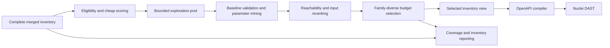

# DAST Endpoint Prioritization

Status: proposed

Related designs:

- [Pentest Request Discovery and Coverage](pentest-request-coverage.md)
- [Pentest Finding Correlation, Benchmark Matching, and Risk Score](pentest-finding-correlation-and-risk-score.md)

## Summary

NuGuard must preserve the complete discovered HTTP inventory for coverage reporting while
sending only a deterministic, high-value, bounded subset to active DAST. Selection occurs
before expensive parameter mining and again after request validation. It is generic to any
HTTP application and must not use benchmark findings, application names, or fixture-specific
route allowlists.

The initial defaults are:

- no more than 50 DAST operations;
- no more than 80 named input points;
- no more than three operations from one normalized route family; and
- an exploration pool no larger than twice the final operation and input-point budgets.

These are soft execution budgets. Existing scope, authorization, rate, request, timeout, and
hard operation limits remain authoritative.

## Problem

The original VulnerableApp scan had zero structurally fuzzable operations. Structured Java
request extraction, merged discovery, crawling, and parameter mining fixed that starvation,
but exposed the opposite scaling problem:

| Current VulnerableApp inventory | Count |
|---|---:|
| Compiled operations | 190 |
| Input-bearing operations | 142 |
| Named input points | 171 |
| GET operations | 157 |
| POST operations | 33 |
| Operations without known input points | 48 |

DAST cost grows approximately with
`input points × applicable templates × payload variants`. Passing the whole inventory to
Nuclei makes a timeout select an accidental prefix of work. Increasing the timeout alone
does not ensure that distinct routes, methods, body types, and input locations are exercised.

The missing capability is therefore selection after broad discovery: NuGuard currently
merges and mines request seeds, compiles them to OpenAPI, and applies a hard operation cap,
but does not rank operations by expected DAST value and cost.

## Goals

1. Keep discovery broad and lossless for coverage reporting.
2. Bound parameter mining as well as DAST execution.
3. Prefer reachable operations with real request inputs.
4. Preserve method, content-type, input-location, and route-family diversity.
5. Produce identical output for identical input regardless of discovery order.
6. Let operators explicitly include or exclude same-scope paths.
7. Expose selection counts without leaking request values or credentials.
8. Apply the same behavior through YAML, CLI, Python, streaming, and platform interfaces.

## Non-goals

- Predicting whether a particular endpoint is vulnerable.
- Reading VulnerableApp benchmark data before or during selection.
- Adding application-specific route names, payloads, templates, or parameter maps.
- Replacing host-level Nuclei templates or finding verification.
- Treating a prioritized sample as complete-inventory vulnerability coverage.

## Processing model



Selection creates an immutable view. It never deletes or mutates the complete inventory.
OpenAPI compilation happens only after final selection, so the engine cannot consume scan
time on omitted operations.

## Selection inputs

Extend the internal immutable request seed with structured selection facts:

```python
@dataclass(frozen=True, slots=True)
class RequestSelectionHints:
    accepts_user_input: bool = False
    returns_sensitive_data: bool = False
    idor_surface: bool = False
    unresolved_input_surface: bool = False
    route_kind: str | None = None

@dataclass(frozen=True, slots=True)
class RequestSeed:
    method: str
    path_template: str
    content_types: tuple[str, ...] = ()
    inputs: tuple[RequestInputPoint, ...] = ()
    confidence: float = 0.5
    sources: tuple[str, ...] = field(default_factory=tuple)
    selection_hints: RequestSelectionHints = field(
        default_factory=RequestSelectionHints
    )
```

Discovery adapters populate hints only from structured evidence. Boolean hints merge with
OR. Hints contain no raw source text, request values, responses, headers, or credentials.
The selector must not reparse arbitrary signatures or SBOM extras.

## Stage 1: exploration pool

Rank all seeds using evidence available without new target requests. A seed is eligible when
at least one condition holds:

- it has a named path, query, header, cookie, JSON, form, or multipart input;
- structured evidence says it accepts input but the input names are unresolved;
- an HTML form or captured request supplies its request shape; or
- an explicit include pattern matches it.

Informational routes remain available to the host-level scan and coverage report but do not
consume DAST budget unless explicitly included.

The pool is limited to twice the configured final operation budget and twice the known
input-point budget. An unresolved input surface reserves one point for accounting. Mining
requests remain subject to `max_parameter_candidates` and all global rate, concurrency,
retry, request-timeout, and scan-timeout limits.

## Stage 2: final selection

After baseline validation and mining, rerank the exploration pool using confirmed
reachability and named inputs. Select under both the operation and input-point budgets.

An operation is atomic in version 1: NuGuard does not remove individual fields from its
request shape to make it fit. A non-mandatory operation that would cross either remaining
budget is skipped and selection continues. An explicitly included operation can exceed a
soft budget but can never exceed a hard cap.

### Version 1 score

Use additive, versioned signals with deterministic reasons:

| Signal | Weight |
|---|---:|
| Reachable baseline, or route-specific validation/auth response | +30 |
| At least one confirmed named input point | +25 |
| JSON, form, or multipart body input | +18 |
| Query or path input | +15 |
| Cookie or non-credential header input | +10 |
| Explicit capture or OpenAPI evidence | +12 |
| Live contract or HTML form evidence | +10 |
| Structured SBOM evidence | +8 |
| POST, PUT, or PATCH with a real body shape | +8 |
| Generic security-relevant input semantics | +6 once |
| `accepts_user_input` hint | +5 |
| `returns_sensitive_data` hint | +5 |
| `idor_surface` hint | +5 |
| Only mined or guessed evidence, not confirmed | -8 |
| No named or unresolved input surface | -30 |
| Input-free static, documentation, health, or scanner-metadata route | -25 |

Generic security-relevant terms include `url`, `redirect`, `file`, `path`, `query`,
`search`, `command`, `token`, `username`, `password`, `upload`, `import`, `export`, and
`callback`. They are application-neutral hints and contribute only once per operation.
A vulnerability name in a route receives no special treatment.

Confidence contributions must be clamped so source confidence cannot outweigh a confirmed
input point. Final ties use `(method, path, content types, input signature)`.

## Diversity and route families

A global score sort allows repeated variants from one controller to monopolize the budget.
Build a family key from the normalized route skeleton by replacing:

- declared path parameters;
- numeric, UUID, and hex-ID segments; and
- trailing `name_123` and `name-123` variant suffixes.

For example, `/orders/1`, `/orders/2`, and `/orders/{id}` share a family. This also groups
benchmark-style level variants without encoding a benchmark convention.

Selection proceeds as follows:

1. Sort operations within each family by score and the stable tie-breaker.
2. Reserve 60% of the operation budget for one best representative per family.
3. Fill the remaining 40% using the best marginal
   `score / max(1, input_points)` candidate.
4. Allow at most three operations from one family by default.
5. Before adding a second equivalent variant, retain a representative for each available
   method, content-type class, and input-location class.

No random sampling is used.

## Configuration and validation

Add the following YAML and equivalent CLI/public request fields with
CLI > YAML > default precedence:

```yaml
pentest:
  dast_selection: prioritized       # prioritized | all
  max_dast_operations: 50
  max_dast_input_points: 80
  max_dast_operations_per_family: 3
  dast_include_paths: []            # normalized same-scope glob patterns
  dast_exclude_paths: []
```

Pydantic validation must use identical constraints at every public boundary:

| Field | Constraint |
|---|---|
| `max_dast_operations` | 1 through 200 |
| `max_dast_input_points` | 1 through 400 |
| `max_dast_operations_per_family` | 1 through 20 |
| include/exclude patterns | at most 50 each |

Reject absolute URLs, traversal, backslashes, control characters, and patterns that can
expand scope. Excludes run before scoring. Includes run first and consume soft budgets. If
expanded includes exceed a hard cap, fail after discovery but before baseline/mining
requests rather than silently omitting requested operations.

`dast_selection: all` bypasses scoring but retains hard operation/input caps and existing
request, rate, timeout, authorization, and scope controls. An operator-provided OpenAPI
document is authoritative discovery evidence, not permission for unbounded execution.

Defaults are independent of inventory size so runtime remains predictable across application
types.

## Public result and reporting

Add an optional typed selection result to public coverage:

```python
class PentestDastSelectionResult(BaseModel):
    strategy: Literal["prioritized", "all"]
    score_version: str = "v1"
    operations_considered: int
    operations_eligible: int
    operations_selected: int
    operations_omitted_by_budget: int
    operations_excluded_no_inputs: int
    input_points_considered: int
    input_points_selected: int
    families_considered: int
    families_selected: int
    include_overrun: bool = False
```

`PentestCoverageResult` gains
`dast_selection: PentestDastSelectionResult | None = None`. The optional default preserves
construction and deserialization compatibility for existing consumers. NuGuard-produced
results populate it whenever DAST selection runs.

Selection telemetry contains aggregate counts only. Default logs, stream events, errors,
cache keys, and public results must not expose request values, bodies, captured headers,
cookies, credentials, or raw responses. Verbose Markdown may show sanitized selected and
omitted method/path pairs.

Prioritization alone does not make coverage `degraded`. Coverage status reports whether the
selected work executed successfully. Reports separately identify the run as a prioritized
sample and show operation, family, and input-point breadth. Selecting zero eligible
operations is `insufficient`.

## Implementation

1. Add `nuguard/pentest/inventory/selector.py` with pure functions for normalization,
   eligibility, scoring, family grouping, and two-stage selection.
2. Extend `RequestSeed` and merge behavior with `RequestSelectionHints`.
3. Invoke exploration selection in `resolve_openapi_spec()` after `merge_seeds()` and before
   `mine_query_parameters()`.
4. Invoke final selection after mining and before `seeds_to_openapi()`.
5. Thread configuration through internal `PentestConfig`, YAML loading, CLI request options,
   and `PentestRunRequest` without changing existing names or imports.
6. Add internal and public typed selection results; populate JSON, Markdown, text, SARIF
   properties, and terminal stream summaries.
7. Register the new public model in
   `tests/contracts/test_public_api_schema_contract.py`, regenerate
   `tests/contracts/public_api.schema.json`, and inspect the schema diff.
8. Preserve the complete inventory for coverage calculations and future scan tiers.

The selector operates on internal dataclasses. Public models expose configuration and
aggregate results only. All public values must round-trip through
`model_dump(mode="json")` and validation.

## Verification

### Unit and contract tests

- identical selection regardless of discovery order;
- stable score and tie-break behavior;
- exploration-pool operation and input-point bounds;
- final operation and input-point budget enforcement;
- atomic operation handling at a budget boundary;
- family normalization and the per-family cap;
- method, content-type, and input-location diversity;
- include priority, soft-budget overrun, hard-cap failure, and exclude precedence;
- unsafe-pattern rejection and same-scope enforcement;
- `all` mode retaining hard caps;
- configuration precedence and matching validation constraints;
- public JSON round trips, optional-field backward compatibility, and schema snapshot;
- monotonic streaming with exactly one sanitized terminal event; and
- absence of credentials, cookies, request values, bodies, and response fragments in every
  serialized result and error path.

### Generic integration fixtures

Exercise server-rendered GET forms, POST forms, multipart upload, OpenAPI JSON APIs,
SBOM-only APIs, SPAs with literal requests, GraphQL-over-HTTP, and mounted applications.
Assertions target selected operations and coverage rather than vulnerability findings.

### VulnerableApp acceptance

- the full inventory remains available for reporting;
- prioritized mode selects at most 50 operations and 80 input points unless explicit
  includes cause a reported soft-budget overrun;
- selected operations cover available route families and input-location classes before
  repeated variants;
- DAST starts with non-zero structurally fuzzable operations;
- coverage is not `insufficient`;
- at least one stable injection-style route produces a confirmed finding;
- benchmark coverage is greater than zero on two consecutive runs; and
- production code contains no VulnerableApp-specific allowlist, route map, payload, template,
  or benchmark-data read.

Do not use a high benchmark percentage as the first gate. Bounded generic DAST does not
cover every business-logic, cryptographic, JWT, rate-limit, or stateful vulnerability class.

## Rollout

Ship prioritized mode as the default and retain `all` as an explicit compatibility escape
hatch. Compare runtime, selected breadth, request errors, findings, and benchmark coverage
across two consecutive fixture runs. Tune generic weights or defaults only from aggregate
cross-application evidence; do not tune against individual VulnerableApp route labels.

Rollback is configuration-only: select `all` while keeping the inventory and telemetry
changes. Removing result fields or changing their meaning requires a separate compatibility
review.
