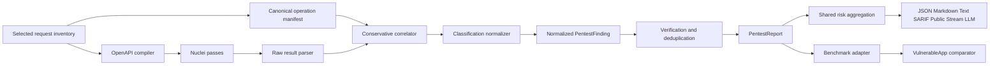

# Pentest Finding Correlation, Benchmark Matching, and Risk Score Plan

**Status:** Proposed

**Scope:** Pentest finding provenance and classification, multi-format artifact consistency,
VulnerableApp benchmark conversion, scanner execution diagnostics, and severity-based risk
scoring across internal reports, public APIs, streams, and report formats.

**Related specifications:**

- [Pentest Request Discovery and Coverage](pentest-request-coverage.md)
- [DAST Endpoint Prioritization](dast-endpoint-prioritization.md)

## Decision

Treat a scanner match as two related but different locations:

1. the immutable canonical operation NuGuard selected, such as
   `GET /ErrorBasedSQLInjectionVulnerability/LEVEL_1`; and
2. the engine's mutated evidence location, such as
   `/ErrorBasedSQLInjectionVulnerability;/LEVEL_1`.

Findings retain both. Correlation, deduplication, and benchmark export use the canonical
operation. Evidence display uses the mutated location. A finding is benchmark-exportable only
when it has a canonical operation and at least one independently justified classification axis
(`type`, CWE, or WASC).

Calculate the pentest's overall risk score with the same severity aggregation helper and
fallback weights used by Redteam. Compute it once from normalized findings and expose the same
0-100 value in Markdown, text, JSON, SARIF, public result models, streaming terminal data, and
the LLM executive-summary prompt.

## Current evidence and root causes

### Artifacts represent different runs

The current fixture outputs are not one coherent result:

- `vulnerableapp-pentest.md` was generated at 2026-09-25 22:36 UTC and reports zero findings;
- `vulnerableapp-pentest.json` was generated at 2026-09-25 21:01 UTC and contains seven
  `sqli-error-based` findings; and
- `vulnerableapp-benchmark-coverage.json` was generated from the earlier JSON report.

The fixture has separate Markdown-only and JSON-plus-benchmark scripts. A user can therefore
compare a report from one scan with benchmark coverage from another without a shared run
identifier detecting the mismatch.

### Already-detected findings cannot match

The seven JSON findings have two correlation defects:

1. `matched_at` is the fuzzed attack URL. Four otherwise useful results contain an injected
   semicolon in the route, for example
   `/ErrorBasedSQLInjectionVulnerability;/LEVEL_1`, while the discovered operation is
   `/ErrorBasedSQLInjectionVulnerability/LEVEL_1`.
2. The installed Nuclei `sqli-error-based` template does not declare `classification.cwe-id`.
   NuGuard consequently stores an empty classification object.

The benchmark converter reads only `matched_at` and Nuclei classification. It submits URL-only
entries when classification is absent. VulnerableApp requires URL agreement plus at least one
matching type, CWE, or WASC axis, so those entries receive no credit. The benchmark response
also reports zero unmatched items because unusable URL-only entries are effectively ignored,
which hides the conversion failure.

If the four route-specific SQL-injection findings are confirmed, correlated back to their
canonical operations, and classified as `CWE-89` or `ERROR_BASED_SQL_INJECTION`, the expected
first improvement is at least 4 detected items out of 163 (approximately 2.45%). This is an
acceptance hypothesis, not a claimed result until a fresh benchmark run proves it.

### The latest zero-finding scan is degraded

The latest Markdown report discovered 190 operations and selected 37 operations/48 input
points across all 14 route families. Its DAST pass recorded 1,644 requests, 1,674 errors, and
zero matches. The standard pass completed only 14%. This is not evidence that the application
is clean; it is an execution-quality problem that must be diagnosable by error category.

### Risk scoring is only partially shared

`nuguard.pentest.reporting.render_markdown()` already converts pentest findings to the common
`Finding` model and calls Redteam's `aggregate_score()`. The remaining surfaces do not use or
expose that value:

- `PentestReport.to_dict()` has no risk score;
- text and SARIF omit it;
- `PentestRunResult` and `PentestExecutionResult` omit it;
- the terminal streaming result omits it; and
- `pentest_executive_summary()` does not receive it.

The Markdown renderer is therefore the de facto owner of a value that belongs to the scan
result. Other formats can diverge or remain incomplete.

## Goals

1. Correlate engine findings to a canonical request operation without using benchmark ground
   truth or application-specific route knowledge.
2. Preserve mutated request evidence without using it as the finding's identity.
3. Normalize classifications from engine metadata or a reviewed, application-neutral template
   taxonomy.
4. Refuse to benchmark-export structurally unusable findings and explain every rejection.
5. Generate all fixture artifacts from one scan and prove their shared identity.
6. Make DAST request failures actionable rather than an aggregate counter.
7. Improve benchmark recall with generic detection and stateful verification techniques.
8. Use one severity-based overall risk calculation across Pentest and Redteam.
9. Preserve public imports, existing request fields, authorization behavior, and credential
   redaction.

## Non-goals

- Reading `/scanner/dast`, benchmark output, or route vulnerability names during production
  discovery, selection, classification, or verification.
- Assigning a benchmark type merely because a route name resembles that type.
- Submitting SAST-only evidence as a DAST finding.
- Claiming that a non-zero benchmark score represents complete security coverage.
- Changing Redteam's NGRS factor model or severity bands.
- Making scan risk depend on benchmark coverage percentage.
- Treating a risk score of zero on a degraded scan as evidence of low inherent risk.

## Architecture



Production scanning ends at the normalized report. The VulnerableApp adapter remains a test
fixture consumer of that generic output.

## 1. Canonical operation manifest

### Identity model

Add an immutable operation identity alongside the selected seed view:

```python
@dataclass(frozen=True, slots=True)
class RequestOperationIdentity:
    operation_id: str
    target_origin: str
    method: str
    path_template: str
    content_types: tuple[str, ...]
    input_signature: tuple[tuple[str, str], ...]
```

`operation_id` is a stable hash of sanitized structural values. It must never include query
values, request bodies, authentication material, cookies, or captured headers.

Extend `ResolvedOpenApiSpec` with the final selected identities and the existing selection
manifest hash. The inventory remains the source of truth; the compiled OpenAPI document is only
engine transport.

### Engine correlation

Create `nuguard/pentest/finding_correlation.py`. It receives one parsed engine result and the
selected manifest for that target.

Correlation order:

1. use an engine-provided stable operation identifier if a verified Nuclei/OpenAPI integration
   can propagate one;
2. exact method plus normalized canonical path;
3. unique method plus path-template match after replacing declared path parameters;
4. unique conservative match between the mutated request path and a selected canonical path,
   allowing only mutations proven by the engine result/request metadata; and
5. otherwise leave the operation unresolved.

Do not choose the nearest route when two candidates tie. Ambiguous findings remain reportable
with mutated evidence but are not benchmark-exportable. The correlator returns a status and
reason (`exact`, `template`, `mutation_reconciled`, `ambiguous`, or `unresolved`) for aggregate
diagnostics.

Raw request/response data may be inspected transiently for correlation but must not be stored in
the report, logs, stream, exception, cache key, or manifest. Existing authenticated-scan error
suppression remains authoritative.

### Finding fields

Add optional fields to the internal `PentestFinding`:

```python
canonical_method: str | None = None
canonical_path: str | None = None
operation_id: str | None = None
input_name: str | None = None
input_location: Literal[
    "path", "query", "header", "cookie", "json", "form", "multipart"
] | None = None
correlation_status: Literal[
    "exact", "template", "mutation_reconciled", "ambiguous", "unresolved"
] = "unresolved"
cwe_ids: tuple[str, ...] = ()
wasc_ids: tuple[str, ...] = ()
vulnerability_types: tuple[str, ...] = ()
classification_source: Literal[
    "engine", "template_registry", "verified_detector", "none"
] = "none"
```

Keep `matched_at` unchanged as sanitized attack evidence. Additive defaults preserve direct
construction by existing tests and consumers. `to_dict()` emits JSON-safe lists and never emits
raw request material.

## 2. Classification normalization

Create `nuguard/pentest/classification.py` with one normalization path:

1. normalize engine-provided `cwe-id`/CVE data;
2. apply an exact-template registry only when the template identifier and matcher semantics have
   been reviewed;
3. apply a classification emitted by a NuGuard-owned verified detector; and
4. otherwise leave the finding unclassified.

The registry is generic scanner metadata, not a benchmark translation table. Example:

```python
TEMPLATE_CLASSIFICATIONS = {
    "sqli-error-based": Classification(
        cwe_ids=("CWE-89",),
        vulnerability_types=("ERROR_BASED_SQL_INJECTION",),
    ),
}
```

Requirements:

- prefer engine metadata over the registry;
- accept only canonical `CWE-N` values after validation;
- never infer from free-form title, description, tags alone, target response text, or route name;
- document the evidence for each registry entry beside its tests;
- test that unrelated template identifiers receive no classification; and
- expose classification provenance so downstream users can distinguish engine metadata from
  NuGuard normalization.

Exact vulnerability types are preferable when template semantics prove a precise technique.
Use CWE as a broader fallback when the detector proves only a weakness family.

## 3. Verification and false-positive control

The existing `verification_status` field anticipates replay but currently marks findings
`engine_only`. Implement bounded attack/control verification for generic injection findings:

1. replay the canonical seed with a type-compatible benign control;
2. replay the engine attack value when safely recoverable;
3. require attack-specific evidence absent from the baseline/control;
4. retain `engine_only` when the template already provides an equivalent deterministic check but
   NuGuard cannot replay safely;
5. set `confirmed` only when NuGuard reproduces the differential; and
6. remove `rejected` findings from final report findings while retaining aggregate rejection
   diagnostics.

This is particularly important for the current SQL template matches on metadata-style endpoints
such as `/allEndPoint`, `/allEndPointJson`, and `/VulnerabilityDefinitions`, whose normal
responses may contain database-related strings.

Verification consumes the same target authorization, scope, rate, concurrency, retry, and
timeout budgets as scanning. It never follows an off-scope callback.

## 4. Benchmark adapter contract

Keep benchmark-specific behavior under `tests/apps/owasp-vulnerableapp`; production code only
supplies generic canonical findings.

Update `vulnerableapp_benchmark.py` to export:

- `url` from `canonical_path`, never `matched_at`;
- `method` only when canonical correlation is certain;
- exact `type` when present;
- otherwise a normalized CWE or WASC axis; and
- no finding that lacks both a canonical path and classification axis.

Before submission, print and optionally persist a sanitized conversion summary:

```text
findings_read=7
findings_exported=4
rejected_unresolved_operation=0
rejected_unclassified=3
deduplicated=0
```

Add `--strict` and make fixture automation use it. Strict mode fails before network submission
when:

- the report has findings but none are exportable;
- a finding claims a canonical path outside the configured app context;
- the report scan ID does not match the fixture run manifest; or
- duplicate canonical identity/classification entries disagree.

Do not silently convert `matched_at` by stripping punctuation: punctuation may be a legitimate
path character or attack payload. Correlation belongs in production normalization where the
selected operation manifest is available.

## 5. Atomic scan artifacts

Add a non-secret `scan_id` to `PentestReport`, public results, JSON, SARIF run properties, and
stream terminal results. Existing direct constructors receive a compatibility default; NuGuard
runs always populate a UUID or equivalent random identifier.

Implement one report-bundle writer that renders multiple formats from one in-memory
`PentestReport`. Preserve the existing single `--format/--output` interface. Add a repeatable,
additive output mechanism only after its CLI shape is covered by compatibility tests.

For the fixture, one orchestration must:

1. generate/resolve the SBOM;
2. run the pentest once;
3. render JSON and Markdown from that result;
4. write a small owner-only run manifest containing scan ID, timestamps, target, artifact paths,
   and SHA-256 hashes;
5. convert the JSON findings;
6. submit the benchmark payload; and
7. save the raw benchmark response plus the same scan ID in a local wrapper/sidecar.

Artifact replacement remains atomic and owner-only. A failed scan must not leave a new Markdown
report beside stale JSON/coverage files that appear related.

## 6. DAST execution quality

### Error diagnostics

Enable a temporary owner-only Nuclei error log for each pass. Parse it into a bounded,
secret-safe taxonomy such as:

- connect/DNS/TLS;
- request timeout;
- target reset/rate limit;
- invalid generated request;
- OpenAPI input/validation;
- template/runtime; and
- unknown.

Expose counts and the top sanitized reason codes, never raw request lines. Delete the raw error
log after aggregation. Authenticated scan failures retain the existing suppressed diagnostic.

Mark coverage `insufficient` when the selected DAST pass produces no successful requests, and
`degraded` when error ratio or pass truncation crosses the existing coverage threshold.

### Pass budgeting and order

When active fuzzing is explicitly requested, run the bounded, selected DAST pass before the
broad standard-template pass, or assign independent per-pass budgets so 10,000+ standard
templates cannot consume DAST time. Keep the bundled pass independent.

Add per-pass telemetry for start/end time, successful requests, categorized errors, matches,
and termination reason (`completed`, `timeout`, `host_error_cap`, `cancelled`, `failed`). Do not
use Nuclei's percentage estimate as NuGuard coverage.

### Valid request examples

Compile type-correct benign examples from the request inventory:

- integers use bounded integers rather than `string`;
- enums use a declared member;
- booleans use `false`;
- forms preserve their encoding;
- JSON preserves object structure; and
- multipart requests include bounded synthetic files.

Baseline validation should reject stable not-found routes, correct content-type/method evidence
within budget, and record shape failures. DAST should not spend payload variants on a request
that never reached its handler.

## 7. Adaptive endpoint and technique coverage

The first prioritized sample should remain bounded. Add two generic expansion mechanisms:

1. **Family expansion:** test additional siblings when a representative finds a vulnerability,
   differs in method/input shape, or has a materially different baseline fingerprint.
2. **Campaign rotation:** persist only sanitized operation identities and rotate through omitted
   operations over repeated CI runs. The same individual run stays deterministic; a campaign
   makes cumulative coverage explicit.

Apply detection techniques from request shape, never benchmark route names:

- scalar text/query inputs: SQL/LDAP/command injection and reflected XSS;
- path/file inputs: traversal and local-file inclusion;
- URL-like inputs: redirect and SSRF with an authorized self-hosted callback;
- XML bodies/uploads: XXE;
- multipart bodies: bounded upload plus safe retrieval verification;
- identifiers: differential IDOR with two authorized identities or public-object controls; and
- login/token/session workflows: bounded stateful checks for enumeration, fixation, logout,
  reset-token, JWT, and rate-limit behavior.

SAST/SBOM evidence may prioritize or shape a runtime hypothesis but cannot become a DAST finding
until an authorized live request verifies it.

## 8. Shared risk score

### Shared helper ownership

The current aggregator lives at `nuguard/redteam/risk_engine/risk_scorer.py` but operates on the
common `nuguard.models.finding.Finding`. Move the generic aggregation pieces to a neutral module,
for example:

```text
nuguard/risk/
  __init__.py
  aggregation.py
```

Move, without changing behavior:

- severity fallback weights;
- `aggregate_score(findings) -> float` returning 0-10; and
- `highest_severity(findings)`.

Re-export these names from `nuguard.redteam.risk_engine` and keep the old
`risk_scorer.py` import path as a compatibility wrapper. Redteam callers and tests must continue
to pass unchanged. NGRS factor scoring remains under Redteam.

Pentest uses `to_common_findings(report)` and the shared aggregator:

```python
def calculate_pentest_risk_score(report: PentestReport) -> float:
    common_findings = to_common_findings(report)
    return round(aggregate_score(common_findings) * 10, 1)
```

This preserves Redteam fallback semantics for pentest findings, which currently have no
per-finding NGRS score:

| Severity | Fallback contribution on 0-100 display scale |
|---|---:|
| Critical | 90 |
| High | 70 |
| Medium | 40 |
| Low | 10 |
| Info | 0 |

The result is the arithmetic mean of normalized finding contributions, exactly like Redteam.
Presentation-only grouping does not change the input list or score. Repeated findings of the same
severity do not inflate the mean merely because the issue appears at several URLs.

### Single calculation path

Add `nuguard/pentest/risk.py` as the only Pentest adapter to the shared helper. All consumers
call it rather than importing Redteam or recreating weights:

- Markdown `Overall Risk Score`;
- text `Overall risk score`;
- JSON `summary.risk_score`;
- SARIF `runs[0].properties.riskScore`;
- `PentestRunResult.risk_score` and inherited `PentestExecutionResult`;
- the terminal stream result; and
- `LLMSummaryGenerator.pentest_executive_summary(risk_score=...)`.

Add `risk_score: float = Field(default=0.0, ge=0.0, le=100.0)` to the additive public result
model. The compatibility default preserves direct construction. NuGuard-produced results always
populate the computed value. Do not accept a caller-provided risk override in `PentestRunRequest`.

Bump the file report schema from `1.1` to `1.2` for the additive summary field. Existing findings
and coverage shapes remain unchanged.

### Coverage language

Risk measures the severity mix of reported findings. Coverage measures how much authorized work
executed successfully. They are independent:

- `risk_score=0`, sufficient coverage: no reported findings in a completed bounded scan;
- `risk_score=0`, degraded/insufficient coverage: unknown risk due to coverage gaps; and
- positive risk with degraded coverage: known findings exist and additional risk may remain.

Every human-readable report must place coverage next to the score or retain the existing
coverage warning. The LLM prompt receives both risk and coverage status so it cannot describe a
degraded zero as low risk.

## 9. Public interface and compatibility

Follow the Pydantic interface workflow for every additive field:

1. preserve existing `PentestRunRequest`, `PentestRunResult`, and
   `PentestExecutionResult` imports and call signatures;
2. add optional/defaulted result fields only;
3. make `model_dump(mode="json")` round-trip;
4. update the stream reducer and preserve monotonic sequence/progress, settled cancellation, and
   exactly one terminal event;
5. register any new public model in
   `tests/contracts/test_public_api_schema_contract.py`;
6. regenerate `tests/contracts/public_api.schema.json` and inspect the diff;
7. update JSON schema version documentation; and
8. prove credentials, cookies, bodies, raw requests/responses, and mutation payloads do not enter
   results, events, logs, cache metadata, or errors.

The existing `findings: list[dict[str, Any]]` public field is retained during this additive
change to avoid changing Python access semantics. Canonical/classification keys are additive
inside each existing finding dictionary. A future typed-finding migration requires its own
compatibility design.

## Implementation phases

### Phase 0: regression fixtures and observability

- Freeze sanitized copies of the seven-finding JSON shapes as unit fixtures.
- Add a synthetic selected-operation manifest covering exact, mutated, ambiguous, and unresolved
  paths.
- Add conversion counters and dry-run payload output to the benchmark adapter.
- Capture sanitized DAST error categories in fixture logs.

Exit criterion: current failure modes reproduce without network access.

### Phase 1: shared risk aggregation

- Extract/re-export the generic aggregation helper without behavior change.
- Add `nuguard/pentest/risk.py`.
- Replace Markdown's renderer-local calculation with the adapter.
- Add the risk value to text, JSON, SARIF, public results, stream terminal result, and LLM summary
  input.
- Bump file schema to `1.2` and regenerate the public schema snapshot.

Exit criterion: every format reports the same risk value and all existing Redteam risk tests
remain unchanged and passing.

### Phase 2: canonical provenance

- Add operation identities and the selected manifest.
- Thread the manifest into Nuclei result normalization.
- Add conservative correlation and additive finding fields.
- Add aggregate correlation telemetry.
- Verify no sensitive request data is serialized.

Exit criterion: the four mutated ErrorBasedSQLInjection findings correlate to their canonical
paths in offline tests; ambiguous cases remain unresolved.

### Phase 3: classification normalization

- Add engine classification normalization.
- Add the reviewed exact-template registry and provenance.
- Update common-finding/remediation conversion to consume normalized CWE values.
- Reject unsupported or malformed classification values.

Exit criterion: `sqli-error-based` produces the expected generic classification without reading
the target route or benchmark data.

### Phase 4: strict benchmark conversion and atomic artifacts

- Export canonical paths and classification axes.
- Add strict preflight validation and conversion summary.
- Add scan ID and one-run artifact bundle generation.
- Update fixture scripts and README.

Exit criterion: JSON, Markdown, manifest, and benchmark response share one scan ID; stale mixing
is detected before submission.

### Phase 5: execution quality and verification

- Add per-pass error taxonomy and termination reason.
- Allocate/reorder pass budgets so selected DAST executes first.
- Compile type-correct request examples and validate baselines.
- Add bounded attack/control replay for supported generic findings.

Exit criterion: DAST no longer reports an unexplained error count at or above its request count,
and rejected false positives do not reach benchmark export.

### Phase 6: adaptive generic coverage

- Add family expansion and campaign rotation.
- Add high-yield request-shape-driven techniques incrementally.
- Track per-technique attempted, confirmed, rejected, and unsupported counts.

Exit criterion: benchmark improvement is repeatable without production benchmark-specific route
or type logic.

## Test plan

### Risk calculation

- no findings → `0.0`;
- one critical without NGRS → `90.0`;
- one high without NGRS → `70.0`;
- one critical plus one high → `80.0`;
- info-only → `0.0`;
- values remain within 0-100;
- Markdown, text, JSON, SARIF, public result, stream result, and LLM prompt agree exactly;
- Redteam import paths and aggregate results remain unchanged; and
- degraded zero-finding output says risk is unknown beyond tested coverage, not low.

### Correlation and classification

- exact canonical path;
- query mutation with unchanged path;
- semicolon/postfix mutation reconciled to one selected operation;
- declared path-parameter mutation;
- two equally plausible candidates remain ambiguous;
- off-target/off-mount result remains unresolved;
- exact template registry classification;
- engine classification precedence;
- no inference from tags/title/route name; and
- serialization contains no raw request, cookie, token, body, or response.

### Benchmark adapter

- canonical path strips the configured context exactly once;
- query strings do not affect exported URL;
- type, CWE, and WASC axes normalize correctly;
- URL-only findings are rejected with a counter;
- unresolved/ambiguous findings are rejected;
- exact duplicates collapse;
- conflicting duplicates fail strict mode;
- dry-run performs no network request;
- report/manifest scan-ID mismatch fails; and
- the four confirmed ErrorBasedSQLInjection fixture findings form valid payload entries.

### Execution and artifact lifecycle

- each pass has independent timing and termination status;
- error logs are owner-only and deleted after aggregation;
- authenticated raw diagnostics stay suppressed;
- cancellation produces one terminal event and cleans temporary files;
- bundle writes are atomic and do not mix old/new formats; and
- failed benchmark submission preserves the scan report and sanitized payload for diagnosis.

## Validation commands

Run focused checks first:

```bash
uv run pytest tests/pentest/test_risk.py tests/pentest/test_finding_correlation.py -q
uv run pytest tests/apps/owasp-vulnerableapp/test_vulnerableapp_benchmark.py -q
uv run pytest tests/pentest/test_reporting.py tests/pentest/test_public_api.py -q
uv run pytest tests/contracts/test_public_api_schema_contract.py -q
```

Then validate the complete affected boundary:

```bash
uv run pytest tests/pentest tests/redteam/test_risk_engine.py -q
uv run ruff check nuguard/pentest nuguard/risk tests/pentest
uv run mypy nuguard/
git diff --check
```

Run the authorized VulnerableApp workflow only after offline tests pass. Execute it twice to
separate deterministic behavior from a one-off target or network condition.

## Acceptance criteria

### First milestone

- one scan produces JSON, Markdown, and benchmark artifacts with one scan ID;
- risk score is identical in every format and public result;
- at least the four route-specific SQL-injection findings correlate and carry justified
  classification;
- strict conversion submits no URL-only findings;
- fresh benchmark coverage is greater than zero on two consecutive runs; and
- conversion and scan coverage diagnostics explain every omitted finding.

### Completion

- production code has no VulnerableApp route allowlist, expected-vulnerability map, or benchmark
  API read;
- selected DAST executes within its configured budget with categorized errors and truthful
  coverage;
- confirmed findings retain canonical identity and mutated evidence;
- false positives rejected by controls do not affect benchmark or risk score;
- public schema, compatibility, streaming, redaction, and cancellation contracts pass; and
- benchmark recall improves through generic technique coverage while unmatched/false-positive
  counts remain visible.

## Rollback

The changes are additive. If canonical correlation causes an engine regression, continue
reporting the sanitized `matched_at` finding with `correlation_status="unresolved"` and disable
benchmark export for that finding; never fall back to silently guessing a canonical path.

If shared helper extraction causes import regressions, retain the compatibility wrappers and
restore their implementation while keeping Pentest's single risk adapter. Artifact scan IDs,
strict conversion, classification provenance, and risk fields should not be removed once public;
their absence would recreate ambiguity rather than provide a safe rollback.
