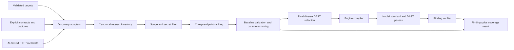

# Generic HTTP pentest request-coverage design

**Status:** Proposed
**Scope:** `nuguard pentest` discovery, request-shape synthesis, Nuclei execution,
coverage reporting, and public interfaces
**Motivating regression:** OWASP VulnerableApp reported 0 of 163 expected findings in
[`vulnerableapp-benchmark-coverage.json`](../../tests/apps/owasp-vulnerableapp/reports/vulnerableapp-benchmark-coverage.json)

**Follow-up plan:**
[Pentest Finding Correlation, Benchmark Matching, and Risk Score](pentest-finding-correlation-and-risk-score.md)

## Decision

Replace the current single-OpenAPI-document fallback with a bounded, multi-source
**request inventory**. The inventory is a scanner-neutral set of validated HTTP request
seeds: method, path, content type, and named input points. Nuclei remains the first
execution engine, but it receives a prioritized, budgeted subset of compiled request
seeds instead of a skeletal contract, bare application root, or the entire discovered
inventory.

This is intentionally not a VulnerableApp-specific fix. The same pipeline must support:

- server-rendered applications with links and forms;
- REST APIs with or without OpenAPI;
- single-page applications whose routes are visible in JavaScript or captured traffic;
- JSON, form-urlencoded, and multipart endpoints;
- GraphQL/RPC endpoints represented as HTTP request bodies; and
- applications implemented in any source language or framework.

Native mobile/desktop protocols, raw TCP, and WebSocket message fuzzing are outside this
phase. Their HTTP backends remain in scope.

## Root-cause analysis

The original zero-finding JSON run was real scanner under-coverage, so its benchmark adapter
correctly submitted an empty finding set. A later JSON run produced seven engine findings but
still scored zero because their mutated URLs and missing classification axes could not match the
benchmark. The follow-up correlation and classification defects are specified in
[Pentest Finding Correlation, Benchmark Matching, and Risk Score](pentest-finding-correlation-and-risk-score.md).

### Evidence from the original failed run

| Signal | Observed | Meaning |
|---|---:|---|
| Benchmark ground truth | 163 findings across 132 method/path operations | The target exposes a broad, route-level attack surface. |
| Failed-run SBOM | 93 endpoint nodes, 89 unique paths | Static discovery was incomplete and contained duplicate operations. |
| Expected operations whose path appears in the SBOM | 55 / 132 (41.7%) | Most benchmark routes never enter the scan input. |
| Synthesized OpenAPI operations | 89 | The DAST pass receives the SBOM-derived document. |
| Operations with a query/header/cookie/form parameter | 0 | Nuclei has no named parameter to fuzz. |
| Operations with a request body | 0 | POST/body attack surfaces are absent. |
| Structurally fuzzable operations | 0 / 89 | Route discovery alone cannot drive DAST. |
| Nuclei DAST stats | 365 requests, 443 errors, reported as 410% complete | Engine estimates are not reliable coverage telemetry and the pass is unhealthy. |
| Nuclei standard stats | 2,807 / 18,676 estimated requests, 110 errors, 15% complete | The generic host scan did not complete enough work to compensate. |
| Bundled pass | 144 / 144 requests, 0 findings | Bundled templates probe the application root and guessed routes/parameter names, not the discovered operations. |

At the time of the failed run, the target also served a same-scope `sitemap.xml` containing
174 URLs. NuGuard discovered `/sitemap.xml` statically but did not consume it as runtime
route inventory. The current opt-in crawler addresses that route-discovery omission; the
selection design below bounds the resulting execution cost.

### Post-discovery scaling problem

After structured Java request extraction and merged discovery were added, the regenerated
VulnerableApp SBOM grew to 197 endpoint nodes and 190 unique compiled operations:

| Current inventory signal | Observed |
|---|---:|
| Compiled operations | 190 |
| Input-bearing operations | 142 |
| Named fuzz points | 171 |
| GET operations | 157 |
| POST operations | 33 |
| Operations with no known input point | 48 |

This fixes the original starvation problem but exposes the opposite failure mode: feeding
every operation to every DAST template makes runtime grow approximately with
`input points × applicable templates × payload variants`. A scan timeout then selects an
accidental prefix of work rather than the most useful application surface. Discovery must
remain broad, while expensive DAST execution must be deliberately selective.

### Original code-level causes and current status

The initial investigation found six independent gaps. The current implementation has
addressed their core paths: discovery sources merge, mount-aware live probing and
per-target compilation are supported, structured SBOM request metadata preserves request
shape, the crawler/miner are opt-in, and reports distinguish coverage gaps from a clean
scan. The implementation and contract tests remain the source of truth for those shipped
behaviors.

The remaining open gap is **selection after successful discovery**.
[`resolve_openapi_spec()`](../../nuguard/pentest/openapi_input.py) can merge and mine the
expanded inventory, but it does not rank operations by DAST value or cost. The compiler's
hard operation cap prevents unbounded documents; it does not choose a representative,
high-value subset. As a result, scan timeout and stable input order decide which routes
receive expensive fuzzing. That is the root cause of the new runtime problem.

The upstream benchmark matches a finding by URL, optional method, and at least one of
type/CWE/WASC. The existing adapter already emits usable relative URLs and CWE values
when Nuclei produces a classified finding. Changing benchmark matching cannot create the
missing scan traffic. See the upstream
[benchmark contract](https://github.com/SasanLabs/VulnerableApp/blob/master/benchmarks/README.md).

## Design goals

1. Discover HTTP operations independently of implementation language or framework.
2. Preserve actual request shape instead of reducing an operation to a URL.
3. Merge static, live, and operator-provided evidence without allowing any source to
   redirect the scan outside its validated scope.
4. Produce useful seeds when an application has routes but no formal API contract.
5. Distinguish “no findings” from “insufficient or degraded coverage.”
6. Keep all discovery and fuzzing bounded, deterministic, explicitly authorized, and
   credential-safe.
7. Keep Nuclei replaceable: discovery, coverage, and verification belong to NuGuard.
8. Bound DAST work before parameter mining and engine execution while preserving route,
   method, content-type, and input-location diversity.

## Non-goals

- Reading VulnerableApp's `/scanner/dast` endpoint as scan input.
- Adding templates, route names, payloads, or parameter dictionaries that are specific to
  VulnerableApp, Juice Shop, or another benchmark.
- Claiming that route coverage equals vulnerability coverage.
- Automatically brute-forcing login credentials, destructive actions, denial of service,
  or business workflows.
- Treating every response difference as a vulnerability.

## Architecture



The inventory, not OpenAPI, is the source of truth. OpenAPI becomes one input adapter and
one Nuclei compiler format.

The complete inventory is retained for reporting and later scan tiers. Selection creates a
view; it must never delete or mutate discovery evidence.

## Canonical request inventory

Add `nuguard/pentest/inventory/` with internal immutable models. These models must not
store authentication values or raw responses.

```python
HttpMethod = Literal[
    "GET", "HEAD", "OPTIONS", "POST", "PUT", "PATCH", "DELETE", "TRACE", "UNKNOWN"
]
InputLocation = Literal[
    "path", "query", "header", "cookie", "json", "form", "multipart"
]

@dataclass(frozen=True, slots=True)
class RequestInputPoint:
    name: str
    location: InputLocation
    type_hint: str = "string"
    required: bool = False
    safe_example: object | None = None
    confidence: float = 0.0
    sources: tuple[str, ...] = ()

@dataclass(frozen=True, slots=True)
class RequestSeed:
    seed_id: str                 # stable hash; never contains credentials
    target_url: str              # already validated and sanitized
    method: str
    path_template: str
    content_type: str | None
    inputs: tuple[RequestInputPoint, ...]
    confidence: float
    sources: tuple[str, ...]
    baseline_status: int | None = None
    reachability: str = "unvalidated"
```

Inventory identity is
`(target, method, normalized path template, normalized content type)`. Merging unions input
points and provenance. Conflicting types remain source-attributed; higher-confidence
evidence selects the engine example without deleting the conflict from diagnostics.
Selection-specific seed metadata is defined in
[DAST Endpoint Prioritization](dast-endpoint-prioritization.md).

`safe_example` is a synthetic placeholder such as `1`, `nuguard`, or an empty test file.
Imported real values are held only in a short-lived secret-aware runtime object and are
never serialized into the SBOM, report, stream event, cache key, log, or exception.

## Discovery adapters

All enabled adapters contribute to the same inventory. They do not stop after the first
successful source.

### 1. Operator-provided artifacts

Support OpenAPI 3.x first, then HAR and Burp/Nuclei request exports. Preserve
`--openapi-spec` as a backward-compatible alias. Add repeatable `--request-file` and
`pentest.request_files` inputs with format auto-detection and an explicit override.

Files containing headers, cookies, or example bodies are treated as sensitive:

- require a regular, non-symlinked file;
- enforce size and operation-count limits;
- require owner-only permissions for HAR/Burp/raw-request captures and reject
  group/world-writable OpenAPI files;
- pass credential-like values through `SecretRedactor`; and
- report only the file type and aggregate counts, never values or raw requests.

### 2. Live contracts

Probe both the target mount path and origin for known OpenAPI paths. For
`https://host/app`, try `/app/openapi.json` before `/openapi.json`. Preserve same-origin
scope pinning and operation caps.

Swagger 2.x should be converted to the canonical inventory instead of rejected. GraphQL
introspection is opt-in and compiled to POST request seeds; when introspection is disabled,
captured or SBOM-derived GraphQL operations still work.

### 3. Static SBOM metadata

Extend `NodeMetadata` with a structured, technology-neutral request description while
retaining current fields for compatibility:

```python
class HttpParameterMetadata(BaseModel):
    name: str
    location: Literal["path", "query", "header", "cookie", "json", "form", "multipart"]
    type_hint: str = "string"
    required: bool = False

class HttpRequestMetadata(BaseModel):
    methods: list[str] = Field(default_factory=list)
    parameters: list[HttpParameterMetadata] = Field(default_factory=list)
    content_types: list[str] = Field(default_factory=list)
```

Add `NodeMetadata.http_request: HttpRequestMetadata | None`. Framework adapters populate
it from their AST/parser data. A compatibility normalizer derives it from `method`,
`path_params`, and `request_body_schema` for existing SBOMs. Do not parse arbitrary raw
signature text inside the pentest package; parsing belongs to the source adapter that
understands the language.

For map/dictionary request parameters, adapters should resolve statically visible keys
used in the handler body when possible. If they cannot, they emit an unknown input surface
rather than pretending the operation has no inputs.

The Pydantic model, committed AI-SBOM schema, serializers/exporters, tests, and public
documentation must change together.

### 4. Safe runtime discovery

For each validated target, perform a bounded GET-only crawl before active fuzzing:

- parse same-scope `sitemap.xml`, links, forms, and declared canonical URLs;
- honor the target mount prefix and reject protocol-relative/off-origin URLs;
- optionally parse static JavaScript for literal same-scope `fetch`, XHR, and form-action
  URLs; do not execute JavaScript unless `--allow-headless-browser` is set;
- infer form methods, names, and encodings from HTML;
- cap redirects, depth, response bytes, URLs, and wall-clock time; and
- deduplicate normalized paths before fetching.

Discovery GETs may follow redirects only while every hop remains in the already validated
origin and mount scope. Nuclei's broader `-disable-redirects` safety policy remains
unchanged until its adapter can enforce the same hop-by-hop rule.

### 5. Generic parameter mining

An operation with `accepts_user_input=True` or a form/body-capable method but no named input
points is a coverage gap, not a parameterless request.

When active fuzzing is authorized, run a bounded miner:

1. Build candidates from source identifiers, HTML/JavaScript names, validation messages,
   and a small application-neutral dictionary (`id`, `q`, `query`, `search`, `url`,
   `file`, `name`, `username`, `email`, `message`).
2. Send a benign control value in one location at a time.
3. Compare status, normalized body hash/length, selected non-secret headers, and latency
   with the baseline.
4. Retain candidates that produce a stable differential on a confirmation request.
5. Feed only retained input points to active DAST, subject to a bounded fallback allowance
   for routes whose source metadata proves user input but whose response is non-differential.

The dictionary is deliberately small and configurable. It is not vulnerability- or
fixture-specific. Mining requests consume the same global rate, concurrency, retry, and
timeout budgets as scanner requests.

## DAST endpoint prioritization

Broad discovery creates an inventory for reporting; it must not imply that every operation
is sent to every active-fuzzing template. Before parameter mining and engine compilation,
NuGuard selects a deterministic, family-diverse view under operation and input-point
budgets. The selector preserves the complete inventory and reports what it omitted.

The authoritative design, scoring rules, public configuration, telemetry, implementation
steps, and acceptance tests are in
[DAST Endpoint Prioritization](dast-endpoint-prioritization.md).

## Baseline validation

Validate each seed before fuzzing and assign one of these states:

| State | Meaning | Action |
|---|---|---|
| `reachable` | 2xx or same-scope 3xx | Fuzz. |
| `auth_required` | 401/403 | Fuzz only when configured authentication applies; otherwise report coverage gap. |
| `shape_rejected` | 400/415/422 or a route-specific validation response | Refine content type/body, then retry within budget. |
| `method_rejected` | 405 or an `Allow` mismatch | Correct the method from evidence; never spray every unsafe verb. |
| `server_error` | 5xx baseline | Keep as reachable but do not call it a vulnerability; require differential verification. |
| `not_found` | stable target-specific 404 fingerprint | Drop from execution and report rejected seed. |
| `unreachable` | transport/DNS/TLS/timeout failure | Report degraded coverage. |

`UNKNOWN`/`ANY` methods must not silently become `GET`. Safe discovery may try GET/HEAD and
OPTIONS. Unsafe methods require explicit source evidence or `--allow-active-fuzzing`; even
then, only one bounded baseline request per plausible method is permitted.

## Nuclei execution adapter

Add `nuguard/pentest/engines/nuclei_input.py`:

1. Partition inventory by validated target.
2. Compile each partition to a scope-pinned OpenAPI 3.x document with real query, header,
   cookie, JSON, form, and multipart input points.
3. Keep the normal signed-template host pass once per target.
4. Run the DAST pass on each target's compiled document; never apply target 1's contract to
   other targets.
5. Keep host-level bundled checks separate. Replace guessed per-route bundled probes over
   time with seed-aware fuzz templates or NuGuard verification logic.
6. Record the inventory manifest hash, operation count, fuzzable operation count, and
   compiler omissions before launching Nuclei.

OpenAPI is an engine transport, not the internal data model. A future ZAP or custom engine
adapter consumes the same inventory.

Nuclei fuzzing templates operate on query, header, path, body, and cookie parts, which is
why real input points are mandatory; see the official
[Nuclei syntax reference](https://github.com/projectdiscovery/nuclei/blob/dev/SYNTAX-REFERENCE.md).

## Finding verification

Route expansion increases both detection opportunity and false-positive risk. Before a
NuGuard-bundled or generic injection finding becomes final:

1. replay the exact request seed with the attack value;
2. replay a type-compatible benign control;
3. require attack-specific evidence absent from the baseline/control, or a template result
   with an equivalent differential guarantee; and
4. store only sanitized method, path, input name/location, matcher, and extracted evidence.

Official signed templates may initially retain their current trust policy, but the report
must identify `verification_status: engine_only | confirmed | rejected` so consumers can
separate engine matches from NuGuard-confirmed findings.

## Coverage and outcome model

Do not use Nuclei's estimated `percent` as NuGuard coverage; the failed run demonstrates
that it can exceed 100%. Compute structural and runtime coverage from the inventory:

```python
class PentestDiscoverySourceResult(BaseModel):
    source: str
    status: Literal["succeeded", "partial", "failed", "disabled"]
    operations_added: int = 0
    input_points_added: int = 0
    capped: bool = False
    warning: str | None = None

class PentestCoverageResult(BaseModel):
    status: Literal["sufficient", "degraded", "insufficient"]
    operations_discovered: int
    operations_with_inputs: int
    seeds_generated: int
    seeds_reachable: int
    seeds_executed: int
    seeds_rejected: int
    request_errors: int
    sources: list[PentestDiscoverySourceResult]
    reasons: list[str]
```

The additive selection telemetry attached to coverage is specified in
[DAST Endpoint Prioritization](dast-endpoint-prioritization.md).

Initial status rules:

- `insufficient` when active DAST was requested but there are no reachable input-bearing
  seeds, no target pass completed, or authentication blocks all relevant seeds;
- `degraded` when a source/operation cap truncates inventory, a target/pass is incomplete,
  or more than 20% of validated seeds fail before execution; and
- `sufficient` only when at least one discovery source succeeds, every target has a
  completed host pass, and at least 80% of reachable seeds enter the requested DAST pass.

These thresholds describe execution coverage, not security assurance. A sufficient scan
may still miss vulnerability classes.

Add `coverage` and `outcome` to JSON, Markdown, text, SARIF properties, and public results.
Use `outcome = completed | completed_with_coverage_gaps | failed`. A zero-finding
`completed_with_coverage_gaps` result must say that the target was not adequately tested,
not that no remediation is indicated.

Keep exit-code behavior backward compatible by default. Add opt-in
`pentest.fail_on_coverage: insufficient | degraded | none` and a matching CLI flag for CI.

## Public Pydantic interface

This change affects CLI, Python, stream, report, and platform consumers and must follow
the repository's Pydantic interface workflow.

1. Add typed public coverage/result models in
   [`nuguard/pentest/public_api.py`](../../nuguard/pentest/public_api.py); do not leave new
   coverage data as `dict[str, Any]`.
2. Add optional/additive request fields to `PentestRunRequest`, preserving existing names
   and imports. `openapi_spec` remains supported.
3. Add `coverage: PentestCoverageResult | None = None` and an `outcome` field whose
   compatibility default is `completed` to `PentestRunResult` and
   `PentestExecutionResult`. NuGuard-created results always populate coverage; defaults
   preserve direct construction by existing consumers during the additive transition.
4. Stream discovery and validation progress using sanitized counts only. Preserve monotonic
   sequence/progress, one terminal event, cancellation behavior, and the existing reducer.
5. Bump the file report schema from `1.0` to `1.1` for additive fields. The benchmark
   adapter continues to read `findings` unchanged.
6. Register every public model in
   [`test_public_api_schema_contract.py`](../../tests/contracts/test_public_api_schema_contract.py),
   regenerate `public_api.schema.json`, and inspect the snapshot diff.
7. Verify `model_dump(mode="json")` round trips and that fixture credentials, HAR values,
   cookies, raw bodies, and response fragments never appear in results or errors.

## Configuration proposal

```yaml
pentest:
  discover_requests: true
  request_files: []
  request_file_format: auto        # auto | openapi | swagger | har | burp | nuclei-jsonl
  max_discovery_urls: 500
  max_crawl_depth: 3
  max_request_seeds: 2000
  max_parameter_candidates: 10
  discovery_timeout: 120
  fail_on_coverage: none           # none | insufficient | degraded
```

DAST selection configuration is defined separately in
[DAST Endpoint Prioritization](dast-endpoint-prioritization.md).

Bounds require matching Pydantic validation in CLI/YAML/public request models. Existing
rate, concurrency, per-request timeout, whole-scan timeout, authorization, private-network,
headless, auth, and active-fuzzing controls remain authoritative.

`discover_requests=true` performs GET-only discovery for every authorized pentest.
Parameter mining and unsafe-method baselines run only with `allow_active_fuzzing=true`.

## Implementation plan

Phases 1 through 4 describe the foundation already present on the current branch and are
retained to make dependencies and verification scope explicit. Endpoint prioritization is
specified separately. Phase 5 is partially implemented and remains follow-up work where
noted by tests.

### Phase 1: truthful diagnostics and mount/multi-target fixes

- Add coverage models to [`models.py`](../../nuguard/pentest/models.py) and the typed public
  API.
- Count operations and fuzzable input points before execution.
- Mark the current VulnerableApp run `insufficient` instead of clean.
- Probe live specs under both target mount and origin.
- Resolve/compile a document per target rather than only `targets[0]`.
- Treat operation caps and incomplete/error-heavy passes as explicit coverage reasons.

This phase does not improve detection, but prevents false assurance and makes subsequent
work measurable.

### Phase 2: request inventory and multi-source merging

- Add `inventory/models.py`, `inventory/merge.py`, `inventory/scope.py`, and source adapter
  protocol.
- Refactor existing OpenAPI loading/SBOM synthesis into adapters.
- Merge explicit, live, and SBOM evidence.
- Compile inventory back to OpenAPI for Nuclei.
- Preserve the old OpenAPI functions as compatibility wrappers until callers migrate.

### Phase 3: structured SBOM request metadata

- Add `HttpParameterMetadata`, `HttpRequestMetadata`, and `NodeMetadata.http_request`.
- Update Python, TypeScript/JavaScript, Java, Go, and C# HTTP adapters incrementally, with
  shared conformance tests requiring method, path, location, and content type.
- For each adapter, emit `UNKNOWN`/unknown-input evidence instead of silently defaulting.
- Regenerate `nuguard/sbom/schemas/aibom.schema.json` and verify all exporters.

### Phase 4: runtime crawler, forms, and parameter mining

- Add `inventory/crawler.py`, `inventory/html_forms.py`, `inventory/javascript.py`, and
  `inventory/miner.py`.
- Reuse the existing pinned/scope-validated HTTP transport; do not create an unrestricted
  client.
- Add baseline fingerprints and reachability states.
- Apply global budgets across discovery, mining, and scanning.

### Phase 4a: prioritized DAST selection

Implement the independent
[DAST Endpoint Prioritization](dast-endpoint-prioritization.md) specification after the
merged inventory exists and before engine compilation.

### Phase 5: verification and coverage gates

- Add `verification.py` for attack/control replay.
- Add finding input-point metadata and verification status.
- Render coverage/outcome in all formats and stream summaries.
- Add `--fail-on-coverage` after status behavior is stable in fixture runs.

## Tests

### Unit and contract tests

- inventory normalization, deterministic IDs, precedence, conflict preservation, and caps;
- mount-aware live contract discovery;
- multi-target isolation;
- sitemap/link/form parsing and off-origin rejection;
- OpenAPI, Swagger, HAR, form, multipart, JSON, GraphQL-body, and SBOM adapters;
- unknown method and unknown input-surface behavior;
- parameter differential confirmation and non-differential rejection;
- baseline state classification for 2xx/3xx/4xx/5xx/transport failures;
- Nuclei compiler operation/input counts;
- sufficient/degraded/insufficient status boundaries;
- secret leakage across reports, streams, errors, logs, and schema examples;
- public model validation, JSON round trips, backward compatibility, and schema snapshot;
- cancellation and exactly-one-terminal-event streaming behavior.

### Technology-neutral integration fixtures

Use small local fixtures representing application styles, not brands:

1. server-rendered GET form with a query parameter;
2. POST form-urlencoded login-like form;
3. multipart upload form;
4. REST JSON API with OpenAPI;
5. REST JSON API without OpenAPI but with SBOM metadata;
6. SPA with literal `fetch()` calls;
7. GraphQL-over-HTTP request body; and
8. mounted application under `/app` with two targets in one run.

Each fixture asserts inventory and execution coverage, not merely findings.

### VulnerableApp regression acceptance

Use the benchmark only after scanning; never feed its ground truth to discovery.

- same-scope discovery includes all benchmark URLs exposed through ordinary runtime/static
  sources, with omissions listed explicitly;
- the request inventory has non-zero input-bearing operations;
- DAST no longer starts with zero structurally fuzzable operations;
- coverage status is not `insufficient`;
- stable SQL injection/XSS/path-style test routes produce at least one confirmed finding;
- benchmark coverage is greater than 0% on two consecutive runs; and
- no app-specific templates, route allowlists, parameter maps, or benchmark API reads are
  present in production code.

Prioritized-scan acceptance criteria are defined in
[DAST Endpoint Prioritization](dast-endpoint-prioritization.md).

Do not set a high detection percentage as the first gate: the upstream benchmark includes
business-logic, cryptographic-storage, JWT, rate-limit, and stateful vulnerabilities that a
bounded generic DAST engine cannot truthfully claim from route fuzzing alone. Track those
classes separately and raise the threshold only after representative generic techniques
exist.

## Rollout and compatibility

- Land phases behind additive configuration and keep existing authorization semantics.
- Default GET-only discovery on after unit/integration validation; keep parameter mining
  gated by active fuzzing.
- Preserve current CLI/Python call signatures and `findings` JSON shape.
- Treat existing SBOMs as partial evidence through the compatibility normalizer.
- Emit one deprecation cycle before removing direct single-document helpers.
- Compare request counts, error rates, findings, verification rejection rate, duration, and
  coverage status on VulnerableApp and Juice Shop before changing CI defaults.

## Definition of done

The fix is complete when NuGuard can explain, for every target, what it discovered, which
operations had real input points, which seeds were reachable and executed, why any seed was
not tested, and whether a zero-finding result is supported by sufficient execution coverage.
Detection improvement without that evidence is not sufficient.
