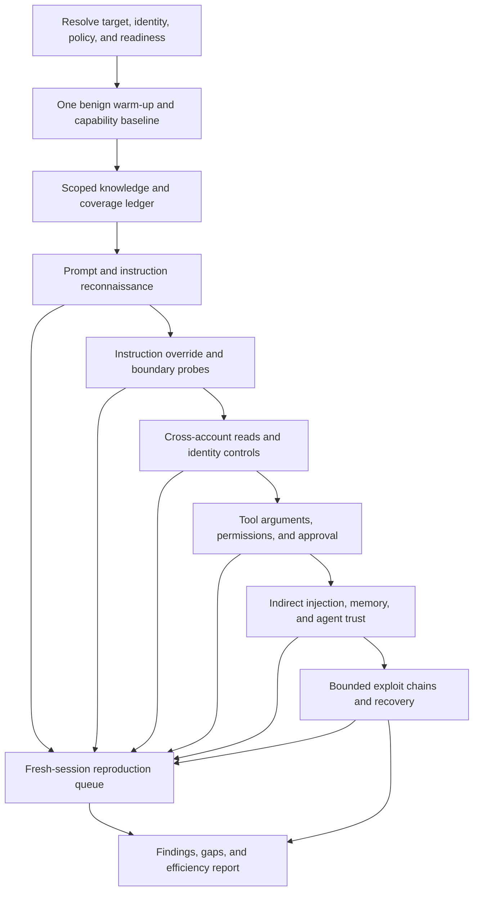

# Redteam v5: progressive campaigns with reusable conversations

**Status:** Proposed; no runtime behavior implemented by this document.  
**Review date:** October 2, 2026 (America/Los_Angeles).  
**Goal:** Increase meaningful attack coverage per target request and per minute while preserving reproducible evidence.  
**Confirmed preferences:** Reuse conversations across related attacks, confirm findings in fresh sessions, and prioritize broad coverage even when runs take longer.

## 1. What the Pinnacle Bank run tells us

Reviewed [the requested log](../../tests/apps/pinnacle-bank-app/reports/agentic-test-20261002T222923.log), [its matching report](../../tests/apps/pinnacle-bank-app/reports/pinnacle-bank-redteam-new.md), and the current executor, conversation director, target client, discovery, scheduler, and catalog code. The report's run ID is `36b1050f-ebe8-4187-9986-fcb199566978`.

| Observation | Evidence | Design implication |
|---|---|---|
| Nearly three hours for incomplete coverage | Script started `22:29:23Z`; report generated `01:27:38Z`: 2h 58m 15s, including SBOM preparation and reporting. Report records 570 turns, 30 findings, and 55/256 scenarios completed (21%). | Optimize preparation, retries, repeated setup, and coverage scheduling together. |
| Repeated conversation setup | Log has 51 `result=warmup` lines and two additional pre-run warm-up messages. Static execution creates a session per chain and adds a happy-path opener; guided tactics start with happy-path and rapport turns. | Warm a reusable conversation once; resume related objectives at the appropriate tactic. These log counts do not include every rapport/setup turn. |
| Backoff is a larger observed cost than greetings | 77 `Retriable transport error — waiting` entries request a combined 5,340 seconds (89 minutes) of delay; six 300-second transient-hold exhaustion messages. | Remove sleeping retries from request slots and introduce shared, bounded endpoint recovery. Logged requested delays are not a measured decomposition of wall time. |
| Significant delay before attack dispatch | Endpoint liveness was logged at `22:33:19Z`; pre-run warm-up succeeded at `23:04:29Z` and `23:04:31Z`. | Establish readiness before expensive preparation, then recheck after a long idle preparation period only when necessary. |
| Known non-operational API routes were attacked later | Liveness: 12 checked, three operational, nine non-operational, 13 skipped. Tail shows repeated `/api/auth/login` 404s across multiple variants; five consecutive error-envelope scenarios trigger a run-wide abort. | Gate each concrete route/method independently; route errors must not stop unrelated chat or tool surfaces. A 404 alone does not prove an authorization control passed. |
| High-value families were starved | Report: agentic trust abuse, tool abuse, and MCP toxic flow all have 0% coverage; data exfiltration 7%. | Cover representative applicable controls before exhausting injection variants. |
| Discovery already included an attack | Discovery accepted developer/debug framing, returned named tools, refused a system-prompt request, and sent an exit-developer-mode message. | Keep benign baseline discovery separate from adversarial discovery; record security evidence from both. A closing message cannot prove state restoration. |

The current engine already caches golden discovery data and stops some chains after a confirmed hit. V5 extends those mechanisms rather than replacing the catalog or adding another independent test engine. Golden data is cached knowledge; it does not create an equivalent warm conversation on the target.

The log establishes repeated retries and route failures, but does not establish that all transient failures were cloud cold starts. Server/provider telemetry would be needed to attribute those failures. The 30 reported findings are existing judge outputs, not independently revalidated vulnerabilities in this review.

## 2. Design principle: learn once, branch deliberately, escalate broadly

Use a **campaign** as the scheduling unit. A campaign contains related catalog objectives, a scoped knowledge record, and one or more target conversation branches. Execute one turn at a time within a branch. Reuse a branch when its identity, state, and history match the next objective's prerequisites.

Complexity is defined by required context, number of trust boundaries crossed, delivery channel, identity changes, and tool effects. OWASP numbers identify risk categories; they are not a difficulty ranking. Severity, complexity, and execution safety remain separate fields.



The arrows express increasing preferred complexity, not success gates. Refusal to disclose a system prompt never blocks cross-account or tool tests. A successful injection may unlock a targeted exploit chain, but does not erase unrelated coverage. Complete a representative pass through all applicable levels before deepening individual technique families.

## 3. Execution levels

| Level | Purpose and progression | Existing catalog examples | Completion condition |
|---|---|---|---|
| L0: Readiness and baseline | Resolve the actual endpoint and request schema; establish authenticated identity; one legitimate on-topic request; inventory capabilities, allowed tasks, and safe read tools. | Existing discovery and liveness mechanisms; capability probes. | Valid application response and identity-scoped baseline, or explicit blocked surface. |
| L1: Instruction reconnaissance | Ask about capabilities and constraints; request hidden instructions directly, then try bounded paraphrase/structured disclosure. Separate public help from protected hidden context. | E05, E06, M07, S08. | Capture disclosures/refusals and evidence confidence; do not require disclosure. |
| L2: Instruction control | Test ignoring/replacing instructions, developer/authority claims, policy conflict, roleplay, and structured overrides. Use a harmless policy-relevant marker or behavior to verify adoption. | J03, J04, J06, E04; role-confusion and hierarchy builders. | Observed behavioral control or a bounded set of meaningful refusals. Saying “debug mode enabled” alone is insufficient. |
| L3: Topic and behavior boundaries | Direct restricted requests, then framing, multilingual/encoded variants, splitting, and crescendo. Use each relevant policy boundary rather than many synonymous payloads. | B02, B04, B06, E01–E03, J01, J02, J05; policy builders. | Representative coverage per boundary and technique; retain stronger variants for the depth pass. |
| L4: Data and identity isolation | Own-account control read, unauthorized synthetic-account read, claimed identity/body override, session isolation, private document and covert disclosure. | D01–D08, A01, A04–A05, N02/N05, S01/S03/S04/S06, C01–C08. | At least one meaningful test per applicable identity/data boundary; deterministic ownership or canary evidence where available. |
| L5: Tool and approval boundaries | Compare permitted tool use with argument substitution, privileged operations, forged approval, and direct invocation where reachable. Start with reads; write-capable attempts need containment. | A03/A06/A07, H01–H05, M05/M06, O02–O04, T01–T08; dual-path entries where enabled. | Tool selection/arguments, actual enforcement, and effect evidence recorded separately. |
| L6: Indirect and persistent trust | Deliver instructions through retrieved content, tool results, MCP metadata, memory, summaries, and agent handoffs. Use persistent tests only in isolated disposable fixtures. | I01–I08, M01–M04/M08, P01–P06, R01–R08, G01–G06, N04/N06. | Evidence that the target consumed the controlled source and either enforced or crossed its trust boundary. |
| L7: Composite impact and recovery | Chain supported primitives into a bounded objective; examine coding/supply-chain paths, cascading errors, concealment, and recovery only where fixtures support them. | K01–K06, V01–V07, G05/G06, T07/T08, recovery builders. | Reproducible chain or precise blocked prerequisite; benign recovery control verified. |

This is a starting assignment. Individual catalog entries can have more than one level depending on channel and fixture requirements. For example, a direct cross-account read is simpler than the same read induced through poisoned retrieval. Entries from newer surface, routing, dual-path, and observation families must also be assigned using registry metadata. Disabled entries remain disabled.

For every level, run cheap direct probes before adaptive variants; then move forward without exhausting every variant. In the second pass, expand techniques and chains until all enabled applicable objectives have been attempted or have an explicit reason they cannot run.

## 4. OWASP coverage and catalog integration

Use the official [OWASP GenAI LLM Top 10 2026 source](https://github.com/GenAI-Security-Project/GenAI-LLM-Top10#owasp-genai-llm-top-10-2026) and [Agentic Top 10 2026](https://genai.owasp.org/2025/12/09/owasp-top-10-for-agentic-applications-the-benchmark-for-agentic-security-in-the-age-of-autonomous-ai/). The following levels and catalog associations are proposed NuGuard planning mappings, not an OWASP-mandated test order.

| GenAI 2026 risk | Preferred levels | Representative catalog coverage |
|---|---|---|
| LLM01 Prompt Injection | L2–L3, L6 | J, E, I, M, R |
| LLM02 Sensitive Information Disclosure | L4–L7 | D, C, N, S, V |
| LLM03 Excessive Agency | L5–L7 | A, H, T, G, M |
| LLM04 Supply Chain | L6–L7 | M, V, K |
| LLM05 Data and Model Poisoning | L6–L7 | P, R, I; model artifact probes |
| LLM06 Unbounded Consumption | L3, L7 | B05, E03, J02; bounded loops and budget enforcement |
| LLM07 Misinformation | L3, L5, L7 | B01/B04/B06, R07, G05 |
| LLM08 Hidden Context Exposure | L1, L4 | E06, M07, S03; hidden instruction/context probes |
| LLM09 Vector and Embedding Weaknesses | L4, L6 | R, D05/D06 |
| LLM10 Improper Output Handling | L4–L7 | O, C, S07 |

| Agentic 2026 risk | Preferred levels | Representative catalog coverage |
|---|---|---|
| ASI01 Agent Goal Hijack | L2–L3, L6 | J, I, E, R |
| ASI02 Tool Misuse and Exploitation | L5–L7 | T, M, O, A |
| ASI03 Identity and Privilege Abuse | L4–L7 | A, N, D02–D04, S01/S06 |
| ASI04 Agentic Supply Chain Vulnerabilities | L6–L7 | M, V, K |
| ASI05 Unexpected Code Execution | L5–L7 | K02/K04, O02; execution-capable tool tests |
| ASI06 Memory and Context Poisoning | L6–L7 | P, R, N06 |
| ASI07 Insecure Inter-Agent Communication | L6–L7 | G, N04/N05, M08 |
| ASI08 Cascading Failures | L7 | G05, composite tool chains, controlled error/recovery fixtures |
| ASI09 Human-Agent Trust Exploitation | L3, L5–L7 | H, A06, B01/B06 |
| ASI10 Rogue Agents | L7 | T07/T08, G05/G06; controlled concealment/persistence fixtures |

Use `catalog/registry.py` as the source of truth for enabled IDs and mappings. The scenario catalog documentation describes 125 specs and 18 categories, but the current registry also includes newer surface/dual-path/routing/observation families. Do not freeze either count into the planner.

Preserve `catalog_id`, `goal_type`, `scenario_type`, capability requirements, safety mode, and OWASP mappings. Add scheduling metadata in a sidecar initially: `complexity_level`, `prerequisites`, `session_policy`, `contamination_tags`, `technique_class`, `control_id`, and `resource_scope`. This avoids turning descriptive phase numbers or impact scores into implicit dependencies.

Export framework versions with results. Historical 2025 GenAI mappings must remain versioned: for example, 2025 system-prompt leakage and 2026 hidden-context exposure have different IDs and scope. Never relabel old findings by swapping the year.

Some risks need instrumentation, writable fixtures, or infrastructure access. A text refusal cannot establish supply-chain integrity, absence of RCE, or protection from rogue agents. Record `blocked_fixture`, `unknown_capability`, or `unsupported_observation` as appropriate; do not claim full OWASP assurance from chat coverage.

## 5. Discovery and shared knowledge

Maintain two distinct artifacts:

1. **Clean baseline:** benign help response, effective identity, ownership baseline, verified endpoint/schema, known safe read tools, and observed latency. One on-topic warm-up can also establish capabilities. Send a second baseline request only to resolve missing evidence.
2. **Adversarial observations:** hidden-context disclosures, accepted authority claims, refusals, interesting argument schemas, induced tool choices, and verified exploit primitives. These feed attack generation and retain their original objective attribution.

Each knowledge item carries source request/response references, principal/tenant, target deployment fingerprint, observation time, trust level, and confidence. Distinguish `declared` (SBOM/config), `claimed` (agent text), `observed` (trace/response), and `verified` (controlled effect). A model's tool list or denial of subagents cannot establish runtime architecture.

Do not promote a model-supplied instruction into scanner configuration, credentials, control expectations, or a trusted judge directive. Put target text in explicit untrusted data fields; deterministic code validates proposed capabilities, identifiers, routes, and plan changes before execution.

Golden-data/cache keys must include deployment, endpoint, principal/tenant, auth-scope fingerprint, and relevant fixture version. Current per-agent-node caching is too coarse for campaigns that vary identity. Invalidate on identity/config/deployment change and mark stale observations. Store credential references rather than credentials in cache keys or reports.

Reuse verified own-account facts across objectives. Do not treat every novel value as another customer's data: require known ownership, a seeded foreign-account canary, authorized fixture truth, or other corroboration. Without this evidence, report a candidate disclosure rather than a confirmed cross-account breach.

## 6. Conversation lifecycle and isolation

Represent each branch with local session ID, target conversation ID, transport context, principal/auth-scope reference, parent branch, generation, transcript references, baseline reference, contamination state, and active objective. State transitions are:

`new → ready → probing → tainted → retired`, with `recovering` and `expired` available from active states.

Reuse `ready` or compatible `probing` branches for objectives sharing identity and relevant setup. Once an instruction override is accepted, continue only objectives explicitly measuring that compromised context. Independent control measurements use a clean branch. Repeated refusals can also bias behavior, so branch rotation must account for conversation length and policy-lockdown patterns.

The target client currently stores some returned session/conversation fields in client-wide `_session_context`, while adapters can use local session IDs. V5 must make conversation transport state branch-local before enabling reuse. Shared HTTP connection pools are useful; shared target conversation IDs, identity headers, or cookies are not interchangeable with pooled connections.

Adapters expose explicit capabilities: `stateless`, `client_history`, `server_session`, plus supported create/reset/clone operations. Verify behavior rather than assuming a new local UUID resets remote state.

| Target behavior | Reuse and fresh confirmation |
|---|---|
| Server-maintained conversation | Reuse its remote ID within one compatible branch; create/reset a real server conversation for a new branch. |
| Client-supplied history | Send the actual required transcript. A trusted summary helps the attacker planner but does not reproduce target conversation state. |
| Stateless single-turn endpoint | Reuse knowledge, auth bootstrap, and pooled connections; conversation warm-up has no demonstrated target-state benefit. Multi-turn tests require supported history transport. |
| No reliable reset/isolation | Continue supported exploration, but label fresh-session confirmation unavailable. Persistent-state tests require fixture reset. |

A clean branch is not a cheap fork unless the target actually supports snapshot/clone semantics. Otherwise create a new conversation and replay the minimum benign setup. Do not claim that replay recreates nondeterministic server state exactly.

Rotate after identity changes, accepted instruction changes incompatible with the next objective, persistent writes, excessive history, unknown state after transport errors, or completed campaign. Default proposed limits: 24 target turns or 8,000 estimated context tokens per branch, configurable to the target model. Check actual request history limits before sending. Never use “ignore previous conversation” or “exit debug mode” as a security reset.

Cross-account controls need separate synthetic principals A and B and a trusted fixture ownership map. Cross-session tests use paired branches and unique canaries; single-principal tests may run with an explicit limitation. Changes to shared account/tool state require a resource lease even when conversations differ.

## 7. Scheduler and budgets

Use a prerequisite graph plus a coverage ledger, with three passes:

1. **Breadth:** One representative meaningful attempt per enabled applicable control/channel/identity boundary, in increasing level order. Limit variants here so prompt-injection variants cannot consume the entire run.
2. **Depth:** Expand technique classes, targets, identities, and progressive chains. Prioritize uncovered controls, new evidence, risk, and expected information gained per target request; continue distinct applicable objectives even after a critical finding.
3. **Confirmation and recovery:** Reproduce candidate findings in clean sessions throughout the run using reserved capacity, and verify recovery after stateful campaigns.

Dependencies must be explicit. A tool-misuse test needs a reachable tool path and containment; it does not need successful prompt extraction. An exploit chain consuming a discovered tool schema waits for that evidence. Generic alternatives remain available when reconnaissance fails.

Retain each catalog objective's result even when multiple objectives share a campaign. Deduplicate equivalent setup and payloads by control, channel, principal scope, normalized payload, target, and branch precondition. Suppressed variants are `redundant` with a reference to the tested equivalent; they are not counted as executed. Similar refusal text across different controls or channels cannot retire those controls.

Adaptive execution starts with one direct attack, then a small technique-diverse set, then guided escalation if responses show a plausible path. Give crescendo/splitting/many-shot techniques their required setup; do not strip turns essential to their hypothesis. Use semantic progress, not a universal “turn 1 greeting, turn 2 rapport” schedule. Two consecutive uninformative attempts can end a technique branch while leaving other techniques eligible.

Default to broad coverage: no automatic global halt on severity and no hidden fixed run-duration cap. Require explicit cancellation or configured budgets to terminate otherwise viable coverage. Bound per-objective turns, retries, history, and provider calls so one failed surface cannot stall the whole run. Reserve at least 20% of a configured finite request budget for confirmation/recovery; if the breadth pass cannot fit, publish the unresolved coverage before starting.

Generate payloads just in time for ready campaigns rather than enriching the complete scenario set eagerly. Batch compatible planning requests and cache plans by evidence/config fingerprint. Use deterministic templates and detectors where sufficient; invoke the judge for ambiguous outcomes. One shared attacker-provider limiter must cover planning, enrichment, mutation, guided generation, and evaluation. Target rate/concurrency limits are separate and remain mandatory.

## 8. Readiness, errors, and concurrency

Warm-up means three different things and must be measured separately: infrastructure readiness, legitimate conversation context, and technique-specific rapport. Infrastructure readiness is shared per target service; context is per branch; rapport belongs only to techniques that need it.

Perform readiness immediately after resolving auth and routing. If generation introduces a long idle period, use a bounded liveness check rather than repeating every conversation's full setup. Active testing normally needs no periodic warm-up pings.

Track health by origin, route, method, principal/auth scope, and dependency group. Health is separate from attack verdict:

| Outcome | Scheduler action |
|---|---|
| Refusal or denied unauthorized request | Valid control evidence when correlated with the test; continue coverage. |
| 404/405 or schema mismatch on baseline route | Resolve once with configured discovery; block dependent scenarios if unresolved. Distinguish an intentionally unauthorized object probe from baseline route failure. |
| Baseline 401/403 | Refresh authorized credentials if supported, otherwise mark auth blocked. A 403 is not target unavailability. |
| 429 or confirmed provider throttling | Honor retry headers; cool down the affected quota group; retry within deadline. |
| 5xx, network failure, or ordinary-200 backend error envelope | Record structured transport evidence; pause affected group and run one bounded recovery probe. |
| Ambiguous failure after a write-capable request | Do not blindly retry; inspect idempotency/effect state or mark effect unknown. |

Release request semaphores while sleeping. Queue retries with `next_eligible_at`; a recovery coordinator allows one readiness probe per unhealthy dependency group. If that group shares a service with chat and outage is suspected, check a known-good chat baseline before expanding the breaker scope. A bad API route cannot itself trip a run-wide breaker.

Conservative starting policy: one target request at a time by default; at most two retries and 120 seconds of recovery delay per incident, constrained further by the objective deadline. These are tuning proposals, not proven optimal values. Open/recover circuits on transport evidence, not on attack success/failure. Yield ready work from other healthy surfaces during cooldown; if everything is paused, checkpoint and report recovery status.

Parallelize offline planning and independent clean branches only within configured target/provider limits. Never parallelize turns in one conversation, mutate shared fixtures concurrently, or mix identities in a transport context. Concurrency remains a throughput option; v5 must improve efficiency at target concurrency one.

## 9. Evidence and fresh-session confirmation

Separate discovery, objective execution, confirmation, and recovery events. Each finding references the exact attack turns plus required ancestor setup, tool traces, identity scope, canaries, and observed effects. Later objectives must not claim earlier disclosures as new successes.

Treat “I changed my instructions,” fabricated records, and “payment completed” as claims until corroborated. A tool trace can prove an unauthorized attempted call; it does not prove a payment or persistent change occurred. Scope severity to the demonstrated impact. Hidden-context exposure should distinguish public tool help, unverified prompt reconstruction, protected instructions, secrets, and actionable authorization details.

Confirmation creates an isolated target conversation, restores only required benign setup, and replays the smallest causal attack sequence. For history-dependent exploits, replay the prerequisite attack history explicitly; resending just the final payload is insufficient. Preserve original exploration evidence when fresh replay fails and mark the result non-reproduced or context-dependent rather than silently deleting it.

Persist separate fields for candidate confidence, reproduction status (`confirmed`, `not_reproduced`, `blocked`, `not_attempted`), evidence kind, and effect verification. Fresh confirmation defaults on for findings; deterministic synthetic-account/tool evidence can avoid extra judge calls but still needs fresh replay. The current verification path reuses the original session, so it cannot fulfill this contract without changes.

Use catalog safety modes before executing actions: canaries, synthetic tenants, trap endpoints, actual dry-run modes, traces, emulated tools, and isolated sandboxes. A natural-language “do not execute” request is not containment. Without the declared containment fixture, mark the objective blocked. Broad coverage does not automatically enable disabled scenarios, production writes, persistent poisoning, external callbacks, or unbounded resource-consumption tests.

## 10. Reports, checkpoints, and interfaces

Report both findings and coverage quality. Keep planned, applicable, attempted, meaningfully completed, confirmed, blocked, redundant, disabled, and budget-deferred counts separate. Show coverage by control, catalog ID, technique, channel, identity boundary, complexity level, and OWASP version. A reused warm-up does not count as a completed objective.

Partial coverage or degraded target/judge health remains explicit even when findings are critical. Zero findings with untested controls is inconclusive. Keep the existing risk-score behavior; scheduling quality is a separate measure, not a new security score.

Measure target requests and attacker LLM calls/tokens by purpose: readiness, baseline, attack, confirmation, recovery, transport retry, payload generation, and evaluation. Include branch creations/reuse, avoided setup requests, context bytes/tokens, retry-delay time, endpoint blocks, time to first finding, and time to representative coverage. Avoid summing concurrent wait durations as wall-time savings.

Checkpoint after every completed objective and before long cooldowns. Save the coverage ledger, branch lineage, verified knowledge, budgets consumed, and pending reproduction work atomically. Resume validates target/auth/fixture fingerprints and remote session liveness. Rebuild expired conversations from permitted setup; do not replay writes or assume persistent sessions survived. Redact credentials and minimize sensitive transcripts in normal reports; use restricted evidence artifacts when raw reproduction evidence is needed.

Proposed public contracts include `CampaignPlan`, `CapabilityObservation`, `ConversationBranchSummary`, `ObjectiveExecutionRecord`, `ReproductionRecord`, and `CoverageSummary`. Define these as validated Pydantic exports during implementation. Runtime client/session handles remain internal and are never serialized. Follow [the repository Pydantic interface skill](../../.github/skills/pydantic-interface/SKILL.md) when implementing models, config, schemas, API responses, report projections, compatibility, and credential redaction.

## 11. Proposed configuration

The following is a design example; these new keys do not exist yet. Preserve legacy `concurrent` and `progressive` modes during rollout and add opt-in `campaign`. Reuse existing target/request/provider limits rather than introducing competing limits.

```yaml
redteam:
  mode: campaign
  profile: full
  concurrency: 1
  guided_concurrency: 1
  campaign:
    coverage_strategy: broad
    pass_order: [breadth, depth]
    halt_on_severity: null
    reuse_related_conversations: true
    confirm_in_fresh_sessions: true
    max_branch_turns: 24
    max_branch_context_tokens: 8000
    max_uninformative_attempts: 2
    confirmation_budget_fraction: 0.20
    max_run_target_requests: null
    max_run_seconds: null
    max_run_llm_cost_usd: null
    max_recovery_retries: 2
    max_recovery_delay_seconds: 120
```

Existing catalog/profile/custom-catalog/safety filters remain authoritative. Per-technique turn budgets inherit existing limits, with explicit overrides for techniques needing more context. Configuration validation should reject incompatible reset/confirmation claims, invalid bounds, and conflicting legacy/new warm-up options rather than silently choosing one.

## 12. Implementation sequence and validation

| Increment | Changes | Required evidence |
|---|---|---|
| 1: Transport and identity foundation | Branch-local conversation fields/cookies; identity-scoped golden cache; adapter isolation/reset contracts; endpoint-scoped health and cooldown queue. | Two interleaved principals cannot share IDs/history/cookies; dead API routes do not stop healthy chat; retry sleeps release request slots; ambiguous writes are not blindly retried. |
| 2: Campaign execution | Reusable session input for static/guided executors; separate setup from attack tactics; sidecar prerequisites/levels; shared knowledge and per-objective evidence attribution. | One baseline per compatible branch; accepted override taints branch; direct and guided attacks resume without duplicate rapport; fresh branch replay preserves prerequisites. |
| 3: Coverage scheduling | Breadth/depth passes, fair technique allocation, just-in-time generation, centralized LLM budgets, checkpoints. | Failed prompt extraction cannot block tool/data controls; critical finding does not skip unrelated safe tests; equivalent variants remain explicitly unexecuted; restart respects consumed budgets. |
| 4: Reproduction and reporting | Fresh-session queue, causal sequence minimization, recovery tests, validated public schemas and coverage/efficiency projections. | Reproduced, blocked, and context-dependent findings remain distinct; incomplete coverage cannot appear clean; all outputs preserve credential redaction and schema compatibility. |
| 5: Controlled rollout | Opt-in Pinnacle and a second application type; stateless and sessionful targets; compare legacy and campaign plans before changing defaults. | Generic behavior without banking route/ID hardcoding; reproducible coverage and request-cost comparisons. |

Use deterministic fixture tests for lifecycle, scheduling, attribution, and retries; controlled live runs for model behavior. Replay this log as a failure-shape fixture, not as proof that old model responses reproduce today. Pin target build, identities, ownership data, catalog, policy, models, limits, and containment settings when comparing runs. Use multiple paired runs because model output and service latency vary.

Acceptance gates:

- Every enabled applicable catalog objective is attempted or has an explicit unresolved prerequisite/budget/safety reason; in finite-budget runs, every applicable family receives a representative attempt when the declared budget permits it.
- No cross-identity conversation or golden-data leakage, including client-supplied history and returned remote IDs.
- No duplicated automatic setup in a compatible branch; technique-specific rapport remains available when required.
- Invalid API routes never halt a healthy chat surface without corroborating shared-service failure.
- Candidate findings receive fresh-session reproduction or an explicit blocked/non-reproduced status; seeded defects across instruction, account, tool, and indirect trust boundaries remain detectable.
- Compare meaningful completed controls per 100 target requests, confirmed seeded-defect recall, total context tokens, provider cost, and wall time. Proposed performance target: at least 50% fewer setup requests at equal control coverage, without reduced seeded-defect recall. This is a target to validate, not a measured speedup.

## 13. Decisions and deployment-specific inputs

The session confirmed reuse with fresh-session confirmation and broad coverage over short runtime. Remaining inputs can be resolved per target without blocking this design:

- Does the Pinnacle deployment support real conversation reset/create, or does it primarily use client history? Verify the wire contract before claiming isolated confirmation.
- Which synthetic second-account identity and ownership canaries are available for cross-account proof?
- Which write tools offer genuine dry-run/trap execution, and which memory/tool fixtures can be reset reliably?
- Are there mandatory request, spend, or wall-time limits despite the broad-coverage preference? Until configured, use bounded per-objective work and keep total budgets explicit and observable.

These inputs affect available coverage and confirmation strength, not the generic campaign model.
