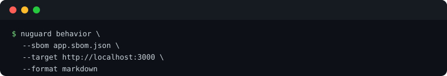

# NuGuard Behavior Engine

Static and dynamic behavioral validation for live AI applications. It's designed for AI developers who want to verify that their application behaves as intended — exercising every declared component, respecting cognitive policy boundaries, and handling sensitive user data correctly — before the app reaches production.

The engine takes an AI-SBOM, a target URL, and a Cognitive Policy, then automatically generates and executes multi-turn test scenarios against the running application, judging every turn with a 3-dimension rubric and producing structured findings with actionable remediation.

---

## Quick Start

Behavior testing needs a live target — point `nuguard init` at your running app, then run it.

. nuguard sbom generate --source <path-to-your-app> --output app.sbom.json. nuguard behavior --config nuguard.yaml --format markdown --output <output-path>." width="620">

**Common changes** (in `nuguard.yaml`, under `target:` / `behavior:`):

- Target URL and endpoint — `target.url`, `target.endpoint` (default: auto-discovered from SBOM, fallback `/chat`)
- Request/response payload shape — `chat_payload_key` / `chat_response_key` / `chat_payload_extras` if your app doesn't use `{"message": "..."}` / `{"response": "..."}`
- Auth — `target.auth`: `bearer`, `api_key`, `basic`, `login_flow`, or `cookie_file` (a captured session cookie — see below)

> 🔐 **App behind an interactive login (Auth0, SSO, OAuth redirect)?** `bearer`/`basic`/`login_flow` can't drive a browser-based sign-in flow. Run [`nuguard target discover-browser`](cli-reference.md#nuguard-target) once to log in with a real (headless) browser, capture the session as `target.auth.type: cookie_file`, and auto-detect any extra chat payload fields the app requires (e.g. an opaque consumer/account ID) — then re-run `behavior` as usual.

---

## Configuration

The examples below use the [OpenAI Customer Service Agents demo](example-openai-cs-agents.md) — a FastAPI backend serving five airline-support agents — as a worked example. Full walkthrough: [example-openai-cs-agents.md](example-openai-cs-agents.md).

### Target URL

`target.url` is the base URL of the **running backend**, shared with `nuguard redteam`. `target.endpoint` is the chat path appended to it — leave empty to auto-discover from the SBOM's `API_ENDPOINT` nodes (falls back to `/chat`):

```yaml
target:
  url: http://localhost:8000        # backend URL, not the frontend
  endpoint: /chat                    # optional — omit to auto-discover from the SBOM
```

`behavior.target` / `behavior.target_endpoint` override the shared block only if behavior testing needs a different endpoint than red-teaming.

### Auth

`target.auth` is inherited from the shared block (see [Auth in the redteam guide](redteam-guide.md#auth) for the full `type` table: `bearer`, `api_key`, `basic`, `login_flow`, `none`). The demo app runs locally with no auth in front of it:

```yaml
target:
  auth:
    type: none
```

### Behavior-specific options

`behavior.workflows` selects which scenario layers to generate — leave empty to run all four:

| Workflow | Generates |
|---|---|
| `topic_coverage` | Happy-path conversations per allowed policy topic |
| `agent_tool_coverage` | One scenario per agent, tool, API endpoint, and agent-handoff in the SBOM |
| `guardrail_coverage` | Probes for HITL triggers and data-classification guardrails |
| `data_discovery_probe` | Discovers real user data mid-conversation and checks how the agent reacts to it |

See the [Behavior Scenario Catalog](behavior-scenario-catalog.md) for how these workflows map to the underlying scenario types and the judging rubric.

Other commonly-tuned fields:

| YAML key | Default | Description |
|---|---|---|
| `behavior.use_llm` (`--llm`) | `false` | Enables LLM-generated scenario phrasing and judging (falls back to deterministic templates when off) |
| `behavior.coverage_turns_per_scenario` | `5` | Max adaptive turns appended to probe still-uncovered components |
| `behavior.max_session_turns` | `10` | Hard cap on total turns per scenario session |
| `behavior.tool_chain_size` | `4` | Max tools grouped into one multi-turn coverage scenario |
| `behavior.guided_coverage` | `false` | Use a live LLM-steered conversation instead of pre-scripted tool chains |
| `behavior.capability_discovery` | `true` | Probe the live agent for undeclared tools/sub-agents and merge them into the in-memory SBOM |
| `behavior.request_timeout` | `60.0` | Per-request HTTP timeout in seconds |

For the demo app, `nuguard.yaml` sets:

```yaml
behavior:
  llm: true
  request_timeout: 60
  verbose: true
```

which is what produced the 28-scenario, 38-finding run described in [Run Behavioral Testing](example-openai-cs-agents.md#5-run-behavioral-testing).

### 📖 Need every flag?

[](cli-reference.md#nuguard-behavior)

### 🔀 Want to run a different test?

[](quick-start.md)

---