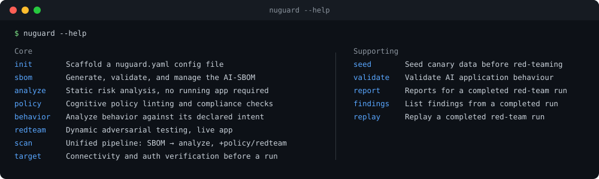
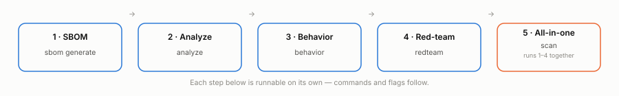
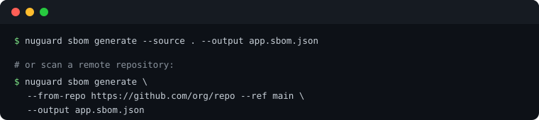
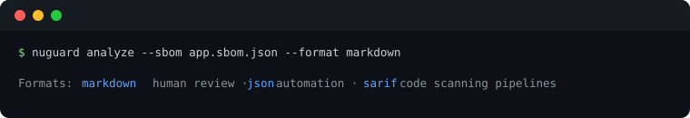
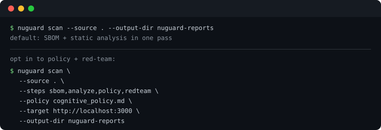

<h1 align="center">Getting Started</h1>

<p align="center">
  <strong>Requirements, installation, the CLI surface, a quick-start walkthrough, and the configuration reference for NuGuard.</strong>
</p>

<p align="center">
  See the <a href="../../.github/README.md">project README</a> for what NuGuard does and the attack catalog / OWASP coverage overview.
</p>

<p align="center">
  <a href="#cli-surface">CLI surface</a> ·
  <a href="#requirements">Requirements</a> ·
  <a href="#installation">Installation</a> ·
  <a href="#quick-start">Quick start</a> ·
  <a href="#configuration">Configuration</a>
</p>

---

## CLI Surface



Run `nuguard <command> --help` for the full flag reference, or see [`cli-reference.md`](cli-reference.md).

## Requirements

- Python 3.12+
- `uv` for the recommended local workflow

## Installation

**Python CLI:**

```bash
pip install nuguard
```

The steps below describe how to set up a local development environment. This is recommended if you want to run the latest code, contribute to the project, or run the CLI with LLM-assisted features that require local environment variable configuration.

```bash
uv sync --dev
```

Run the CLI with:

```bash
uv run nuguard --help
```

Or, from the virtual environment:

```bash
. .venv/bin/activate
nuguard --help
```

### Claude Code plugin

Follow [`plugin-guide.md`](plugin-guide.md) to set up the NuGuard plugin for Claude Code and run commands like `/nuguard-sbom`, `/nuguard-analyze`, and `/nuguard-redteam` directly from a conversation.

## Quick Start

<p align="center">
  <picture>
    <source media="(prefers-color-scheme: dark)" srcset="assets/quickstart-flow-dark.svg">
    
  </picture>
</p>

### 1. Generate an AI-SBOM



### 2. Run Static Analysis



### 3. Behavioral Testing


### 4. Red-Team a Live App


### 5. Run the Unified Pipeline



## Configuration

NuGuard supports project configuration through `nuguard.yaml`. Scaffold one with `nuguard init`, or start from the ready-to-edit example at [`nuguard.yaml.example`](../../nuguard.yaml.example).

| Section | Controls |
|---|---|
| `sbom` | Existing SBOM path |
| `source` | Source directory for generation |
| `policy` | Cognitive policy path |
| `target` | Live app URL, endpoint path, request/response payload shape, and auth (bearer / API key / basic / login-flow) — shared by `behavior` and `redteam`, set once |
| `llm` | Model settings for LLM-assisted features |
| `sbom_generation` | Toggle LLM enrichment of SBOM nodes (`llm: true`), requires `LITELLM_API_KEY` |
| `behavior` | Target URL, endpoint, and test profile settings |
| `redteam` | Target URL, endpoint, canary file, profiles, scenario filters, guided conversation settings, and finding trigger controls (`finding_triggers.*`) |
| `analyze` | Minimum severity threshold |
| `database` | SQLite or Postgres-backed storage settings |
| `output` | Output format and failure threshold |

CLI flags take precedence over `nuguard.yaml`, which takes precedence over environment variables and built-in defaults.

<table>
<tr><td>

### 📖 Need the full flag reference?

Every command, every flag, every default — covered in the CLI reference doc.

[](cli-reference.md)

</td></tr>
</table>
