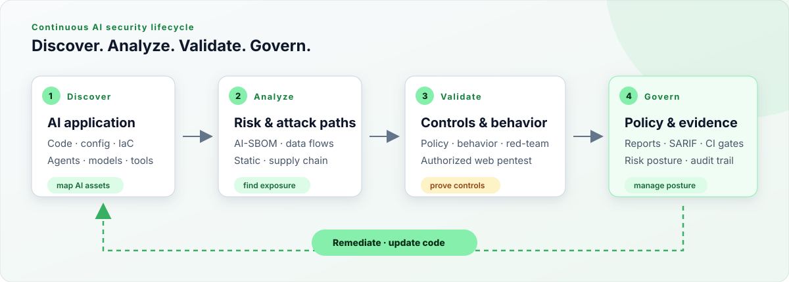
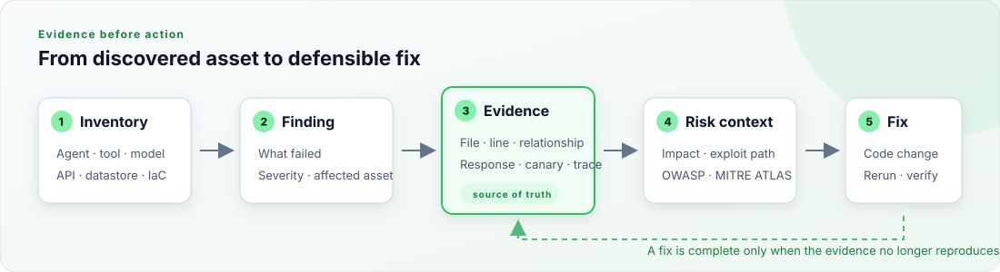

# Getting Started with NuGuard

Build safety and security into an AI application without learning every NuGuard command first. Start with source code, add a sandbox target when you need runtime validation, and automate the checks with every release.

<p align="center">
  <picture>
    <source media="(prefers-color-scheme: dark)" srcset="assets/ai-developer-workflow-dark.svg">
    
  </picture>
</p>

> **Start with source.** `nuguard scan --source .` does not need a running application. Add behavior, red-team, or pentest checks only after you have an isolated target and permission to test it.

## Choose the smallest useful test

| Your question | Start with | Live target? |
|---|---|---|
| What agents, models, tools, data, APIs, and infrastructure exist? | `nuguard sbom generate` | No |
| Which structural, dependency, IaC, and supply-chain risks exist? | `nuguard scan --source .` | No |
| Does the agent behave according to its Cognitive Policy? | `nuguard behavior` | Yes |
| Can an adversary abuse prompts, tools, privileges, or data paths? | `nuguard redteam` | Yes |
| Does the web application expose conventional HTTP vulnerabilities? | `nuguard pentest` | Yes; explicit authorization required |
| Can my coding agent run NuGuard for me? | NuGuard plugin or MCP server | Only for runtime tests |

NuGuard derives its analysis, policy checks, and attack scenarios from an AI-SBOM built from the application. Run each capability on its own, or connect them through `nuguard scan`.

## 1. Install NuGuard

NuGuard requires Python 3.12 or newer.

```bash
pip install nuguard
nuguard --help
```

To work from the repository or contribute to NuGuard, install the development environment instead:

```bash
uv sync --dev
uv run nuguard --help
```


Run `nuguard <command> --help` for command-specific options, or use the [CLI reference](cli-reference.md) for every flag and default.

## 2. Run a source-only scan

From the application repository, run:

```bash
nuguard scan --source . --output-dir nuguard-reports
```

The default unified scan performs two local stages:

1. `sbom` inventories the AI application and its relationships.
2. `analyze` checks that inventory and the repository for security risk.

No target URL or LLM key is required. Some optional vulnerability scanners contact their own advisory services; pin or disable them when your environment requires fully offline execution.

### What the AI-SBOM gives you

```text
Application source
├── AI stack          agents · models · prompts · guardrails
├── Capabilities      tools · MCP servers · API endpoints
├── Data paths        datastores · PII/PHI · read/write access
└── Delivery surface  dependencies · containers · IaC · CI workflows
```

NuGuard also recognizes exported low-code workflows from n8n, Langflow, Flowise, and Microsoft Copilot Studio. See [workflow export scanning](workflow-export-scanning.md) for supported export shapes and runtime boundaries.

## 3. Review evidence before remediation

Open `nuguard-reports/report.md` first, then use JSON or SARIF output for automation. A useful finding connects the affected asset to reproducible evidence, risk context, and a verifiable code change.

<p align="center">
  <picture>
    <source media="(prefers-color-scheme: dark)" srcset="assets/ai-developer-evidence-flow-dark.svg">
    
  </picture>
</p>

Treat generated remediation as a proposed change. Confirm the evidence, update the application, and rerun the smallest command that reproduces the finding.

## 4. Configure a sandbox target

Create project configuration and keep secrets in environment variables:

```bash
nuguard init --source . --target http://localhost:8000
```

```yaml
target:
  url: http://localhost:8000
  auth:
    type: bearer
    header: "Authorization: Bearer ${NUGUARD_TEST_TOKEN}"
```

Settings resolve from most specific to least specific:

```text
CLI flags  →  nuguard.yaml  →  environment variables  →  defaults
```

Use a dedicated test account with the minimum required permissions. Do not put production credentials in configuration files, prompts, reports, or committed fixtures. See [`nuguard.yaml.example`](../../nuguard.yaml.example) for all configuration sections.

## 5. Verify the target

Generate a named SBOM, then check endpoint resolution, authentication, and payload handling before starting a long test:

```bash
nuguard sbom generate --source . --output app.sbom.json
nuguard target verify --config nuguard.yaml --sbom app.sbom.json
```

For an application behind an interactive OAuth or SSO flow:

```bash
pip install "nuguard[browser]"
playwright install chromium
nuguard target discover-browser --config nuguard.yaml
```

Browser discovery is a dry run unless you pass `--write`. Review the proposed configuration before saving it.

## 6. Add the right runtime test

### Validate expected behavior

Use a Cognitive Policy to describe allowed topics, restricted actions, data handling, and human-review boundaries.

```bash
nuguard policy validate --file cognitive_policy.md
nuguard behavior --config nuguard.yaml --policy cognitive_policy.md
```

### Test adversarial AI behavior

Begin with the CI profile and non-destructive scenarios:

```bash
nuguard redteam \
  --config nuguard.yaml \
  --sbom app.sbom.json \
  --policy cognitive_policy.md \
  --scenarios non-destructive \
  --profile ci
```

NuGuard's catalog contains 125 scenarios spanning prompt injection, data exfiltration, tool abuse, privilege escalation, policy violations, MCP toxic flows, and API attacks. Filters let you run only the scenarios relevant to the application.

### Pentest the conventional web surface

`pentest` complements AI-specific behavior and red-team testing with bounded
HTTP/HTTPS application checks. It is a separate active-testing command and
refuses to start without an explicit authorization acknowledgement.

Install [Nuclei](https://github.com/projectdiscovery/nuclei) 3.11.1 or newer
and make sure it is available on `PATH`:

```bash
nuclei -version
```

Run the default safe profile only against an application you own or have
documented permission to test:

```bash
nuguard pentest \
  --target https://staging.example.com \
  --acknowledge-authorization
```

NuGuard validates target scope, rate-limits requests, bounds timeouts, and
returns remediation-ready findings. Write a machine-readable report for CI:

```bash
nuguard pentest \
  --target https://staging.example.com \
  --acknowledge-authorization \
  --format sarif \
  --output pentest.sarif \
  --fail-on high
```

Do not enable active fuzzing or browser-based templates until you have reviewed
the [cloud pentesting guide](cloud-pentesting.md) and confirmed that the target
and test window are authorized. For repeatable runs, targets and scanner
settings can also be placed in the `pentest:` section of `nuguard.yaml`; the
authorization acknowledgement remains a per-invocation CLI flag.

## 7. Add a CI gate

Start with deterministic source checks:

```bash
nuguard scan \
  --source . \
  --output-dir nuguard-reports \
  --fail-on high
```

| Exit code | Meaning |
|---|---|
| `0` | No finding reached the failure threshold |
| `1` | A finding reached `--fail-on` |
| `2` | A critical finding was detected |
| `3` | The scan could not complete |

Upload `nuguard-reports/` as a CI artifact. Use SARIF when your code host can display security findings inline. Add dynamic checks only when CI has an isolated deployment and scoped test credentials.

## 8. Use NuGuard from an AI coding tool

### Claude Code plugin

The Claude Code plugin adds NuGuard commands, reusable security skills, and a dedicated security-auditor agent.

```bash
claude plugin marketplace add NuGuardAI/nuguard
claude plugin install nuguard
```

From the project you want to assess, run `/nuguard-config`. The wizard stores project-local settings in `.claude/nuguard.local.md`; keep this file gitignored.

| Command or integration | Use it for |
|---|---|
| `/nuguard-init` | Create starter NuGuard configuration |
| `/nuguard-scan` | Generate an AI-SBOM and run static analysis |
| `/nuguard-redteam` | Run an approved assessment against a sandbox target |
| `/nuguard-config` | Update project-local NuGuard settings |
| `security-auditor` agent | Coordinate an end-to-end security assessment |

Start with a bounded request:

```text
Use the NuGuard plugin to generate an AI-SBOM for this repository and run
static analysis. Summarize high and critical findings with their evidence.
Do not contact a live target or run dynamic tests.
```

### Other MCP-compatible tools

NuGuard exposes seven MCP tools for Claude Desktop, VS Code, Cursor, Windsurf, Cline, and other compatible clients.

```json
{
  "mcpServers": {
    "nuguard": {
      "command": "npx",
      "args": ["-y", "@nuguardai/nuguard"]
    }
  }
}
```

See the [Plugin and MCP Guide](plugin-guide.md) for client-specific setup, installation alternatives, configuration, and troubleshooting. Require confirmation before an agent contacts a live target.

## Current command status

The implemented assessment path is `sbom`, `analyze`, `scan`, `policy`, `validate`, `behavior`, `redteam`, `pentest`, and `target`. The `seed`, `report`, `findings`, and `replay` commands appear in `nuguard --help` but are placeholders today. Use each implemented command's output options until those test-run management workflows are available.

## Where to go next

- [Supported technologies](supported-technologies.md) — languages, frameworks, platforms, Kubernetes, and datastores
- [CLI reference](cli-reference.md) — flags, defaults, and exit codes
- [AI-SBOM schema](sbom-schema.md) — build integrations against the inventory
- [Static analysis](static-analysis-guide.md) — understand source and supply-chain checks
- [Policy engine](policy-engine-guide.md) — define intended behavior
- [Behavior testing](behavior-guide.md) — test expected behavior
- [Red-team guide](redteam-guide.md) — scope adversarial testing
- [Cloud pentesting](cloud-pentesting.md) — test the conventional web surface
- [Plugin and MCP guide](plugin-guide.md) — connect Claude and other coding agents
- [Python library reference](library-reference.md) — embed NuGuard without shelling out
- [Troubleshooting](troubleshooting.md) — resolve common setup issues
