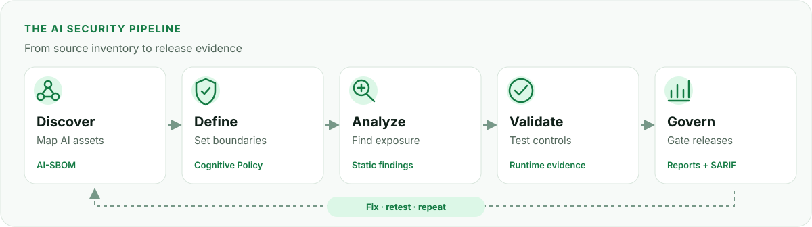

# NuGuard quick start

Map an AI application, set its boundaries, find risks, test controls, and carry evidence into release decisions. Start with source code; add a sandbox target when you are ready for runtime tests.

<p align="center">
  <picture>
    <source media="(prefers-color-scheme: dark)" srcset="assets/ai-developer-workflow-dark.svg">
    
  </picture>
</p>

| Stage | What you get | NuGuard starting point |
|---|---|---|
| **Discover** | An AI-SBOM of agents, models, tools, dependencies, and data paths | `nuguard sbom generate` |
| **Define** | A Cognitive Policy describing allowed behavior and restricted actions | `nuguard policy validate` |
| **Analyze** | Source, dependency, infrastructure, and supply-chain findings | `nuguard analyze` |
| **Validate** | Evidence from behavior, red-team, and authorized web tests | `nuguard behavior`, `redteam`, `pentest` |
| **Govern** | Reports and severity gates for engineering and release review | `report.md`, SARIF, `--fail-on` |

## Run your first scan

NuGuard requires Python 3.12 or newer. From your application repository:

```bash
pip install nuguard
nuguard sbom generate --source . --output app.sbom.json
```

This **Discover** step maps the application's AI assets and data paths in `app.sbom.json`. It needs no live target or LLM key. Use the annotated [`nuguard.yaml.example`](https://github.com/NuGuardAI/nuguard/blob/main/nuguard.yaml.example) to build an application-specific `nuguard.yaml` with your source, SBOM path, policy, target, and authentication settings. 
Keep secrets like LLM API Keys in environment variables. For supported languages and exported low-code workflows, see [supported technologies](supported-technologies.md).

## Define and validate
Initialize the NuGuard configuration and Cognitive Policy for your project by running the init command.

Edit the [Cognitive Policy](policy-engine-guide.md) for allowed topics, data handling, restricted actions, and human review. Validate the document before testing a live application:

```bash
nuguard init --source . --target http://localhost:8000
nuguard policy validate --file cognitive_policy.md
nuguard target verify --config nuguard.yaml --sbom app.sbom.json
```

Use an isolated deployment and a dedicated test account. After target verification, choose the test that answers your question:

- **Expected behavior:** [Behavior testing](behavior-guide.md) checks the application against its policy: `nuguard behavior --config nuguard.yaml --policy cognitive_policy.md`.
- **Adversarial AI behavior:** [Red-team testing](redteam-guide.md) probes prompts, tools, and data paths: `nuguard redteam --config nuguard.yaml --sbom app.sbom.json --policy cognitive_policy.md --scenarios non-destructive --profile ci`.

### Pentest the web surface

For conventional HTTP vulnerabilities, install [Nuclei](https://github.com/projectdiscovery/nuclei) 3.11.1 or newer, then run an authorized test:

```bash
nuguard pentest --target https://staging.example.com --acknowledge-authorization
```

Use only a target you have permission to test. Review the [cloud pentesting guide](cloud-pentesting.md) before enabling active fuzzing or browser-based templates.

## Govern each release

Put the source scan in CI and retain `nuguard-reports/` as a build artifact:

```bash
nuguard scan --source . --output-dir nuguard-reports --fail-on high
```

`--fail-on high` fails the gate when findings reach the threshold; scan errors also exit nonzero. Review the Markdown report with engineering leaders, publish SARIF in your code host, fix confirmed issues, and rerun the relevant check. Add runtime tests to CI only when an isolated target and scoped credentials are available.

For flags and configuration, use the [CLI reference](cli-reference.md). To run NuGuard from a coding agent, see the [Plugin and MCP guide](plugin-guide.md).
