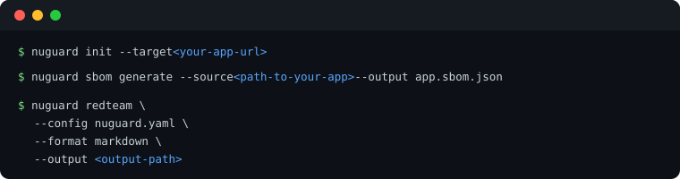

# NuGuard Red-Team Engine

Dynamic adversarial testing for live AI applications. It's designed for AI developers who may not have deep security expertise but want to proactively identify and fix weaknesses in their AI systems before production.

The engine takes an AI-SBOM, a target URL, and optionally a Cognitive Policy, then automatically generates, executes, and scores attack scenarios against the running application — producing structured findings with OWASP/MITRE mappings and LLM-generated remediation briefs.

Only run the red-team engine against a sandbox or staging environment — never against production. It sends adversarial payloads designed to trigger real tool calls, data access, and side effects, so it should only ever run against an environment where that behavior is safe to provoke.

---

## Quick Start

Red-teaming needs a live target — point `nuguard init` at your running app, then run it.

. nuguard sbom generate --source <path-to-your-app> --output app.sbom.json. nuguard redteam --config nuguard.yaml --format markdown --output <output-path>." width="620">

**Common changes** (in `nuguard.yaml`, under `target:` / `redteam:`):

- Target URL and endpoint — `target.url`, `target.endpoint` (default: auto-discovered from SBOM, fallback `/chat`)
- Request/response payload shape — `redteam.chat_payload_key` / `chat_response_key` / `chat_payload_extras` if your app doesn't use `{"message": "..."}` / `{"response": "..."}`
- Auth — `target.auth`: `bearer`, `api_key`, `basic`, `login_flow`, or `cookie_file` (a captured session cookie — see below)

> 🔐 **App behind an interactive login (Auth0, SSO, OAuth redirect)?** `bearer`/`basic`/`login_flow` can't drive a browser-based sign-in flow. Run [`nuguard target discover-browser`](cli-reference.md#nuguard-target) once to log in with a real (headless) browser, capture the session as `target.auth.type: cookie_file`, and auto-detect any extra chat payload fields the app requires (e.g. an opaque consumer/account ID) — then re-run `redteam` as usual.

### 📖 Need every flag?

### 🔀 Want to run a different test?

---
