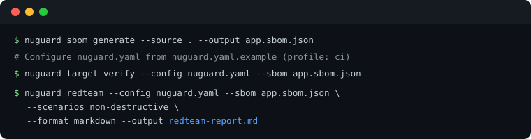

# NuGuard Red-Team Engine

Dynamic adversarial testing for live AI applications. It's designed for AI developers who may not have deep security expertise but want to proactively identify and fix weaknesses in their AI systems before production.

The engine takes an AI-SBOM, a target URL, and optionally a Cognitive Policy, then automatically generates, executes, and scores attack scenarios against the running application — producing structured findings with OWASP/MITRE mappings and LLM-generated remediation briefs.

Only run the red-team engine against a sandbox or staging environment — never against production. It sends adversarial payloads designed to trigger real tool calls, data access, and side effects, so it should only ever run against an environment where that behavior is safe to provoke.

---

## Quick Start

Start in your application's source directory:

```bash
nuguard sbom generate --source . --output app.sbom.json
```

Use the annotated [`nuguard.yaml.example`](https://github.com/NuGuardAI/nuguard/blob/main/nuguard.yaml.example)
to create `nuguard.yaml` for your app's target, authentication and payload shape.
Set `redteam.profile: ci` for a first pass. Verify the live target before running attacks:

```bash
nuguard target verify --config nuguard.yaml --sbom app.sbom.json
nuguard redteam --config nuguard.yaml --sbom app.sbom.json \
  --scenarios non-destructive --format markdown --output redteam-report.md
```



**Common changes** (in `nuguard.yaml`, under `target:` / `redteam:`):

- Target URL and endpoint — `target.url`, `target.endpoint` (omit the endpoint for authenticated live discovery)
- Request/response payload shape — `redteam.chat_payload_key` / `chat_response_key` / `chat_payload_extras` if your app doesn't use `{"message": "..."}` / `{"response": "..."}`
- Auth — `target.auth`: `bearer`, `api_key`, `basic`, `login_flow`, or `cookie_file` (a captured session cookie — see below)

> 🔐 **App behind an interactive login (Auth0, SSO, OAuth redirect)?** `bearer`/`basic`/`login_flow` can't drive a browser-based sign-in flow. Run [`nuguard target discover-browser`](cli-reference.md#nuguard-target) once to log in with a real (headless) browser, capture the session as `target.auth.type: cookie_file`, and auto-detect any extra chat payload fields the app requires (e.g. an opaque consumer/account ID) — then re-run `redteam` as usual.

---

## Configuration

The examples below use the [OpenAI Customer Service Agents demo](example-openai-cs-agents.md) — a FastAPI backend serving five airline-support agents — as a worked example. Full walkthrough: [example-openai-cs-agents.md](example-openai-cs-agents.md).

### Target URL

`target.url` is the base URL of the **running backend**, not the frontend. Point it at wherever the app's chat endpoint is served — a local dev server, a staging deployment, or a container. For the demo app that's the FastAPI process, not the Next.js UI:

```yaml
target:
  url: http://localhost:8000        # backend URL, not the frontend
```

`target.endpoint` is the chat endpoint path appended to `target.url`. Omit it to validate
SBOM candidates against the live target, try authenticated HTTP probes, and use browser
discovery when needed. The confirmed route and payload shape are retained for the scan.
If discovery cannot confirm a route, the scan stops with an endpoint-not-found error;
set the correct path explicitly or check the backend URL and login configuration.

```yaml
target:
  url: http://localhost:8000
  endpoint: /chat                   # optional — omit to auto-discover from the SBOM
```

Resolution order when no `target.url` is set at all: `--target` CLI flag → `redteam.target` in `nuguard.yaml` → SBOM-discovered URLs (local → staging → production) → error.

Before running a full scan, verify the URL and endpoint actually resolve to a live chat endpoint:

```bash
nuguard target verify --config nuguard.yaml --sbom app.sbom.json
```

### Auth

`target.auth` is a shared block inherited by both `nuguard behavior` and `nuguard redteam`; override it under `redteam.auth` only if red-teaming needs different credentials than behavioral testing. Supported `type` values:

| Type | Use case | Required fields |
|---|---|---|
| `bearer` | Static bearer token | `header` (e.g. `"Authorization: Bearer ${TARGET_TOKEN}"`) |
| `api_key` | API key in a custom header | `header` (e.g. `"X-API-Key: ${TARGET_API_KEY}"`) |
| `basic` | HTTP Basic Auth | `username`, `password` |
| `login_flow` | App exposes a login endpoint that returns a token | `login_flow.endpoint`, `login_flow.payload`, `login_flow.token_response_key`, `login_flow.token_header` |
| `cookie_file` | Browser login or an existing captured session | `cookie_file` (path to a Netscape-format `cookies.txt`) |
| `none` | Open/local-dev endpoint, no credentials | — |

The demo app runs locally with no auth in front of it:

```yaml
target:
  auth:
    type: none
```

Always source credential values from environment variables with `${VAR}` interpolation — never commit tokens or passwords directly into `nuguard.yaml`.

### Redteam profile (CI vs. Full)

`redteam.profile` (`--profile` on the CLI) controls how many scenarios run, trading speed for coverage:

| Profile | Catalog selection cap | Threshold | When to use |
|---|---|---|---|
| `ci` (default) | 20 | `base_impact` ≥ 5.0 | Pre-merge gates; excludes destructive and resource-exhaustion catalog scenarios |
| `standard` | 40 | `base_impact` ≥ 3.0 | Regular scans during development |
| `full` | All applicable scenarios | No impact threshold | Pre-release audits and security review |
| `minimal` | One static scenario | No impact threshold | Target smoke check; disables guided conversations |

Actual counts depend on discovered capabilities, scenario filters, and generated variants.
`redteam.min_impact_score` adds a minimum pre-score for inclusion; it does not restore
catalog scenarios already excluded by the profile.

For the demo app's pre-release scan, the `nuguard.yaml` sets:

```yaml
redteam:
  profile: full
```

which is what produced the 111-scenario run described in [Red-Team the Live App](example-openai-cs-agents.md#6-red-team-the-live-app).
For a CI gate, set `redteam.profile: ci` in `nuguard.yaml`, then run:

```bash
nuguard redteam -c nuguard.yaml --profile ci --format sarif --output results.sarif --fail-on high
```

### Scenarios (destructive / non-destructive filter)

`redteam.scenarios` (`--scenarios` on the CLI) restricts the run by whether a scenario is
likely to mutate or destroy target state. Omitted or empty filters run **non-destructive
scenarios only**. Values: `destructive`, `non-destructive`.

A scenario is classified `destructive` when it asks for mutating actions such as
cancel/delete/refund, contains a credentialed write through a direct HTTP probe, or tests
resource exhaustion. Mutating scenarios run after non-destructive probes. The filter is a
classification of intended behavior; adversarial prompts can still trigger unexpected side effects.

For a first pass against a shared or production-like target, restrict to non-destructive scenarios only:

```yaml
redteam:
  profile: ci
  scenarios:
    - non-destructive
```

Equivalent CLI form:

```bash
nuguard redteam -c nuguard.yaml --scenarios non-destructive
```

Once you're confident the target can tolerate mutating actions (a throwaway/staging environment, seeded test data you can re-seed), run both:

```yaml
redteam:
  profile: full
  scenarios:
    - non-destructive
    - destructive
```

Use `standard` or `full` when opting into mutating tests; the CI catalog excludes them.
For write-capable API probes, configure `redteam.canary` with a disposable tenant's
`session_token`. Without one, probes may use the configured target credentials; review
credential fallback notes in the report. See the [example configuration](example-openai-cs-agents.md#4-set-up-project-config).

For attack vectors, impact scores, goal types, and execution modes, see the
[Red-Team Scenario Catalog](redteam-scenario-catalog.md).

### API endpoint coverage

Direct HTTP probes use the AI-SBOM's API endpoints in addition to the chat route.
Above `redteam.api_endpoint_threshold` (default `25`), a configured red-team LLM selects
endpoints relevant to each probe family. CI spot-checks at most
`redteam.ci_api_spot_checks` endpoints (default `3`); it uses a deterministic selection
when the LLM is unavailable. These are coverage limits, so a CI result does not establish
that every API route was tested.

### Customizing the catalog

Export the bundled catalog, edit the exported entries, then select that file for a run:

```bash
nuguard redteam catalog-export --output my-catalog.yaml
nuguard redteam --config nuguard.yaml --sbom app.sbom.json --catalog my-catalog.yaml
```

The custom catalog replaces the bundled catalog. Keep stable entry IDs and the exported
field structure; profile, capability, and destructive-scenario filters still apply.
You can also set `redteam.catalog: ./my-catalog.yaml` in `nuguard.yaml`.

### Execution modes

| Mode | Scheduling | Use case |
|---|---|---|
| `concurrent` (default) | Phases run in order; scenarios within a phase can run in parallel | Independent attack scenarios |
| `progressive` | Named phases run sequentially, one scenario at a time | A staged engagement; `redteam.progressive.halt_on_severity` can stop after a phase |
| `campaign` | Related objectives reuse conversations; representative coverage precedes deeper attempts | Broad coverage with less repeated setup |

Set `redteam.mode` in YAML or use `--mode`. `redteam.max_concurrent_requests` limits
HTTP requests to the target; it is separate from provider-side LLM rate limits.

### Campaign mode (opt-in)

`redteam.mode: campaign` (or `nuguard redteam --mode campaign`) uses a coverage-first
scheduler and reuses conversations across related objectives. Use it when repeated setup
slows a run or whole families (tool abuse, agentic trust, MCP) remain untested.

What changes:

- **One conversation, many objectives.** Related objectives share a warm conversation branch
  (one benign baseline per branch, not one opener per scenario). A branch is rotated on identity
  change, an accepted instruction override, persistent writes, 24 turns / 8,000 estimated tokens,
  or unknown state after a transport error.
- **Breadth first.** One representative meaningful attempt per control × channel × identity
  boundary, in complexity-level order, then a depth pass. A critical finding never halts unrelated
  objectives; a failed prompt extraction never blocks tool or data controls.
- **Retries never hold a request slot.** `429`/5xx cool down in a queue (`Retry-After` honoured,
  at most two retries per 120 s per incident). A dead API route blocks that route only.
- **Fresh-session confirmation.** Findings are reproduced in a brand-new conversation using
  reserved capacity (20% of a finite request budget). Results are reported as `confirmed`,
  `not_reproduced`, `blocked` or `not_attempted`; the original evidence is kept either way.
- **Containment is enforced.** Objectives needing a second principal, a callback server, or a
  declared dry-run/sandbox fixture are recorded as `blocked_fixture:<name>` instead of running.
- **Coverage is reported separately from findings**, and zero findings with untested controls is
  labelled *inconclusive*.

```yaml
redteam:
  mode: campaign
  pre_run_warmup: 0            # campaign manages its own warm-up
  max_concurrent_requests: 1   # one request at a time (default)
  campaign:
    campaign_warmup: true
    confirm_in_fresh_sessions: true
    target_supports_session_reset: null   # detect; use true only when isolated reset is supported
    declared_fixtures: false              # true when dry-run/sandbox tools exist
    fixture_version: ""                  # change when the fixture changes
    max_run_target_requests: 600          # optional; unset = no hidden cap
```

If the target cannot create an isolated session, set both
`target_supports_session_reset: false` and `confirm_in_fresh_sessions: false`.
Setting reset support to `false` while confirmation remains enabled is a configuration
error. Keep `declared_fixtures: false` until the target actually provides the required
dry-run or sandbox behavior.

Optional campaign budgets also include `max_run_seconds` and `max_run_llm_cost_usd`.
Omitted budgets have no run-wide cap. Tune `max_turns_per_branch`, `max_branch_tokens`,
and `max_objective_turns` to bound conversations; the objective turn limit must not exceed
the branch turn limit.

Guided findings are confirmed by replaying the recorded attacker turns in a fresh conversation and
re-judging the final response with the same success criteria as the live run (they are `blocked` with
`no_judge_available` when no redteam LLM is configured). Current limit: WebSocket targets are not
supported (use `concurrent`). See
[redteam-design.md](redteam-design.md#12a-campaign-mode) for the design.

### Resuming an aborted run

If a run is interrupted (crash, circuit breaker trip, `Ctrl-C`) after at least one scenario has
completed, NuGuard writes a checkpoint file under `prompt_cache_dir` and raises a
`PartialRunError` naming that file. Pass it back with `--resume` to pick up where the run left
off — already-completed scenarios are skipped and the final report combines the checkpointed and
newly-run results:

```bash
nuguard redteam -c nuguard.yaml --resume nuguard-reports/.cache/redteam-<key>.json
```

Equivalent config:

```yaml
redteam:
  resume: nuguard-reports/.cache/redteam-<key>.json
```

The checkpoint is fingerprinted against the SBOM and policy it was created with — resuming
against a different SBOM/policy raises a `CheckpointMismatchError` instead of silently mixing
results. On a fully successful run the checkpoint file is deleted automatically.

Campaign resume also checks the target, authentication scope, and `campaign.fixture_version`.
It restores conversation state with current credentials and probes saved branches for liveness;
expired conversations are rebuilt from permitted setup without replaying writes.
Checkpoints contain authentication fingerprints rather than raw headers or cookies.

**Upgrading to 0.9.15:** authenticated campaign checkpoints created with the older
SHA-256 fingerprint cannot be resumed after the credential fingerprint upgrade. Start a
new campaign without `--resume`; a mismatch raises `CheckpointMismatchError` before
campaign state is restored. New fingerprints remain stable across processes and header
ordering, and credential rotation invalidates resume.

### Reading campaign results

Review findings together with the coverage and reproduction sections:

| Result | What to check |
|---|---|
| Coverage quality | Attempted and meaningfully completed objectives, blocked controls, and work deferred by budgets |
| Reproduction | `confirmed`, `not_reproduced`, `blocked`, or `not_attempted`; original evidence is retained |
| Effect verification | Whether a concrete canary or synthetic-account effect was verified; a reproduced response alone does not establish a real side effect |
| Efficiency | Target requests, LLM calls, reused branches, and setup requests avoided |

Zero findings with untested controls is **inconclusive**. Resolve missing fixtures,
transport failures, or exhausted budgets before using the report as a release decision.
For JSON-safe library results and checkpoint exceptions, see
[platform integration](platform-public-api-integration.md).

### 📖 Need every flag?

[](cli-reference.md#nuguard-redteam)

### 🔀 Want to run a different test?

[](quick-start.md)

---

## Remediation priority and coverage integrity

The shared remediation synthesizer applies source constraints after both
synchronous and asynchronous generation. A recommendation cannot have a higher
priority than its source finding. Canonical severity enum values are supported,
and informational findings remain informational. The existing medium fallback
is retained for older untyped inputs with missing or unrecognized severities.

Deduplication removes repeated advice, not source finding associations. Combined
recommendations preserve all finding IDs and per-finding rationales and retain
the highest eligible source priority. Prompt patches merge only when their
location, component type, and other security context are compatible. Generated
artefacts are copied rather than mutating handler-owned objects.

An explicit tool name in a finding is retained. Inferred privilege guidance
requires a unique high-privilege TOOL reachable through CALLS edges from the
identified component. Missing, ambiguous, or unrelated tools are not substituted
from elsewhere in the SBOM. When attribution is unavailable, guidance asks the
operator to review the intended access policy instead of asserting an invented
tool or authorization failure.

Catalog coverage uses the current ScenarioCategory taxonomy as its denominator
and counts each recognized category once. Unrecognized categories in older
serialized snapshots are reported separately and do not inflate coverage.
Catalog generation coverage is not proof that scenarios executed successfully.

These safeguards improve remediation and coverage consistency. They do not
change exploit-success evaluation or independently verify the underlying
findings. Remediation remains advisory.
